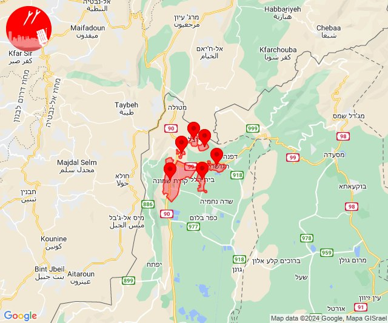

# Alerts for 2024-06-08

## 02:31

🔴 צבע אדום (08/06/2024):

05:31:
• גליל עליון: ביריה, צפת (30 שניות)

צופר - צבע אדום

## 02:31

## 02:33

✈️ חדירת כלי טיס עוין (08/06/2024):

05:33:
• צפון הגולן: מג'דל שמס, מסעדה, נווה אטי''ב, נמרוד, עין קנייא 

צופר - צבע אדום

## 02:33

## 07:47

🔴 צבע אדום (08/06/2024):

10:46:
• קו העימות: זרעית (מיידי)

10:47:
• קו העימות: זרעית (מיידי)

צופר - צבע אדום

## 07:47

## 07:50

🔴 צבע אדום (08/06/2024):

10:49:
• קו העימות: זרעית (מיידי)

10:50:
• קו העימות: זרעית (מיידי)

צופר - צבע אדום

## 07:50

## 08:38

✈️ חדירת כלי טיס עוין (08/06/2024):

11:38:
• קו העימות: אביבים, ברעם, יראון 

צופר - צבע אדום

## 08:38

## 09:59

🔴 צבע אדום (08/06/2024):

12:59:
• עוטף עזה: כיסופים (15 שניות)

צופר - צבע אדום

## 09:59

## 14:29

🔴 צבע אדום (08/06/2024):

17:29:
• קו העימות: רמות נפתלי, מרכז אזורי מבואות חרמון, יפתח (מיידי)

צופר - צבע אדום

## 14:29

## 16:15

🔴 צבע אדום (08/06/2024):

19:15:
• קו העימות: כפר יובל, מעיין ברוך, קריית שמונה, תל חי, הגושרים, בית הלל (מיידי)

צופר - צבע אדום

## 16:15

## 18:02

🔴 צבע אדום (08/06/2024):

21:01:
• עוטף עזה: כפר עזה, מטווח ניר עם (15 שניות)

21:02:
• עוטף עזה: שדרות, איבים, ניר עם, מפלסים (15 שניות)

צופר - צבע אדום

## 18:02

## 18:14

🔴 צבע אדום (08/06/2024):

21:14:
• עוטף עזה: תקומה (15 שניות)

צופר - צבע אדום

## 18:14

