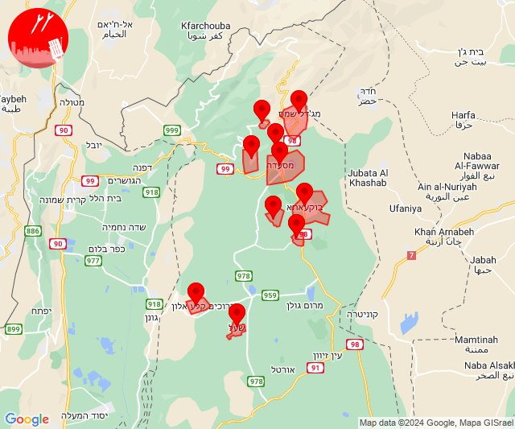

# Alerts for 2024-06-09

## 09:08

🔴 צבע אדום (09/06/2024):

12:07:
• קו העימות: שניר, שמיר, כפר סאלד (מיידי, 15 שניות)

12:08:
• קו העימות: שאר ישוב, כפר סאלד, שדה נחמיה, שמיר, דפנה, הגושרים, קיבוץ דן, שניר (מיידי, 15 שניות)
• צפון הגולן: אודם, מסעדה, עין קנייא (מיידי)

צופר - צבע אדום

## 09:08

## 09:10

🔴 צבע אדום (09/06/2024):

12:10:
• קו העימות: שאר ישוב (מיידי)

צופר - צבע אדום

## 09:10

## 09:19

✈️ חדירת כלי טיס עוין (09/06/2024):

12:15:
• צפון הגולן: נווה אטי''ב, עין קנייא, מג'דל שמס, מסעדה, נמרוד 

12:16:
• צפון הגולן: בוקעתא, אודם, אל רום 

12:17:
• צפון הגולן: קלע, שעל 

12:19:
• צפון הגולן: אודם, אל רום, בוקעתא 

צופר - צבע אדום

## 09:19

## 09:56

✈️ חדירת כלי טיס עוין (09/06/2024):

12:56:
• קו העימות: אזור תעשייה רמת דלתון, עלמה, ריחאנייה, כרם בן זמרה, ג'ש - גוש חלב, דלתון 

צופר - צבע אדום

## 09:57

## 09:58

✈️ חדירת כלי טיס עוין (09/06/2024):

12:58:
• קו העימות: דלתון, ריחאנייה, אזור תעשייה רמת דלתון, כרם בן זמרה, ג'ש - גוש חלב, עלמה 
• גליל עליון: קדיתא 

צופר - צבע אדום

## 09:58

## 10:24

✈️ חדירת כלי טיס עוין (09/06/2024):

13:24:
• קו העימות: מרכז אזורי מבואות חרמון, מלכיה, רמות נפתלי, יפתח, דישון 

צופר - צבע אדום

## 10:24

## 10:33

🔴 צבע אדום (09/06/2024):

13:33:
• עוטף עזה: חולית, סופה (15 שניות)

צופר - צבע אדום

## 10:33

## 11:50

🔴 צבע אדום (09/06/2024):

14:50:
• עוטף עזה: סופה (15 שניות)

צופר - צבע אדום

## 11:50

## 12:49

🔴 צבע אדום (09/06/2024):

15:48:
• קו העימות: אביבים, יראון (מיידי)

15:49:
• קו העימות: אביבים, יראון (מיידי)

צופר - צבע אדום

## 12:49

## 13:18

🔴 צבע אדום (09/06/2024):

16:17:
• קו העימות: אביבים, יראון (מיידי)

16:18:
• קו העימות: אביבים, יראון (מיידי)

צופר - צבע אדום

## 13:18

## 13:20

🔴 צבע אדום (09/06/2024):

16:20:
• קו העימות: אביבים, יראון (מיידי)

צופר - צבע אדום

## 13:20

## 13:24

🔴 צבע אדום (09/06/2024):

16:24:
• קו העימות: אביבים (מיידי)

צופר - צבע אדום

## 13:24

## 13:36

🔴 צבע אדום (09/06/2024):

16:36:
• קו העימות: מלכיה (מיידי)

צופר - צבע אדום

## 13:36

## 13:40

🔴 צבע אדום (09/06/2024):

16:40:
• קו העימות: מלכיה (מיידי)

צופר - צבע אדום

## 13:40

## 19:51

✈️ חדירת כלי טיס עוין (09/06/2024):

22:51:
• קו העימות: בית הלל, כפר גלעדי, כפר יובל, מטולה, מנרה, מעיין ברוך, מרגליות, משגב עם, קריית שמונה, תל חי 

צופר - צבע אדום

## 19:51

## 21:55

🔴 צבע אדום (10/06/2024):

00:55:
• גליל עליון: עכו, כפר מסריק, עכו - אזור תעשייה, עין המפרץ (30 שניות)

צופר - צבע אדום

## 21:55

## 21:56

🔴 צבע אדום (10/06/2024):

00:56:
• גליל עליון: אזור תעשייה שער נעמן, כפר מסריק, עכו - אזור תעשייה (דקה, 30 שניות)
• המפרץ: קריית ביאליק (דקה)

צופר - צבע אדום

## 21:56

