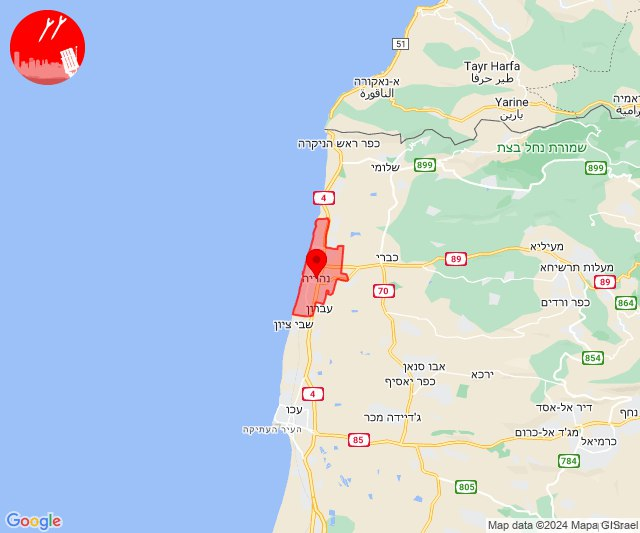

# Alerts for 2024-06-10

## 09:39

✈️ חדירת כלי טיס עוין (10/06/2024):

12:38:
• קו העימות: עבדון, מנות, נווה זיו 

12:39:
• קו העימות: געתון, יחיעם, כברי, עין יעקב 
• גליל עליון: שייח' דנון 

צופר - צבע אדום

## 09:39

## 09:43

✈️ חדירת כלי טיס עוין (10/06/2024):

12:43:
• קו העימות: נהריה 

צופר - צבע אדום

## 09:43

## 10:15

✈️ חדירת כלי טיס עוין (10/06/2024):

13:15:
• קו העימות: בית הלל, מרגליות, כפר גלעדי, מנרה, מטולה, מעיין ברוך, תל חי, כפר יובל, קריית שמונה, משגב עם 

צופר - צבע אדום

## 10:15

## 10:20

✈️ חדירת כלי טיס עוין (10/06/2024):

13:20:
• קו העימות: נאות מרדכי, עמיר, כפר סאלד, שדה נחמיה, גונן, להבות הבשן, כפר בלום, שמיר 

צופר - צבע אדום

## 10:20

## 11:20

🔴 צבע אדום (10/06/2024):

14:20:
• עוטף עזה: דקל, חולית, יתד, שדה אברהם (15 שניות)

צופר - צבע אדום

## 11:20

## 11:25

✈️ חדירת כלי טיס עוין (10/06/2024):

14:25:
• קו העימות: בית הלל, כפר גלעדי, כפר יובל, מטולה, מנרה, מעיין ברוך, מרגליות, משגב עם, קריית שמונה, תל חי 

צופר - צבע אדום

## 11:25

## 11:30

✈️ חדירת כלי טיס עוין (10/06/2024):

14:30:
• צפון הגולן: שעל 

צופר - צבע אדום

## 11:30

## 12:12

✈️ חדירת כלי טיס עוין (10/06/2024):

15:12:
• קו העימות: בית הלל, כפר גלעדי, כפר יובל, מטולה, מנרה, מעיין ברוך, מרגליות, משגב עם, קריית שמונה, תל חי 

צופר - צבע אדום

## 12:12

## 12:26

✈️ חדירת כלי טיס עוין (10/06/2024):

15:26:
• צפון הגולן: שעל 

צופר - צבע אדום

## 12:26

## 12:29

✈️ חדירת כלי טיס עוין (10/06/2024):

15:29:
• צפון הגולן: נווה אטי''ב, עין קנייא, נמרוד, מסעדה, מג'דל שמס 

צופר - צבע אדום

## 12:29

## 12:31

✈️ חדירת כלי טיס עוין (10/06/2024):

15:31:
• צפון הגולן: אודם, אל רום, בוקעתא, קלע, שעל 

צופר - צבע אדום

## 12:31

## 12:34

✈️ חדירת כלי טיס עוין (10/06/2024):

15:34:
• צפון הגולן: מרום גולן, עין זיוון, אורטל, שעל 
• דרום הגולן: אלוני הבשן 

צופר - צבע אדום

## 12:34

## 14:21

🔴 צבע אדום (10/06/2024):

17:20:
• קו העימות: כפר יובל, מעיין ברוך, בית הלל, הגושרים (מיידי)

17:21:
• קו העימות: גונן (15 שניות)

צופר - צבע אדום

## 14:21

## 14:45

🔴 צבע אדום (10/06/2024):

17:45:
• קו העימות: קריית שמונה (מיידי)

צופר - צבע אדום

## 14:45

## 15:01

🔴 צבע אדום (10/06/2024):

18:00:
• קו העימות: מטולה (מיידי)

18:01:
• קו העימות: כפר יובל (מיידי)

צופר - צבע אדום

## 15:01

## 16:13

🔴 צבע אדום (10/06/2024):

19:13:
• קו העימות: נהריה, עברון (15 שניות)
• גליל עליון: שבי ציון, מזרעה, רגבה (30 שניות)

צופר - צבע אדום

## 16:13

## 16:41

✈️ חדירת כלי טיס עוין (10/06/2024):

19:41:
• צפון הגולן: שעל, קלע 

צופר - צבע אדום

## 16:41

## 16:43

✈️ חדירת כלי טיס עוין (10/06/2024):

19:43:
• צפון הגולן: עין זיוון, מרום גולן, אורטל 
• דרום הגולן: אלוני הבשן 

צופר - צבע אדום

## 16:43

## 16:43

🔴 צבע אדום (10/06/2024):

19:43:
• צפון הגולן: שעל (15 שניות)

צופר - צבע אדום

## 16:43

## 18:50

✈️ חדירת כלי טיס עוין (10/06/2024):

21:50:
• צפון הגולן: קלע, שעל 

צופר - צבע אדום

## 18:50

