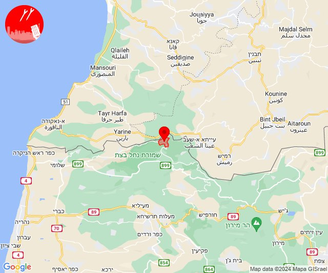

# Alerts for 2024-06-12

## 06:02

🔴 צבע אדום (12/06/2024):

08:58:
• קו העימות: אזור תעשייה רמת דלתון, דלתון (מיידי)
• גליל עליון: ביריה, צפת, קדיתא (30 שניות)

08:59:
• גליל עליון: כורזים ורד הגליל, עמיעד (30 שניות)
• גליל תחתון: טבריה, בית ירח, דגניה א, דגניה ב, כינרת מושבה, כינרת קבוצה (דקה)

09:00:
• גליל עליון: אליפלט, אמנון, צפת, ביריה, קדיתא, אור הגנוז, בר יוחאי, מרכז אזורי מרום גליל, ספסופה - כפר חושן, ראש פינה, כורזים ורד הגליל, עמיעד, ביריה, צפת, אליפלט, כחל, קדיתא, אמנון (30 שניות, דקה)
• קו העימות: דלתון, ג'ש - גוש חלב, כרם בן זמרה, אזור תעשייה רמת דלתון, דוב''ב, סאסא, דלתון, עלמה, ריחאנייה (מיידי)
• מרכז הגליל: ביר אלמכסור, חנתון, כפר מנדא (דקה)
• גליל תחתון: גינוסר, מגדל, פוריה נווה עובד (דקה)

09:01:
• קו העימות: אזור תעשייה רמת דלתון (מיידי)
• גליל עליון: אזור תעשייה חצור הגלילית, אזור תעשייה צ.ח.ר, חצור הגלילית, מנחת מחניים, ראש פינה, עמוקה, עמיעד, כורזים ורד הגליל, אליפלט, צפת (30 שניות)

09:02:
• גליל עליון: קדיתא, צפת, ביריה, חצור הגלילית, ראש פינה, עמוקה (30 שניות)

צופר - צבע אדום

## 06:02

## 07:02

🔴 צבע אדום (12/06/2024):

10:00:
• קו העימות: סאסא, צבעון, דוב''ב, סאסא, בית ספר שדה מירון, צבעון (מיידי)

10:01:
• גליל עליון: כפר שמאי, מירון, מרכז אזורי מרום גליל, ספסופה - כפר חושן, אור הגנוז, בר יוחאי, קדיתא, שפר (30 שניות)
• קו העימות: חורפיש, אלקוש, מתת, ג'ש - גוש חלב, סאסא, בית ספר שדה מירון, צבעון, דוב''ב, מתת (מיידי)

10:02:
• גליל עליון: מירון, עין אל אסד, בית ג'אן, ספסופה - כפר חושן (30 שניות)
• קו העימות: אזור תעשייה רמת דלתון, דלתון, כרם בן זמרה, עלמה, ריחאנייה (מיידי)

צופר - צבע אדום

## 07:02

## 07:31

🔴 צבע אדום (12/06/2024):

10:31:
• קו העימות: שתולה, נטועה (מיידי)

צופר - צבע אדום

## 07:31

## 08:01

🔴 צבע אדום (12/06/2024):

11:00:
• קו העימות: זרעית (מיידי)

11:01:
• קו העימות: זרעית, זרעית (מיידי)

צופר - צבע אדום

## 08:01

## 08:50

✈️ חדירת כלי טיס עוין (12/06/2024):

11:50:
• קו העימות: בית ספר שדה מירון, חורפיש, פקיעין, צבעון, צוריאל 

צופר - צבע אדום

## 08:50

## 08:53

🔴 צבע אדום (12/06/2024):

11:53:
• קו העימות: ברעם, דוב''ב (מיידי)

צופר - צבע אדום

## 08:53

## 08:53

✈️ חדירת כלי טיס עוין (12/06/2024):

11:52:
• קו העימות: יראון, ברעם, אביבים 

11:53:
• קו העימות: אזור תעשייה רמת דלתון, ג'ש - גוש חלב, דלתון, כרם בן זמרה, עלמה, ריחאנייה 

צופר - צבע אדום

## 08:53

## 09:00

✈️ חדירת כלי טיס עוין (12/06/2024):

12:00:
• גליל עליון: ביריה 

צופר - צבע אדום

## 09:00

## 09:18

✈️ חדירת כלי טיס עוין (12/06/2024):

12:18:
• קו העימות: אדמית, אילון, גורן, גורנות הגליל, חניתה, יערה, ערב אל עראמשה 

צופר - צבע אדום

## 09:18

## 09:19

🔴 צבע אדום (12/06/2024):

12:18:
• קו העימות: אדמית, יערה (מיידי)

12:19:
• קו העימות: יערה (מיידי)

צופר - צבע אדום

## 09:19

## 09:20

✈️ חדירת כלי טיס עוין (12/06/2024):

12:20:
• קו העימות: מנות, נווה זיו, עבדון 

צופר - צבע אדום

## 09:20

## 09:55

🔴 צבע אדום (12/06/2024):

12:55:
• קו העימות: בית ספר שדה מירון, צבעון, סאסא, דוב''ב (מיידי)

צופר - צבע אדום

## 09:55

## 11:09

🔴 צבע אדום (12/06/2024):

14:09:
• קו העימות: מלכיה (מיידי)

צופר - צבע אדום

## 11:09

## 14:32

🔴 צבע אדום (12/06/2024):

17:32:
• קו העימות: שלומי (מיידי)

צופר - צבע אדום

## 14:32

## 15:33

🔴 צבע אדום (12/06/2024):

18:33:
• קו העימות: להבות הבשן (15 שניות)

צופר - צבע אדום

## 15:33

## 17:35

ערב טוב לכולם.

מערכת צופר פותחה בהתנדבות מלאה, למען אזרחי מדינת ישראל

מתחילת המלחמה, מפתחי צופר עובדים ומתחזקים את המערכות השונות מסביב לשעון, כאשר מולנו מטרה אחת ויחידה - לספק שירות התרעות אמין, מיידי ומציל חיים.

עקב ריבוי המשתמשים נשמח לעזרתכם

יותר ממליון משתמשים נעזרים ומקבלים התרעות מצופר, ועקב ריבוי המשתמשים הגדול אנו נדרשים להרחיב ולשדרג את המערכות, לבצע תחזוקות שוטפות ולשפר מנגנוני אבטחת מידע למניעת התקפות סייבר.

התרומות שלכם יאפשרו לנו להמשיך ולספק לכם שירות התרעות חיוני ומציל חיים.

תרומה באמצעות פייפאל:
https://paypal.me/tzevaadom

תרומה באמצעות פייבוקס:
https://payboxapp.page.link/D61pA1neQXyGhBui7

אנו רוצים להודות מכאן, לכל האנשים הטובים והיקרים שתרמו ותורמים מכספם עבור המערכת!

צופר מחזקת את אזרחי ישראל וחיילי צה״ל
ביחד ננצח! 🇮🇱

איתכם בכל זמן,
צוות צופר

## 17:48

🔴 צבע אדום (12/06/2024):

20:48:
• קו העימות: קריית שמונה, תל חי (מיידי)

צופר - צבע אדום

## 17:48

## 17:48

✈️ חדירת כלי טיס עוין (12/06/2024):

20:47:
• קו העימות: בית הלל, כפר גלעדי, כפר יובל, מטולה, מנרה, מעיין ברוך, מרגליות, משגב עם, קריית שמונה, תל חי 

20:48:
• קו העימות: גונן, כפר בלום, כפר סאלד, להבות הבשן, נאות מרדכי, עמיר, שדה נחמיה, שמיר 

צופר - צבע אדום

## 17:48

## 17:59

🔴 צבע אדום (12/06/2024):

20:59:
• עוטף עזה: מפלסים, מטווח ניר עם (15 שניות)

צופר - צבע אדום

## 17:59

