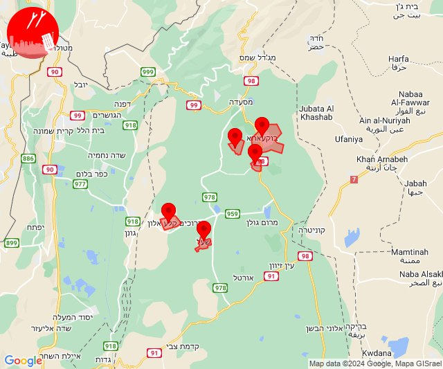

# Alerts for 2024-06-13

## 02:04

🔴 צבע אדום (13/06/2024):

05:04:
• קו העימות: יחיעם (15 שניות)
• גליל עליון: כליל (30 שניות)

צופר - צבע אדום

## 02:04

## 03:05

🔴 צבע אדום (13/06/2024):

06:05:
• קו העימות: שתולה, שתולה (מיידי)

צופר - צבע אדום

## 03:05

## 04:57

✈️ חדירת כלי טיס עוין (13/06/2024):

07:57:
• קו העימות: בית הלל, כפר גלעדי, כפר יובל, מטולה, מנרה, מעיין ברוך, מרגליות, משגב עם, קריית שמונה, תל חי 

צופר - צבע אדום

## 04:57

## 06:30

✈️ חדירת כלי טיס עוין (13/06/2024):

09:28:
• קו העימות: בית הלל, כפר גלעדי, כפר יובל, מטולה, מנרה, מעיין ברוך, מרגליות, משגב עם, קריית שמונה, תל חי, דפנה, הגושרים, ע'ג'ר, קיבוץ דן, שאר ישוב, שניר 

09:29:
• קו העימות: גונן, כפר בלום, כפר סאלד, להבות הבשן, נאות מרדכי, עמיר, שדה נחמיה, שמיר 

09:30:
• קו העימות: דישון, יפתח, מלכיה, מרכז אזורי מבואות חרמון, רמות נפתלי 

צופר - צבע אדום

## 06:30

## 07:23

✈️ חדירת כלי טיס עוין (13/06/2024):

10:23:
• קו העימות: בית הלל, כפר גלעדי, כפר יובל, מטולה, מנרה, מעיין ברוך, מרגליות, משגב עם, קריית שמונה, תל חי, דפנה, הגושרים, ע'ג'ר, קיבוץ דן, שאר ישוב, שניר 

צופר - צבע אדום

## 07:23

## 09:26

🔴 צבע אדום (13/06/2024):

12:26:
• קו העימות: אבירים, אלקוש, דוב''ב, מתת, נטועה, סאסא, פסוטה, בית ספר שדה מירון, חורפיש, פקיעין, צבעון, צוריאל (מיידי, 15 שניות)
• גליל עליון: בית ג'אן, הר-חלוץ, חרשים (30 שניות)

צופר - צבע אדום

## 09:26

## 10:04

✈️ חדירת כלי טיס עוין (13/06/2024):

13:04:
• קו העימות: משגב עם, כפר גלעדי, מטולה, קריית שמונה, מעיין ברוך, כפר יובל, מרגליות, מנרה, בית הלל, תל חי 

צופר - צבע אדום

## 10:04

## 10:19

✈️ חדירת כלי טיס עוין (13/06/2024):

13:19:
• קו העימות: אביבים, ברעם, יראון 

צופר - צבע אדום

## 10:19

## 10:31

✈️ חדירת כלי טיס עוין (13/06/2024):

13:31:
• גליל עליון: ביריה, צפת 

צופר - צבע אדום

## 10:31

## 10:56

🔴 צבע אדום (13/06/2024):

13:55:
• גליל עליון: אזור תעשייה צ.ח.ר, מנחת מחניים, טובא זנגריה, איילת השחר, שדה אליעזר, אזור תעשייה חצור הגלילית, מחניים (30 שניות)

13:56:
• גליל עליון: אזור תעשייה צ.ח.ר, מנחת מחניים, איילת השחר, משמר הירדן (30 שניות)

צופר - צבע אדום

## 10:56

## 11:01

🔴 צבע אדום (13/06/2024):

14:01:
• דרום הגולן: קצרין, קצרין - אזור תעשייה, קדמת צבי, קצרין (30 שניות, 15 שניות)

צופר - צבע אדום

## 11:01

## 11:09

✈️ חדירת כלי טיס עוין (13/06/2024):

14:06:
• גליל עליון: ביריה, צפת 

14:07:
• קו העימות: אביבים, יראון, ברעם 
• דרום הגולן: קדמת צבי, קצרין - אזור תעשייה, קצרין 

14:08:
• קו העימות: דישון, יפתח, מלכיה, מרכז אזורי מבואות חרמון, רמות נפתלי 

14:09:
• גליל עליון: ביריה, צפת 

צופר - צבע אדום

## 11:09

## 11:09

🔴 צבע אדום (13/06/2024):

14:09:
• קו העימות: דישון (מיידי)

צופר - צבע אדום

## 11:09

## 11:11

🔴 צבע אדום (13/06/2024):

14:11:
• קו העימות: עלמה, ריחאנייה (מיידי)

צופר - צבע אדום

## 11:11

## 11:13

🔴 צבע אדום (13/06/2024):

14:13:
• קו העימות: שניר (מיידי)

צופר - צבע אדום

## 11:13

## 11:17

✈️ חדירת כלי טיס עוין (13/06/2024):

14:11:
• גליל עליון: איילת השחר, גדות, חולתה, יסוד המעלה, משמר הירדן, עמוקה, שדה אליעזר 

14:12:
• צפון הגולן: נמרוד, מג'דל שמס, עין קנייא, מסעדה, נווה אטי''ב 
• גליל עליון: ביריה, צפת 

14:13:
• צפון הגולן: קלע, שעל 
• דרום הגולן: קדמת צבי, קצרין - אזור תעשייה, קצרין 

14:14:
• צפון הגולן: קלע, שעל 

14:15:
• קו העימות: שניר, שאר ישוב, הגושרים, קיבוץ דן, ע'ג'ר, דפנה 

14:16:
• קו העימות: גונן, כפר בלום, כפר סאלד, להבות הבשן, נאות מרדכי, עמיר, שדה נחמיה, שמיר 

14:17:
• דרום הגולן: קצרין, קצרין - אזור תעשייה, קדמת צבי 

צופר - צבע אדום

## 11:17

## 11:21

🔴 צבע אדום (13/06/2024):

14:21:
• קו העימות: יראון, אביבים (מיידי)

צופר - צבע אדום

## 11:21

## 11:25

✈️ חדירת כלי טיס עוין (13/06/2024):

14:19:
• גליל עליון: ביריה, צפת 

14:21:
• קו העימות: אזור תעשייה רמת דלתון, ג'ש - גוש חלב, דלתון, כרם בן זמרה, עלמה, ריחאנייה 

14:22:
• קו העימות: אביבים, דישון, יראון, כרם בן זמרה, מלכיה, עלמה, ריחאנייה 

14:23:
• קו העימות: דפנה, הגושרים, ע'ג'ר, קיבוץ דן, שאר ישוב, שניר 
• דרום הגולן: קדמת צבי, קצרין - אזור תעשייה, קצרין 

14:24:
• גליל עליון: איילת השחר, גדות, חולתה, יסוד המעלה, משמר הירדן, עמוקה, שדה אליעזר 

14:25:
• גליל עליון: ביריה, צפת 

צופר - צבע אדום

## 11:25

## 11:28

✈️ חדירת כלי טיס עוין (13/06/2024):

14:28:
• דרום הגולן: קדמת צבי, קצרין - אזור תעשייה, קצרין 
• צפון הגולן: קלע, שעל 

צופר - צבע אדום

## 11:28

## 11:30

✈️ חדירת כלי טיס עוין (13/06/2024):

14:30:
• קו העימות: דפנה, ע'ג'ר, שאר ישוב, שניר, קיבוץ דן, הגושרים 

צופר - צבע אדום

## 11:30

## 11:56

✈️ חדירת כלי טיס עוין (13/06/2024):

14:55:
• קו העימות: אזור תעשייה רמת דלתון, דלתון, עלמה, ריחאנייה, כרם בן זמרה, ג'ש - גוש חלב 

14:56:
• גליל עליון: ביריה, צפת 

צופר - צבע אדום

## 11:56

## 11:58

✈️ חדירת כלי טיס עוין (13/06/2024):

14:58:
• גליל עליון: אור הגנוז, קדיתא, בר יוחאי, ספסופה - כפר חושן 
• קו העימות: דלתון, אזור תעשייה רמת דלתון, עלמה, כרם בן זמרה, ריחאנייה, ג'ש - גוש חלב 

צופר - צבע אדום

## 11:58

## 13:34

🔴 צבע אדום (13/06/2024):

16:34:
• קו העימות: מרכז אזורי מבואות חרמון (מיידי)

צופר - צבע אדום

## 13:34

✈️ חדירת כלי טיס עוין (13/06/2024):

16:34:
• קו העימות: מלכיה, יפתח, רמות נפתלי, שדה נחמיה, נאות מרדכי, דישון, שמיר, מרכז אזורי מבואות חרמון, כפר בלום, כפר סאלד, להבות הבשן, עמיר, גונן 

צופר - צבע אדום

## 13:34

## 13:34

## 13:36

✈️ חדירת כלי טיס עוין (13/06/2024):

16:36:
• גליל עליון: איילת השחר, גדות, חולתה, יסוד המעלה, משמר הירדן, עמוקה, שדה אליעזר 

צופר - צבע אדום

## 13:36

## 13:52

✈️ חדירת כלי טיס עוין (13/06/2024):

16:52:
• צפון הגולן: מסעדה, נמרוד, עין קנייא, נווה אטי''ב, מג'דל שמס 

צופר - צבע אדום

## 13:52

## 13:55

✈️ חדירת כלי טיס עוין (13/06/2024):

16:54:
• צפון הגולן: קלע, שעל 

16:55:
• צפון הגולן: אודם, אל רום, בוקעתא 

צופר - צבע אדום

## 13:55

## 13:56

✈️ חדירת כלי טיס עוין (13/06/2024):

16:56:
• דרום הגולן: קדמת צבי, קצרין - אזור תעשייה, קצרין 

צופר - צבע אדום

## 13:56

## 16:29

🔴 צבע אדום (13/06/2024):

19:29:
• קו העימות: דוב''ב (מיידי)

צופר - צבע אדום

## 16:29

## 17:01

✈️ חדירת כלי טיס עוין (13/06/2024):

20:01:
• קו העימות: אבירים, אלקוש, נטועה, פסוטה, הילה, חוסן, כפר ורדים, מעונה, מעיליא, מעלות תרשיחא 

צופר - צבע אדום

## 17:01

## 17:01

🔴 צבע אדום (13/06/2024):

20:00:
• עוטף עזה: שדרות, איבים, ניר עם, מפלסים, מטווח ניר עם (15 שניות)
• מערב לכיש: בית שקמה, משען (30 שניות)

20:01:
• מערב לכיש: אזור תעשייה הדרומי אשקלון (30 שניות)
• עוטף עזה: זיקים, כרמיה, נתיב העשרה (15 שניות)

צופר - צבע אדום

## 17:01

## 17:14

🔴 צבע אדום (13/06/2024):

20:14:
• קו העימות: יערה (מיידי)

צופר - צבע אדום

## 17:14

