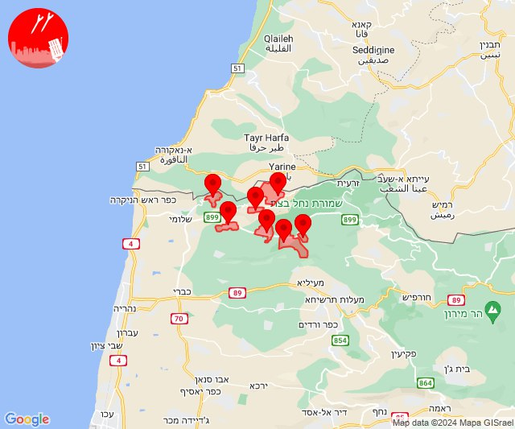
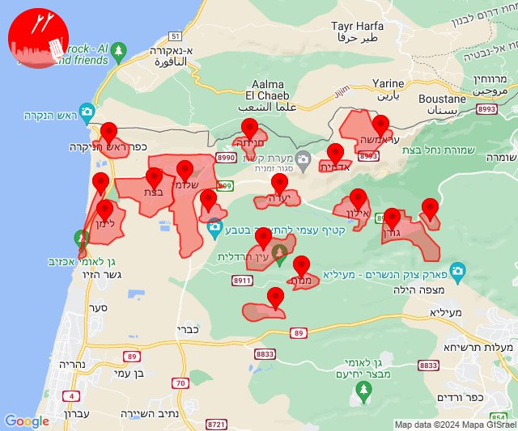
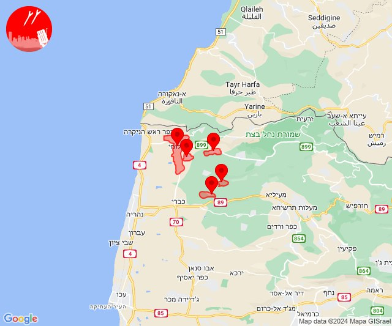
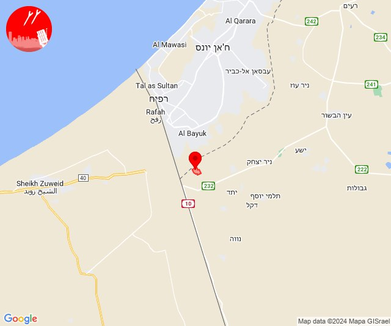
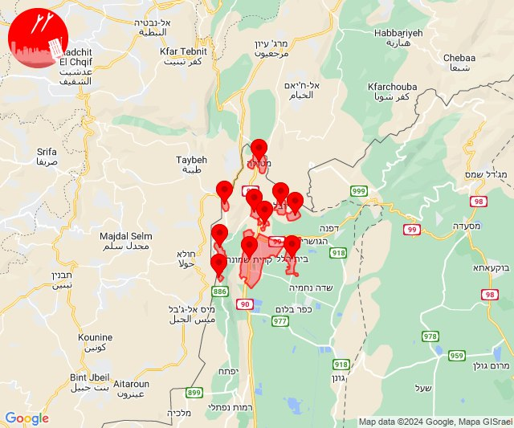
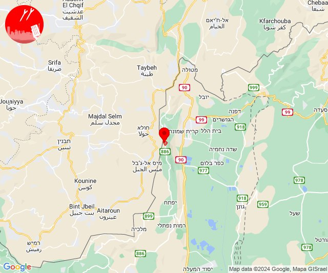
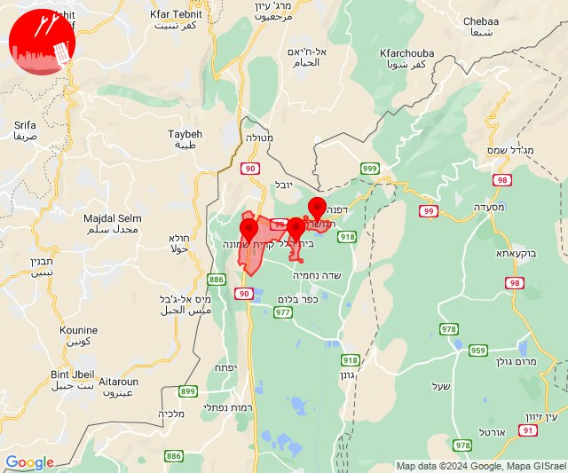
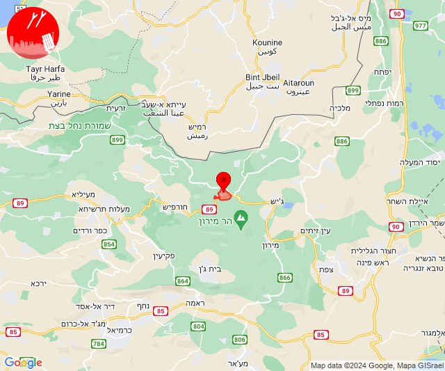

# Alerts for 2024-06-18

## 06:38

🔴 צבע אדום (18/06/2024):

09:38:
• עוטף עזה: כרם שלום (15 שניות)

צופר - צבע אדום

## 06:38

## 09:18

✈️ חדירת כלי טיס עוין (18/06/2024):

12:18:
• קו העימות: אדמית, אילון, גורן, גורנות הגליל, חניתה, יערה, ערב אל עראמשה 

צופר - צבע אדום

## 09:18

## 12:12

✈️ חדירת כלי טיס עוין (18/06/2024):

15:10:
• קו העימות: אדמית, אילון, גורן, גורנות הגליל, חניתה, יערה, ערב אל עראמשה, לימן, מצובה, אזור תעשייה אכזיב מילואות, שלומי, בצת, ראש הנקרה 

15:12:
• קו העימות: מנות, נווה זיו, עבדון 

צופר - צבע אדום

## 12:12

## 12:13

🔴 צבע אדום (18/06/2024):

15:11:
• קו העימות: מצובה, שלומי, יערה (מיידי)

15:12:
• קו העימות: מצובה, שלומי (מיידי)

15:13:
• קו העימות: מנות, נווה זיו, מצובה (מיידי)

צופר - צבע אדום

## 12:13

## 13:33

🔴 צבע אדום (18/06/2024):

16:33:
• עוטף עזה: כרם שלום (15 שניות)

צופר - צבע אדום

## 13:33

## 13:35

🔴 צבע אדום (18/06/2024):

16:35:
• עוטף עזה: כרם שלום (15 שניות)

צופר - צבע אדום

## 13:35

## 16:14

✈️ חדירת כלי טיס עוין (18/06/2024):

19:14:
• קו העימות: בית הלל, כפר גלעדי, כפר יובל, מטולה, מנרה, מעיין ברוך, מרגליות, משגב עם, קריית שמונה, תל חי 

צופר - צבע אדום

## 16:14

## 16:25

🔴 צבע אדום (18/06/2024):

19:25:
• קו העימות: מנרה (מיידי)

צופר - צבע אדום

## 16:25

## 16:32

🔴 צבע אדום (18/06/2024):

19:32:
• קו העימות: מנרה (מיידי)

צופר - צבע אדום

## 16:32

## 18:25

🔴 צבע אדום (18/06/2024):

21:25:
• קו העימות: בית הלל, קריית שמונה, הגושרים (מיידי)

צופר - צבע אדום

## 18:25

## 19:00

🔴 צבע אדום (18/06/2024):

22:00:
• קו העימות: סאסא (מיידי)

צופר - צבע אדום

## 19:00

