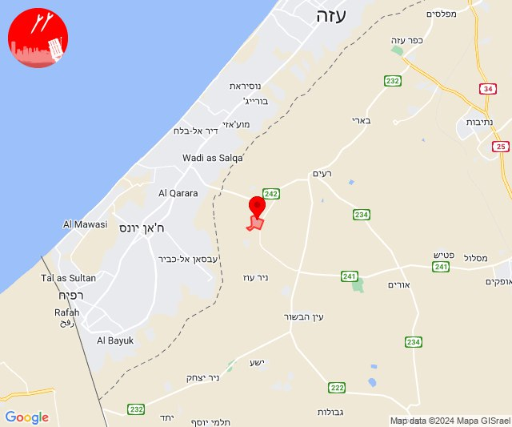
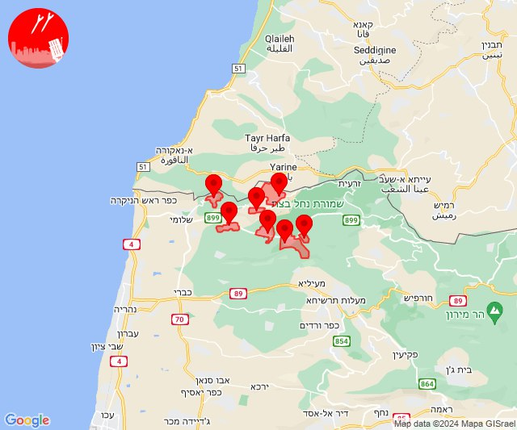
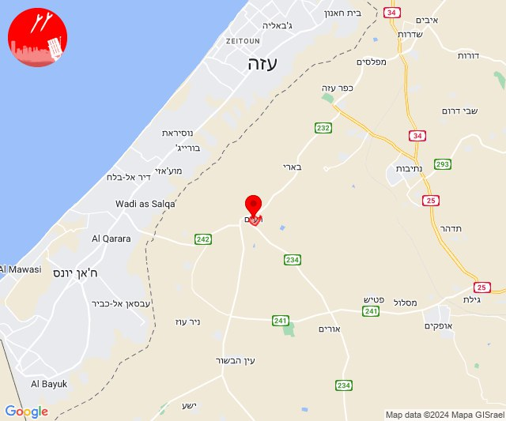
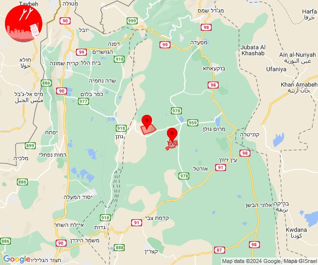

# Alerts for 2024-06-21

## 06:00

✈️ חדירת כלי טיס עוין (21/06/2024):

09:00:
• עוטף עזה: עין השלושה 

צופר - צבע אדום

## 06:00

## 10:43

✈️ חדירת כלי טיס עוין (21/06/2024):

13:43:
• קו העימות: אדמית, יערה, אילון, גורנות הגליל, גורן, חניתה, ערב אל עראמשה 

צופר - צבע אדום

## 10:43

## 11:02

🔴 צבע אדום (21/06/2024):

14:02:
• עוטף עזה: רעים (15 שניות)

צופר - צבע אדום

## 11:02

## 11:15

✈️ חדירת כלי טיס עוין (21/06/2024):

14:15:
• צפון הגולן: קלע, שעל 

צופר - צבע אדום

## 11:15

## 11:21

✈️ חדירת כלי טיס עוין (21/06/2024):

14:21:
• צפון הגולן: קלע, שעל 

צופר - צבע אדום

## 11:21

