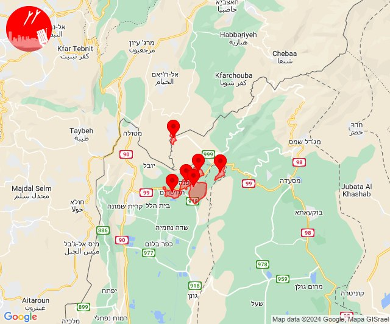
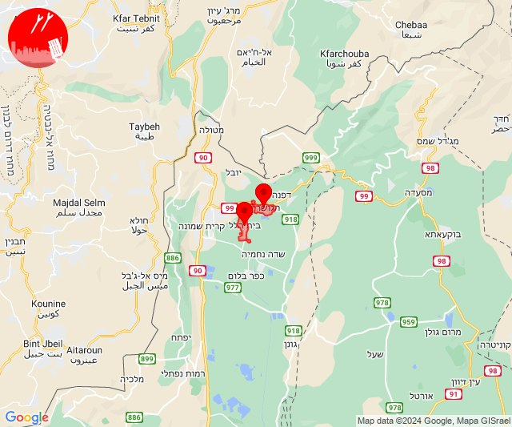
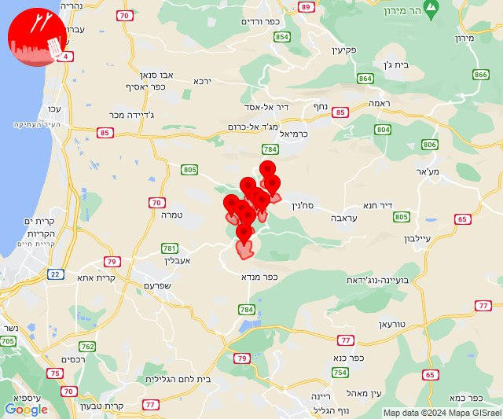
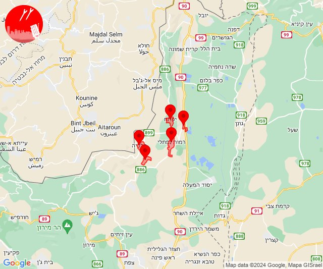
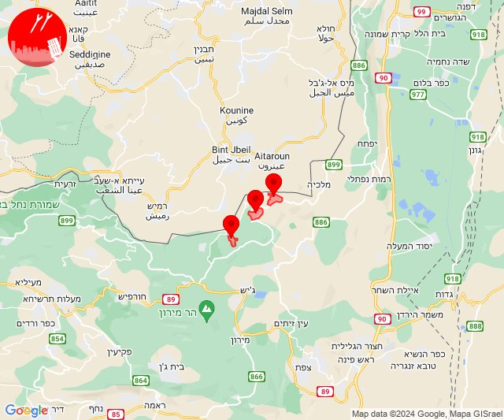
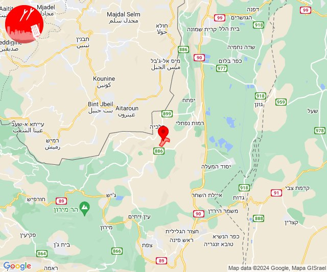
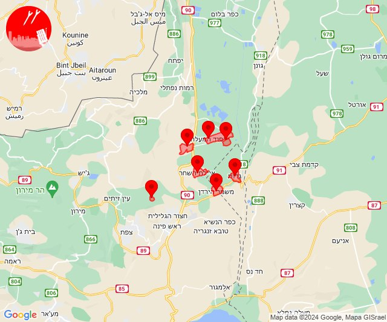
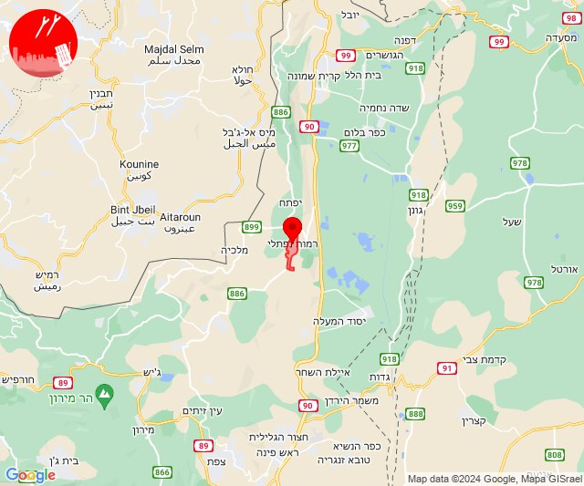
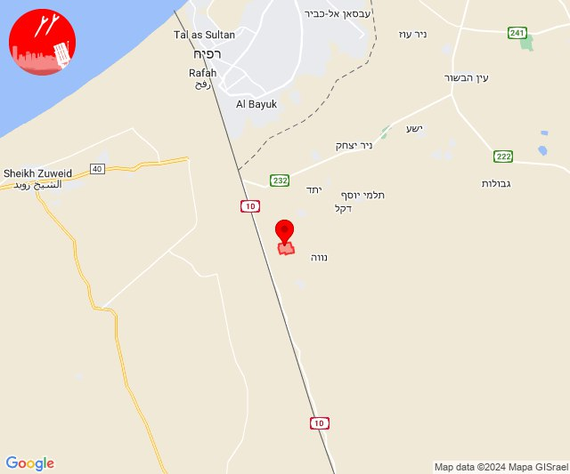

# Alerts for 2024-06-23

## 03:47

✈️ חדירת כלי טיס עוין (23/06/2024):

06:47:
• קו העימות: דפנה, הגושרים, ע'ג'ר, קיבוץ דן, שאר ישוב, שניר 

צופר - צבע אדום

## 03:47

## 03:50

🔴 צבע אדום (23/06/2024):

06:49:
• קו העימות: בית הלל (מיידי)

06:50:
• קו העימות: הגושרים (מיידי)

צופר - צבע אדום

## 03:50

## 08:25

🔴 צבע אדום (23/06/2024):

11:24:
• מרכז הגליל: כאוכב אבו אלהיג'א, קורנית, שכניה, מנוף (דקה)

11:25:
• מרכז הגליל: יובלים, מרכז אזורי משגב, עצמון - שגב, רקפת, אזור תעשייה תרדיון (דקה)

צופר - צבע אדום

## 08:25

## 09:05

✈️ חדירת כלי טיס עוין (23/06/2024):

12:05:
• קו העימות: דישון, יפתח, מלכיה, מרכז אזורי מבואות חרמון, רמות נפתלי 

צופר - צבע אדום

## 09:05

## 09:08

✈️ חדירת כלי טיס עוין (23/06/2024):

12:08:
• קו העימות: יראון, אביבים, ברעם 

צופר - צבע אדום

## 09:08

## 09:10

🔴 צבע אדום (23/06/2024):

12:09:
• קו העימות: דישון (מיידי)

12:10:
• קו העימות: דישון (מיידי)

צופר - צבע אדום

## 09:10

## 09:12

✈️ חדירת כלי טיס עוין (23/06/2024):

12:12:
• גליל עליון: איילת השחר, גדות, שדה אליעזר, משמר הירדן, חולתה, עמוקה, יסוד המעלה 

צופר - צבע אדום

## 09:12

## 11:17

🔴 צבע אדום (23/06/2024):

14:17:
• קו העימות: רמות נפתלי (מיידי)

צופר - צבע אדום

## 11:17

## 14:23

🔴 צבע אדום (23/06/2024):

17:23:
• עוטף עזה: שלומית (30 שניות)

צופר - צבע אדום

## 14:23

