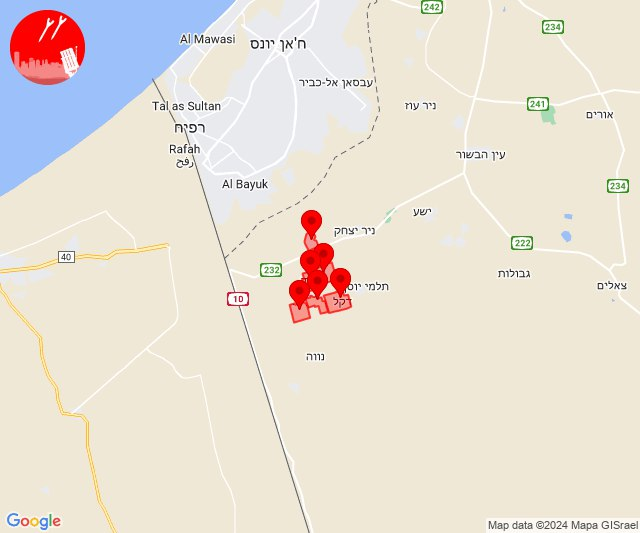
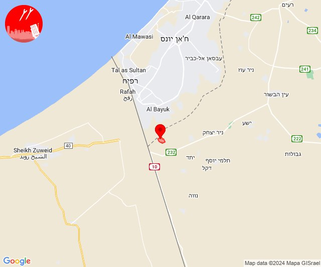
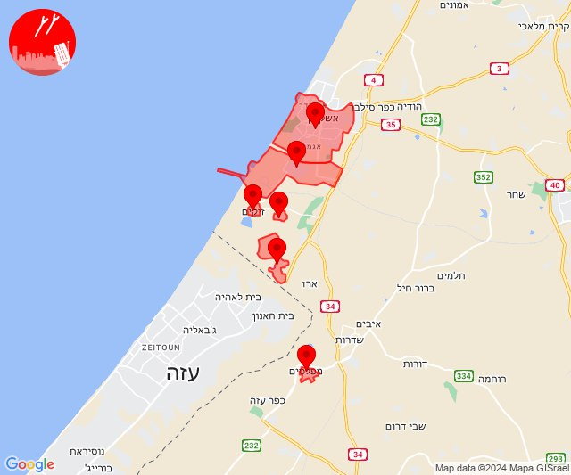
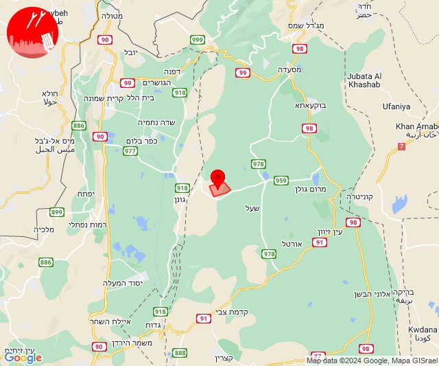
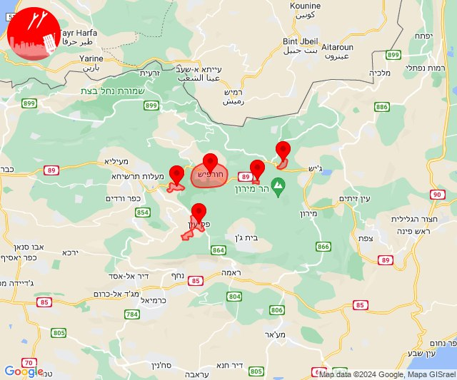

# Alerts for 2024-06-24

## 11:22

🔴 צבע אדום (24/06/2024):

14:21:
• עוטף עזה: חולית, יתד (15 שניות)

14:22:
• עוטף עזה: אבשלום, שדה אברהם, דקל, יבול (15 שניות)

צופר - צבע אדום

## 11:22

## 12:29

🔴 צבע אדום (24/06/2024):

15:29:
• עוטף עזה: כרם שלום (15 שניות)

צופר - צבע אדום

## 12:29

## 15:00

🔴 צבע אדום (24/06/2024):

17:59:
• מערב לכיש: אזור תעשייה הדרומי אשקלון, אשקלון - דרום (30 שניות)

18:00:
• עוטף עזה: מפלסים, זיקים, כרמיה, נתיב העשרה (15 שניות)

צופר - צבע אדום

## 15:00

## 15:17

✈️ חדירת כלי טיס עוין (24/06/2024):

18:17:
• צפון הגולן: קלע 

צופר - צבע אדום

## 15:17

## 15:53

🔴 צבע אדום (24/06/2024):

18:53:
• קו העימות: בית ספר שדה מירון, חורפיש, פקיעין, צבעון, צוריאל (מיידי, 15 שניות)

צופר - צבע אדום

## 15:53

## 16:27

🔴 צבע אדום (24/06/2024):

19:27:
• עוטף עזה: כרם שלום (15 שניות)

צופר - צבע אדום

## 16:27

