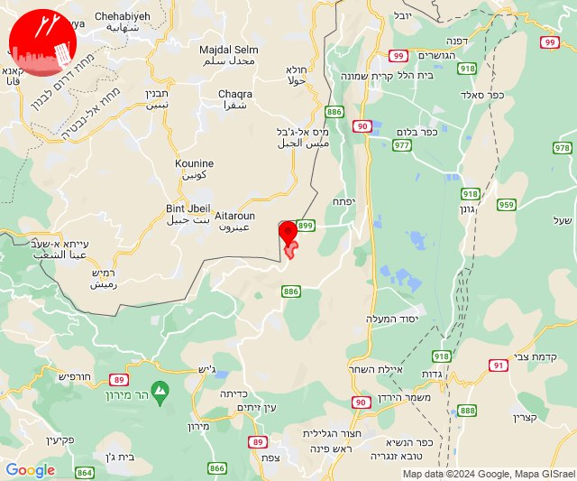
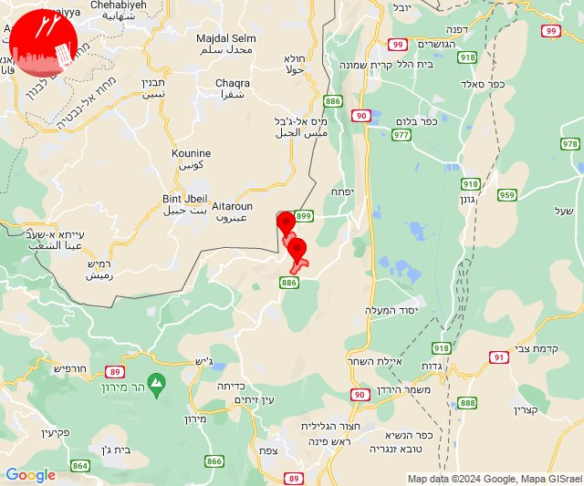
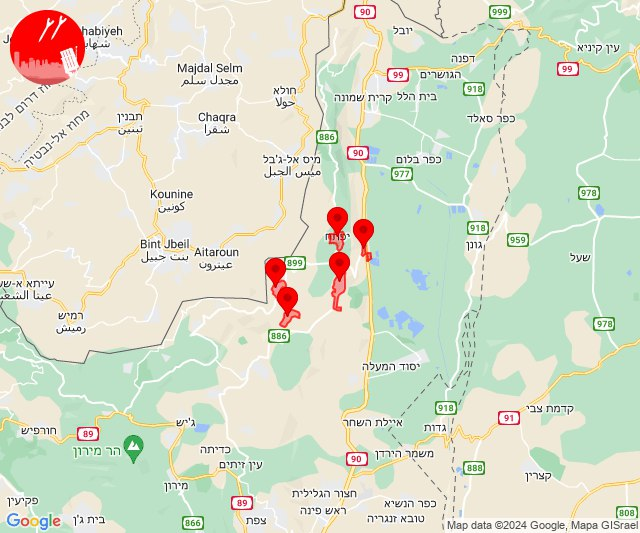
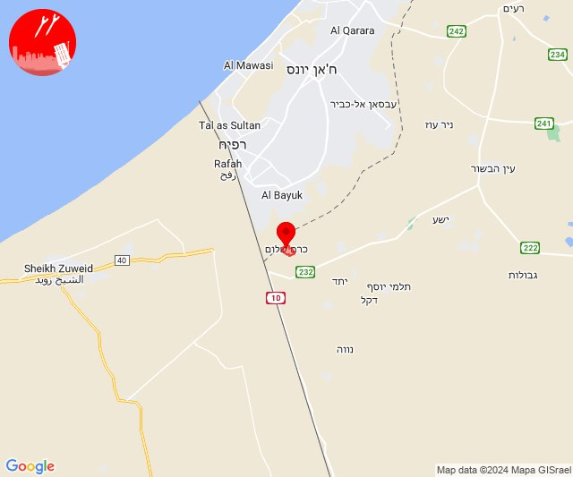
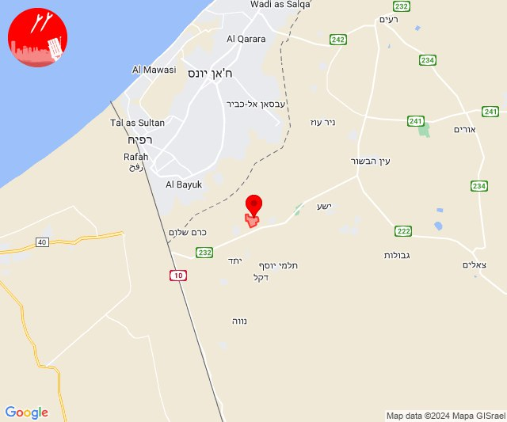
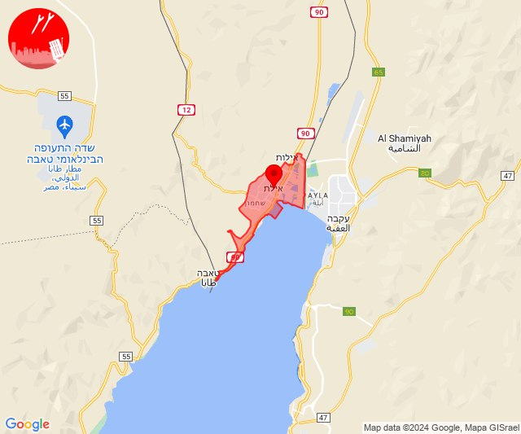

# Alerts for 2024-06-25

## 10:51

🔴 צבע אדום (25/06/2024):

13:51:
• עוטף עזה: כרם שלום (15 שניות)

צופר - צבע אדום

## 10:51

## 11:12

🔴 צבע אדום (25/06/2024):

14:12:
• קו העימות: מלכיה (מיידי)

צופר - צבע אדום

## 11:12

## 11:12

✈️ חדירת כלי טיס עוין (25/06/2024):

14:12:
• קו העימות: מלכיה, דישון, דישון 

צופר - צבע אדום

## 11:12

## 11:20

✈️ חדירת כלי טיס עוין (25/06/2024):

14:19:
• קו העימות: דישון, מלכיה, דישון, יפתח, מלכיה, מרכז אזורי מבואות חרמון, רמות נפתלי, רמות נפתלי 

14:20:
• קו העימות: רמות נפתלי 

צופר - צבע אדום

## 11:20

## 12:00

🔴 צבע אדום (25/06/2024):

15:00:
• עוטף עזה: כרם שלום (15 שניות)

צופר - צבע אדום

## 12:01

## 16:39

🔴 צבע אדום (25/06/2024):

19:39:
• עוטף עזה: סופה (15 שניות)

צופר - צבע אדום

## 16:39

## 23:21

✈️ חדירת כלי טיס עוין (26/06/2024):

02:21:
• אילת: אילת 

צופר - צבע אדום

## 23:21

