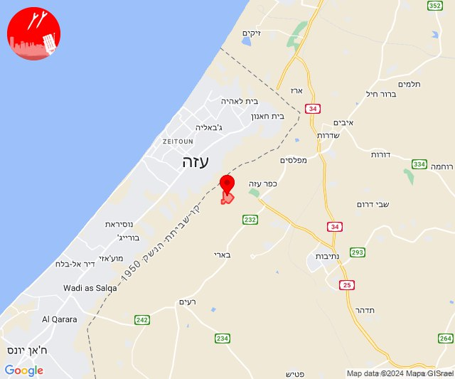
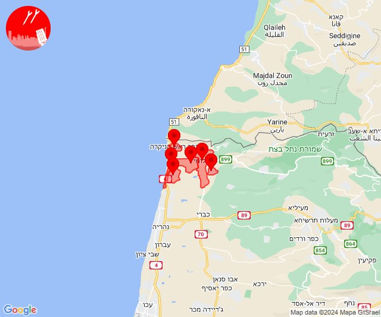
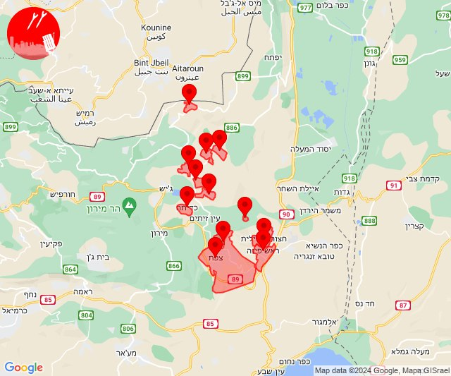
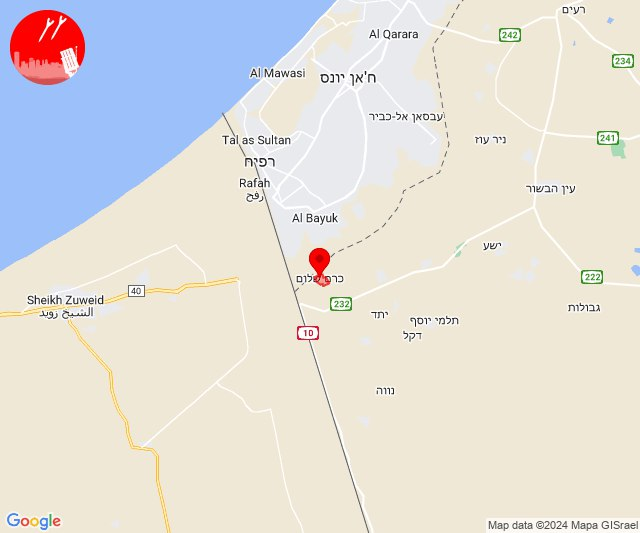

# Alerts for 2024-06-27

## 10:32

🔴 צבע אדום (27/06/2024):

13:32:
• עוטף עזה: נחל עוז (15 שניות)

צופר - צבע אדום

## 10:32

## 12:11

✈️ חדירת כלי טיס עוין (27/06/2024):

15:10:
• קו העימות: ראש הנקרה 

15:11:
• קו העימות: אזור תעשייה אכזיב מילואות, בצת, לימן, מצובה, ראש הנקרה, שלומי 

צופר - צבע אדום

## 12:11

## 16:45

🔴 צבע אדום (27/06/2024):

19:43:
• גליל עליון: ביריה, צפת, קדיתא, עמוקה (30 שניות)
• קו העימות: אזור תעשייה רמת דלתון, דלתון, כרם בן זמרה, עלמה, ריחאנייה (מיידי)

19:44:
• גליל עליון: חצור הגלילית, ראש פינה, ביריה, צפת, קדיתא, עמוקה, חצור הגלילית, ראש פינה, ביריה, צפת (30 שניות)
• קו העימות: אזור תעשייה רמת דלתון, דלתון, כרם בן זמרה, עלמה, ריחאנייה, אביבים (מיידי)

19:45:
• קו העימות: אזור תעשייה רמת דלתון, דלתון, כרם בן זמרה, עלמה, ריחאנייה (מיידי)

צופר - צבע אדום

## 16:45

## 18:00

🔴 צבע אדום (27/06/2024):

21:00:
• עוטף עזה: כרם שלום (15 שניות)

צופר - צבע אדום

## 18:00

