# Alerts for 2024-06-28

## 06:26

🔴 צבע אדום (28/06/2024):

09:26:
• קו העימות: זרעית, ערב אל עראמשה, שומרה (מיידי)

צופר - צבע אדום

## 06:26

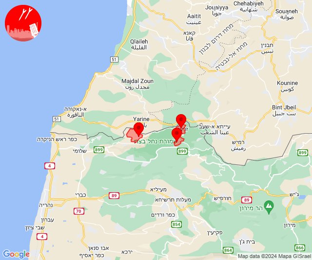

## 06:34

🔴 צבע אדום (28/06/2024):

09:34:
• קו העימות: זרעית, ערב אל עראמשה, שומרה (מיידי)

צופר - צבע אדום

## 06:34

## 11:21

🔴 צבע אדום (28/06/2024):

14:21:
• קו העימות: כפר בלום, עמיר (מיידי, 15 שניות)

צופר - צבע אדום

## 11:21

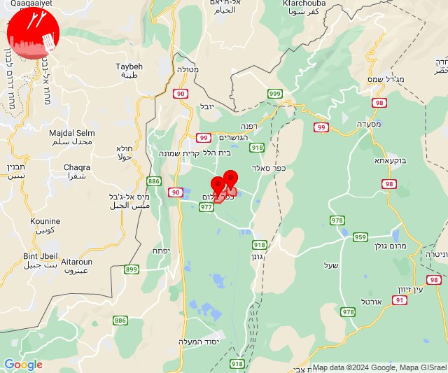

## 14:52

✈️ חדירת כלי טיס עוין (28/06/2024):

17:52:
• קו העימות: מלכיה, דישון 

צופר - צבע אדום

## 14:52

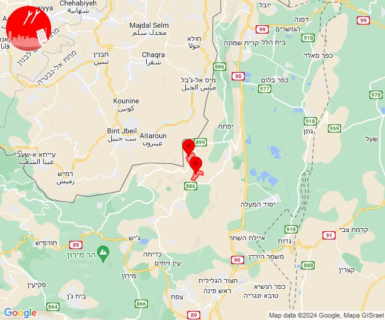

## 15:59

🔴 צבע אדום (28/06/2024):

18:59:
• עוטף עזה: מטווח ניר עם, שדרות, איבים, ניר עם (15 שניות)

צופר - צבע אדום

## 15:59

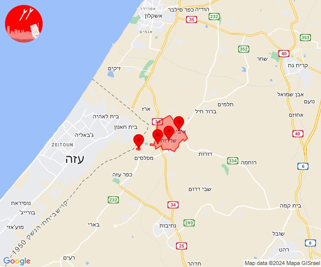

## 16:36

🔴 צבע אדום (28/06/2024):

19:36:
• קו העימות: בצת, שלומי (מיידי)

צופר - צבע אדום

## 16:36

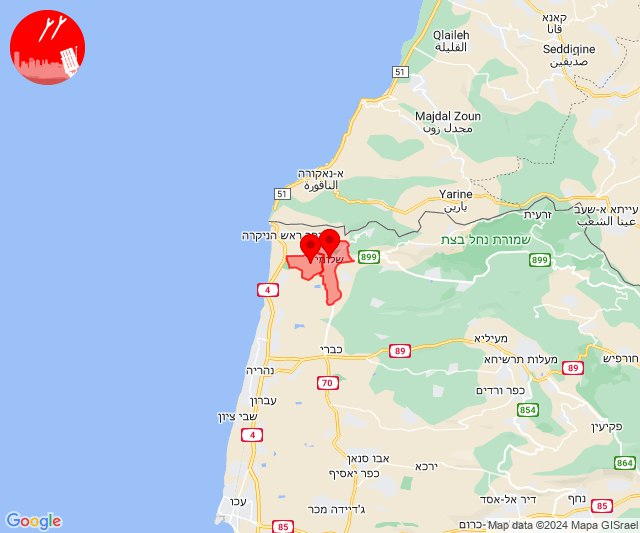

## 16:36

✈️ חדירת כלי טיס עוין (28/06/2024):

19:36:
• קו העימות: אזור תעשייה אכזיב מילואות, לימן, גשר הזיו, נהריה, סער, עברון, בן עמי 
• גליל עליון: מזרעה 

צופר - צבע אדום

## 16:37

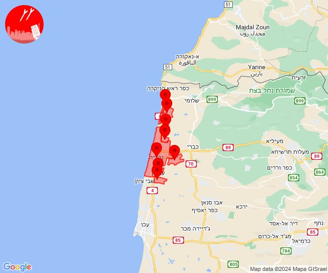

## 16:40

🔴 צבע אדום (28/06/2024):

19:40:
• קו העימות: אדמית (מיידי)

צופר - צבע אדום

## 16:40

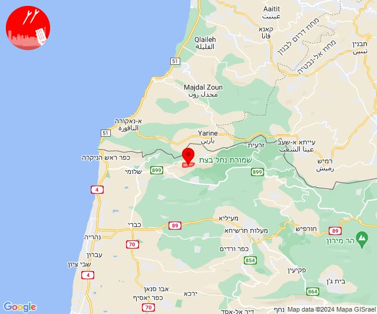

## 16:48

🔴 צבע אדום (28/06/2024):

19:48:
• קו העימות: כברי (מיידי)

צופר - צבע אדום

## 16:48

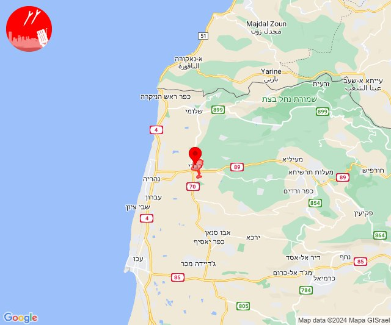

## 16:49

✈️ חדירת כלי טיס עוין (28/06/2024):

19:42:
• קו העימות: חניתה 

19:43:
• קו העימות: חניתה, שלומי 

19:44:
• קו העימות: געתון, שלומי, בצת, שלומי 

19:45:
• קו העימות: מצובה, בצת, שלומי, מצובה 

19:46:
• קו העימות: בצת, שלומי, עבדון, מצובה, שלומי, עבדון 

19:47:
• קו העימות: מצובה, נווה זיו, בצת, שלומי, עבדון, כברי, נווה זיו, שלומי 

19:48:
• קו העימות: נווה זיו, עין יעקב, כברי, געתון, יחיעם, נווה זיו 

19:49:
• גליל עליון: כליל, שייח' דנון, עמקה, אשרת, אבו סנאן 
• קו העימות: כברי, נווה זיו 

צופר - צבע אדום

## 16:49

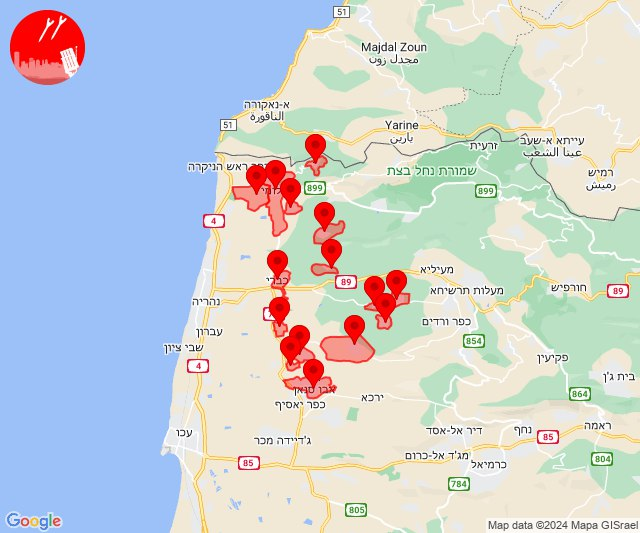

## 17:00

🔴 צבע אדום (28/06/2024):

20:00:
• קו העימות: בית הלל, קריית שמונה, הגושרים (מיידי)

צופר - צבע אדום

## 17:00

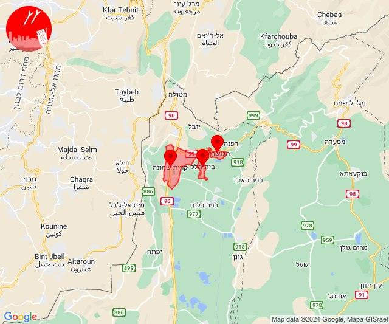

## 17:01

🔴 צבע אדום (28/06/2024):

20:01:
• קו העימות: בית הלל, קריית שמונה, הגושרים, מעיין ברוך (מיידי)

צופר - צבע אדום

## 17:01

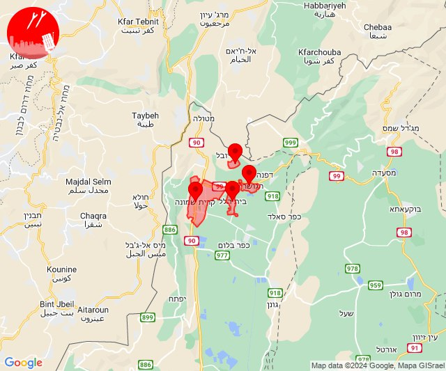

