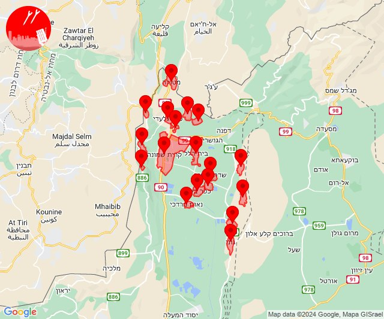
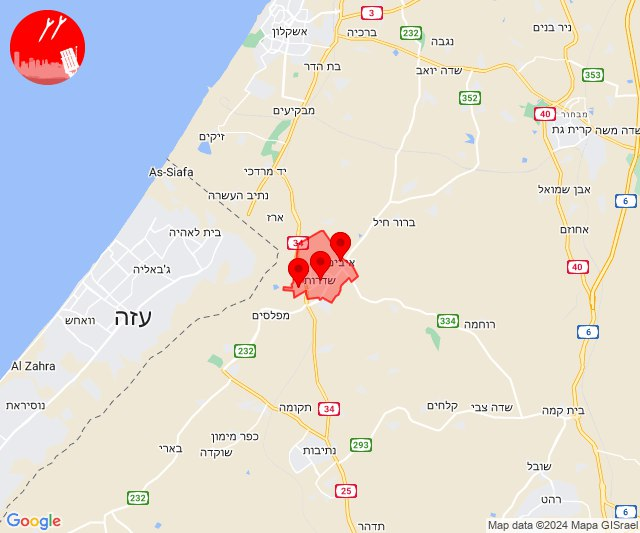
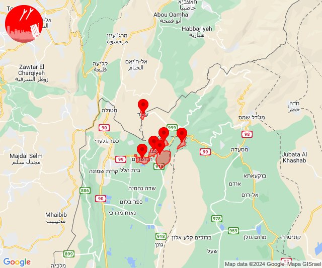
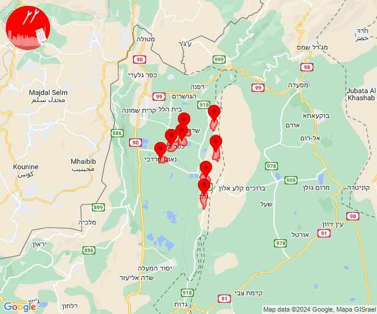
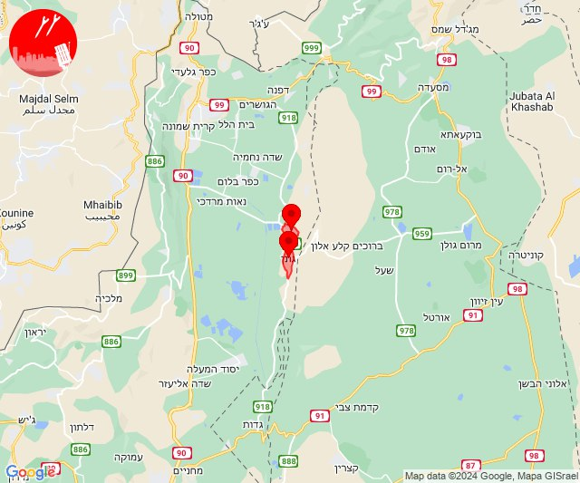
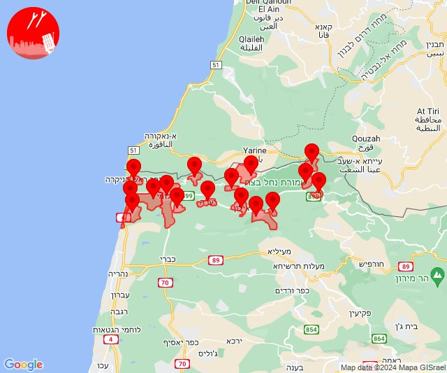

# Alerts for 2024-03-04

## 09:22

✈️ חדירת כלי טיס עוין (04/03/2024):

11:22:
• קו העימות: בית הלל, כפר גלעדי, כפר יובל, מטולה, מנרה, מעיין ברוך, מרגליות, משגב עם, קריית שמונה, תל חי, גונן, כפר בלום, כפר סאלד, להבות הבשן, נאות מרדכי, עמיר, שדה נחמיה, שמיר 

צופר - צבע אדום

## 09:22

## 14:51

🔴 צבע אדום (04/03/2024):

16:51:
• עוטף עזה: שדרות, איבים, ניר עם (15 שניות)

צופר - צבע אדום

## 14:51

## 14:51

✈️ חדירת כלי טיס עוין (04/03/2024):

16:51:
• קו העימות: דפנה, הגושרים, ע'ג'ר, קיבוץ דן, שאר ישוב, שניר 

צופר - צבע אדום

## 14:51

## 16:47

✈️ חדירת כלי טיס עוין (04/03/2024):

18:47:
• קו העימות: גונן, כפר בלום, כפר סאלד, להבות הבשן, נאות מרדכי, עמיר, שדה נחמיה, שמיר 

צופר - צבע אדום

## 16:47

## 16:48

🔴 צבע אדום (04/03/2024):

18:48:
• קו העימות: גונן, להבות הבשן (15 שניות)

צופר - צבע אדום

## 16:48

## 19:50

🔴 צבע אדום (04/03/2024):

21:50:
• קו העימות: בצת, שלומי, לימן, חניתה, אזור תעשייה אכזיב מילואות, מצובה, אבן מנחם, אדמית, אזור תעשייה אכזיב מילואות, אילון, בצת, גורן, גורנות הגליל, זרעית, חניתה, יערה, לימן, ערב אל עראמשה, ראש הנקרה, שומרה, שלומי, חניתה (מיידי)

צופר - צבע אדום

## 19:50

