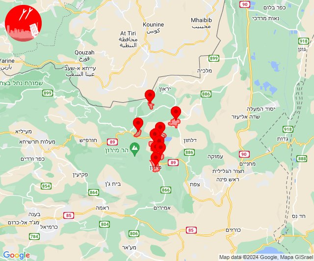
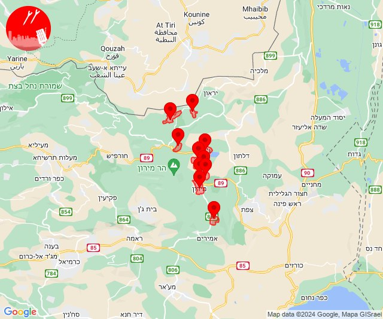
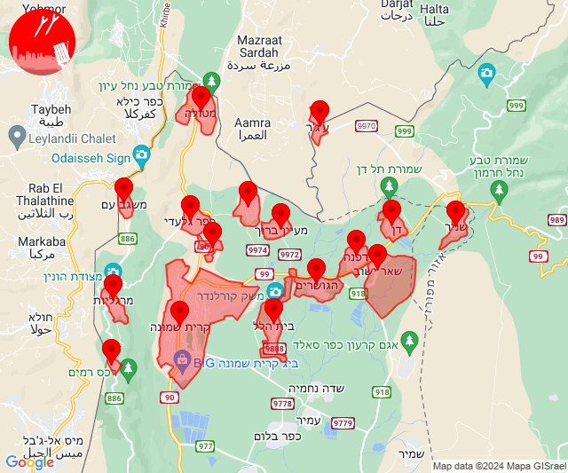
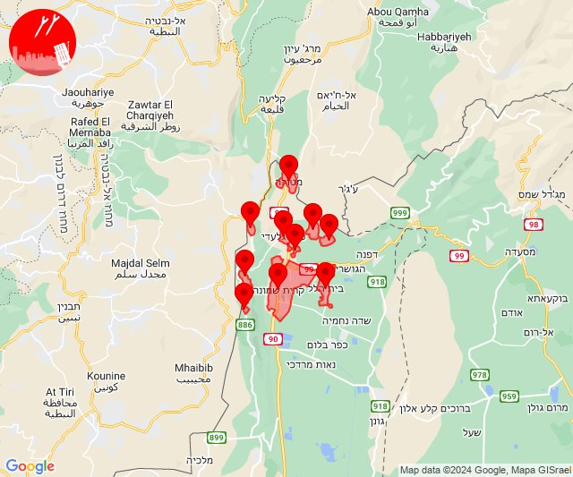
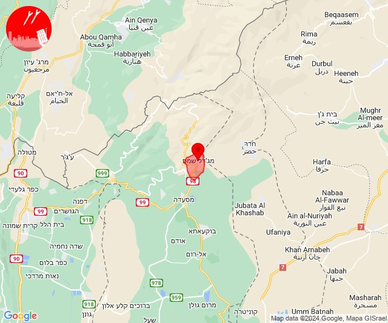

# Alerts for 2024-03-10

## 07:13

🔴 צבע אדום (10/03/2024):

09:12:
• גליל עליון: מירון, מרכז אזורי מרום גליל, ספסופה - כפר חושן (30 שניות)

09:13:
• גליל עליון: אור הגנוז, מירון, בר יוחאי, מרכז אזורי מרום גליל, ספסופה - כפר חושן (30 שניות)
• קו העימות: ברעם, ג'ש - גוש חלב, כרם בן זמרה, צבעון (מיידי)

צופר - צבע אדום

## 07:13

## 07:25

🔴 צבע אדום (10/03/2024):

09:24:
• גליל עליון: בר יוחאי, מירון, מרכז אזורי מרום גליל, כפר שמאי (30 שניות)
• קו העימות: ג'ש - גוש חלב, צבעון (מיידי)

09:25:
• קו העימות: ברעם, דוב''ב, ג'ש - גוש חלב, צבעון (מיידי)
• גליל עליון: ספסופה - כפר חושן, אור הגנוז, מירון (30 שניות)

צופר - צבע אדום

## 07:25

## 09:47

✈️ חדירת כלי טיס עוין (10/03/2024):

11:47:
• קו העימות: בית הלל, כפר גלעדי, כפר יובל, מטולה, מנרה, מעיין ברוך, מרגליות, משגב עם, קריית שמונה, תל חי, דפנה, הגושרים, ע'ג'ר, קיבוץ דן, שאר ישוב, שניר 

צופר - צבע אדום

## 09:47

## 09:55

✈️ חדירת כלי טיס עוין (10/03/2024):

11:55:
• קו העימות: בית הלל, כפר גלעדי, כפר יובל, מטולה, מנרה, מעיין ברוך, מרגליות, משגב עם, קריית שמונה, תל חי 

צופר - צבע אדום

## 09:55

## 14:40

🔴 צבע אדום (10/03/2024):

16:40:
• צפון הגולן: מג'דל שמס, מג'דל שמס (מיידי)

צופר - צבע אדום

## 14:40

