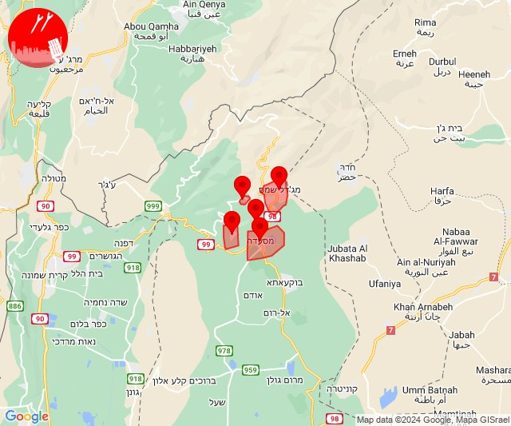

# Alerts for 2024-03-11

## 08:39

✈️ חדירת כלי טיס עוין (11/03/2024):

10:39:
• צפון הגולן: מג'דל שמס, מסעדה, נווה אטי''ב, נמרוד, עין קנייא 

צופר - צבע אדום

## 08:39

## 08:41

✈️ חדירת כלי טיס עוין (11/03/2024):

10:41:
• צפון הגולן: אודם, אל רום, בוקעתא 

צופר - צבע אדום

## 08:41

## 08:42

✈️ חדירת כלי טיס עוין (11/03/2024):

10:42:
• צפון הגולן: קלע, שעל 

צופר - צבע אדום

## 08:42

## 12:57

🔴 צבע אדום (11/03/2024):

14:57:
• קו העימות: שתולה (מיידי)

צופר - צבע אדום

## 12:57

## 14:00

🔴 צבע אדום (11/03/2024):

16:00:
• קו העימות: חוסן, מעלות תרשיחא, צוריאל, אלקוש, פסוטה, אילון, גורן, גורנות הגליל (15 שניות, מיידי)

צופר - צבע אדום

## 14:00

## 14:02

🔴 צבע אדום (11/03/2024):

16:02:
• אילת: אילת (30 שניות)
• קו העימות: כפר גלעדי, מנרה, מרגליות, משגב עם, קריית שמונה, תל חי (מיידי)

צופר - צבע אדום

## 14:02

