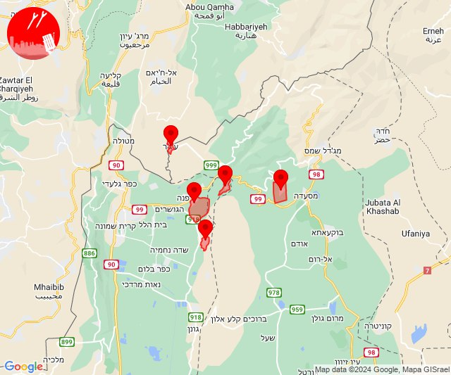
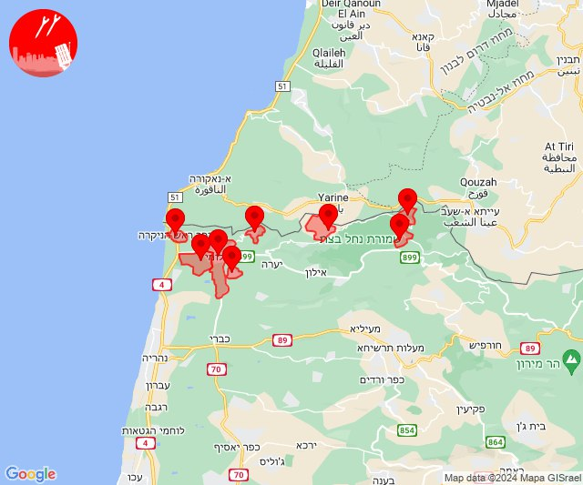
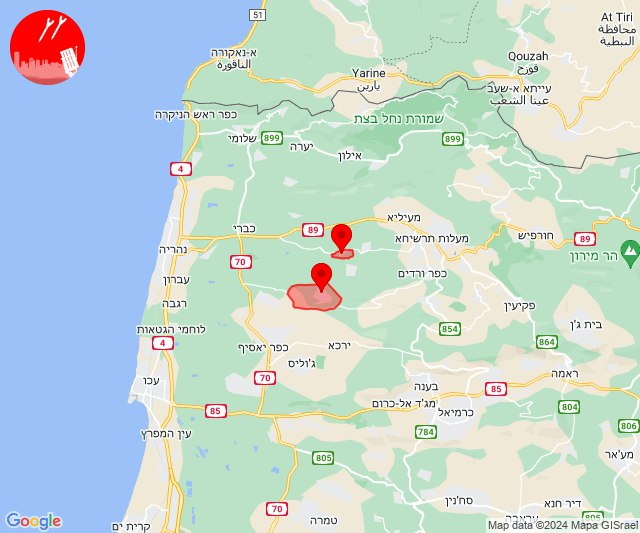
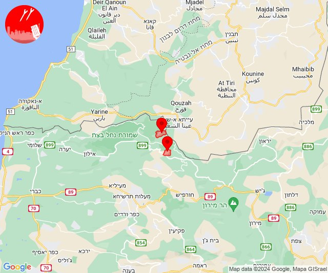
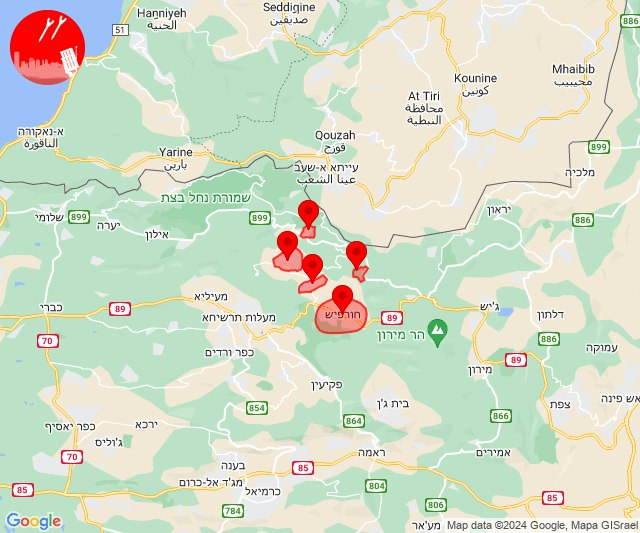

# Alerts for 2024-03-12

## 05:01

🔴 צבע אדום (12/03/2024):

07:00:
• קו העימות: שאר ישוב, שניר, כפר סאלד (מיידי, 15 שניות)
• צפון הגולן: עין קנייא (מיידי)

07:01:
• קו העימות: ע'ג'ר (מיידי)

צופר - צבע אדום

## 05:01

## 14:01

🔴 צבע אדום (12/03/2024):

16:00:
• קו העימות: ראש הנקרה (מיידי)

16:01:
• קו העימות: בצת, חניתה, מצובה, שלומי, זרעית, ערב אל עראמשה, שומרה (מיידי)

צופר - צבע אדום

## 14:01

## 14:16

🔴 צבע אדום (12/03/2024):

16:16:
• קו העימות: געתון (15 שניות)
• גליל עליון: כליל (30 שניות)

צופר - צבע אדום

## 14:16

## 14:51

🔴 צבע אדום (12/03/2024):

16:51:
• קו העימות: שתולה, נטועה (מיידי)

צופר - צבע אדום

## 14:51

## 14:55

🔴 צבע אדום (12/03/2024):

16:55:
• קו העימות: נטועה, אלקוש, מתת, פסוטה, חורפיש (מיידי)

צופר - צבע אדום

## 14:55

