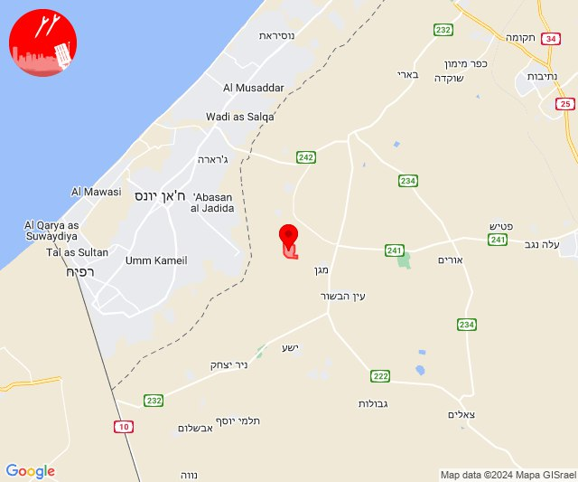
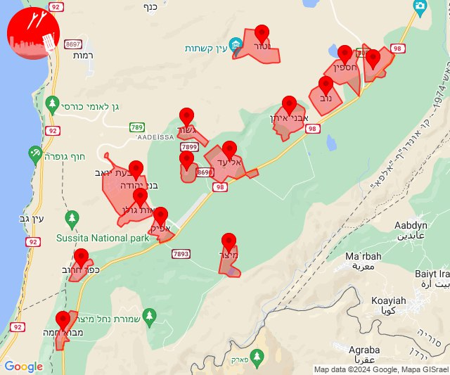
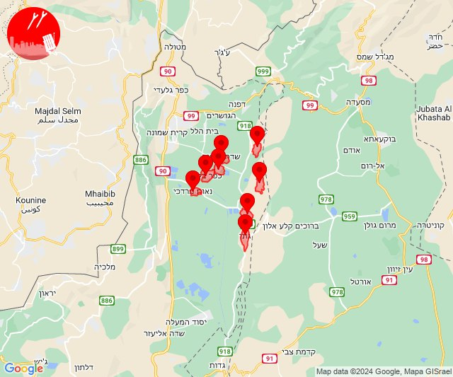
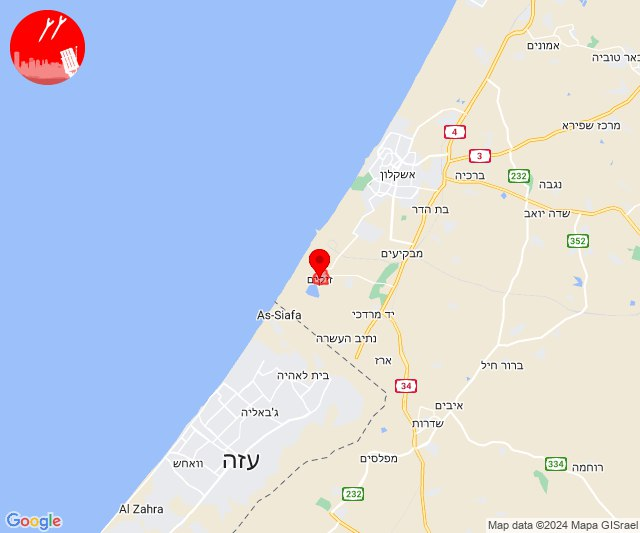
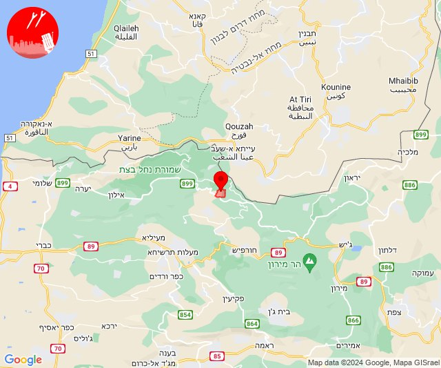

# Alerts for 2024-03-24

## 00:41

🔴 צבע אדום (24/03/2024):

02:41:
• עוטף עזה: ניר עוז (15 שניות)

צופר - צבע אדום

## 00:41

## 07:31

✈️ חדירת כלי טיס עוין (24/03/2024):

09:31:
• דרום הגולן: אבני איתן, אלי עד, אפיק, בני יהודה וגבעת יואב, גשור, חספין, כפר חרוב, מבוא חמה, מיצר, נאות גולן, נוב, נטור, רמת מגשימים, אזור תעשייה בני יהודה 

צופר - צבע אדום

## 07:31

## 09:09

✈️ חדירת כלי טיס עוין (24/03/2024):

11:09:
• קו העימות: גונן, כפר בלום, כפר סאלד, להבות הבשן, נאות מרדכי, עמיר, שדה נחמיה, שמיר 

צופר - צבע אדום

## 09:09

## 11:11

🔴 צבע אדום (24/03/2024):

13:11:
• עוטף עזה: זיקים (15 שניות)

צופר - צבע אדום

## 11:11

## 21:11

🔴 צבע אדום (24/03/2024):

23:11:
• קו העימות: נטועה (מיידי)

צופר - צבע אדום

## 21:11

