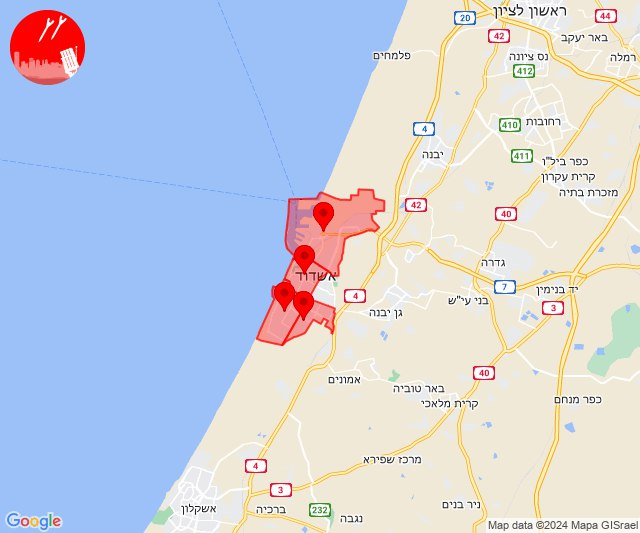
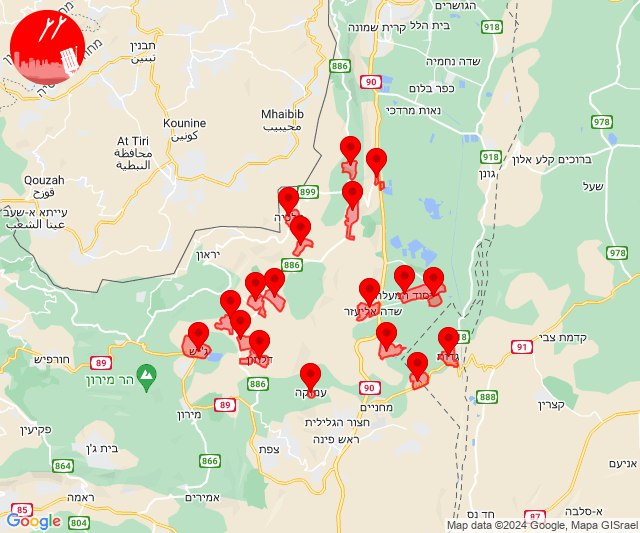
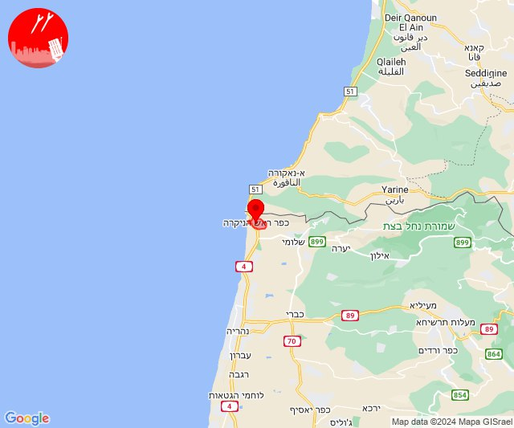
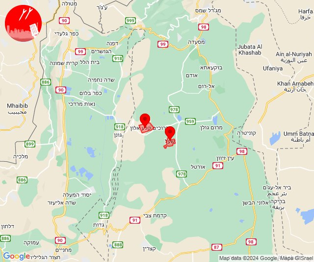
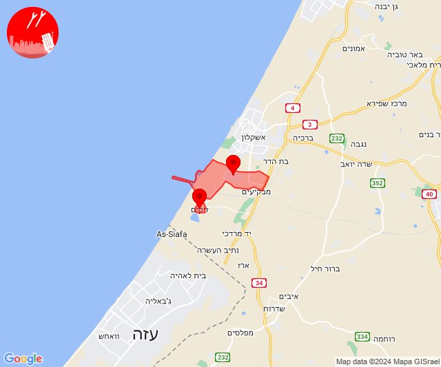
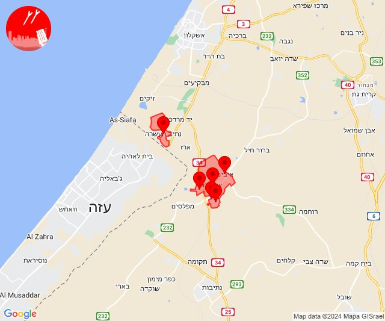
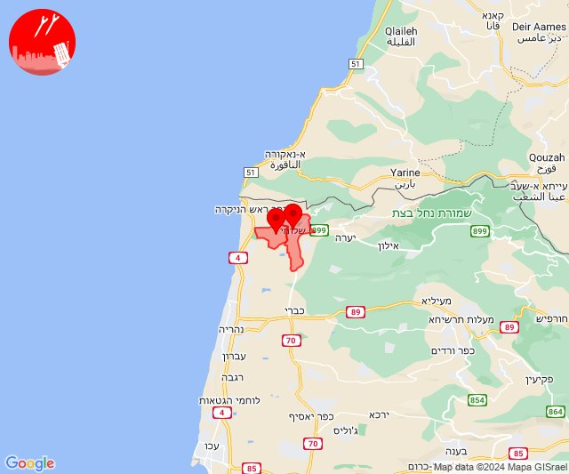

# Alerts for 2024-03-25

## 12:00

🔴 צבע אדום (25/03/2024):

14:00:
• לכיש: אשדוד - ח,ט,י,יג,יד,טז, אשדוד - א,ב,ד,ה, אשדוד - יא,יב,טו,יז,מרינה,סיטי, אשדוד - אזור תעשייה צפוני ונמל (45 שניות)

צופר - צבע אדום

## 12:00

## 12:15

✈️ חדירת כלי טיס עוין (25/03/2024):

14:15:
• קו העימות: אזור תעשייה רמת דלתון, ג'ש - גוש חלב, דלתון, כרם בן זמרה, עלמה, ריחאנייה, דישון, יפתח, מלכיה, מרכז אזורי מבואות חרמון, רמות נפתלי 
• גליל עליון: איילת השחר, גדות, חולתה, יסוד המעלה, משמר הירדן, עמוקה, שדה אליעזר 

צופר - צבע אדום

## 12:15

## 13:02

🔴 צבע אדום (25/03/2024):

15:02:
• קו העימות: ראש הנקרה (מיידי)

צופר - צבע אדום

## 13:02

## 13:19

✈️ חדירת כלי טיס עוין (25/03/2024):

15:19:
• צפון הגולן: קלע, שעל 

צופר - צבע אדום

## 13:19

## 19:02

🔴 צבע אדום (25/03/2024):

21:02:
• מערב לכיש: אזור תעשייה הדרומי אשקלון (30 שניות)
• עוטף עזה: זיקים (15 שניות)

צופר - צבע אדום

## 19:02

## 21:58

🔴 צבע אדום (25/03/2024):

23:58:
• עוטף עזה: שדרות, איבים, ניר עם, נתיב העשרה, גבים, מכללת ספיר (15 שניות)

צופר - צבע אדום

## 21:59

## 22:50

🔴 צבע אדום (26/03/2024):

00:50:
• קו העימות: בצת, שלומי (מיידי)

צופר - צבע אדום

## 22:50

