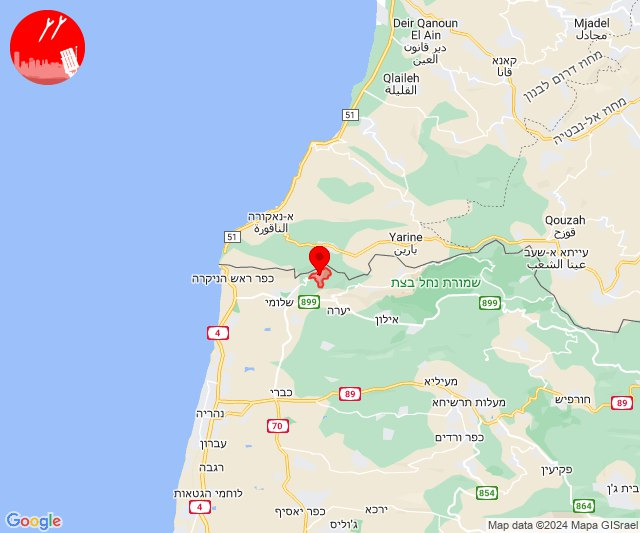
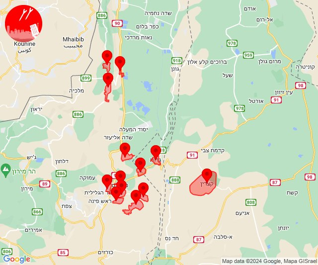

# Alerts for 2024-03-26

## 11:51

🔴 צבע אדום (26/03/2024):

13:51:
• קו העימות: חניתה (מיידי)

צופר - צבע אדום

## 11:51

## 12:48

🔴 צבע אדום (26/03/2024):

14:48:
• קו העימות: חניתה (מיידי)

צופר - צבע אדום

## 12:48

## 14:20

🔴 צבע אדום (26/03/2024):

16:18:
• דרום הגולן: קצרין (30 שניות)
• קו העימות: יפתח, מרכז אזורי מבואות חרמון, רמות נפתלי (מיידי)

16:19:
• גליל עליון: כפר הנשיא, גדות, טובא זנגריה, אזור תעשייה חצור הגלילית, מחניים, איילת השחר, משמר הירדן, מנחת מחניים, כפר הנשיא (30 שניות)

16:20:
• גליל עליון: אזור תעשייה צ.ח.ר (30 שניות)

צופר - צבע אדום

## 14:20

