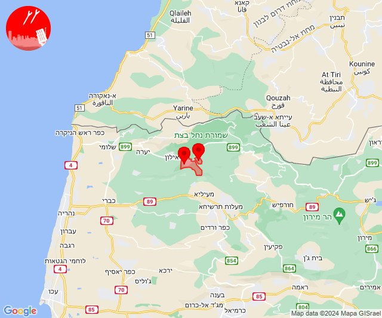
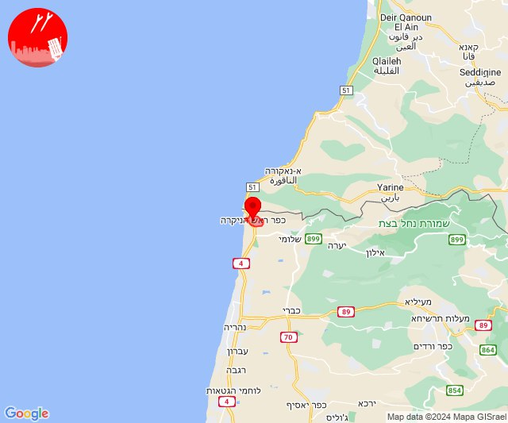
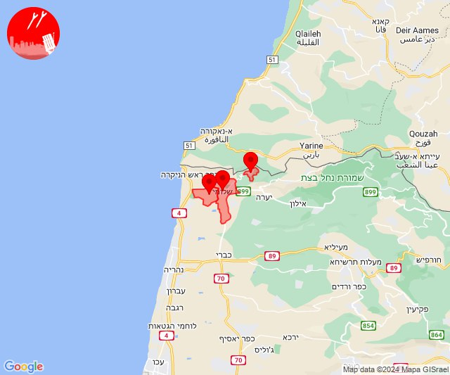
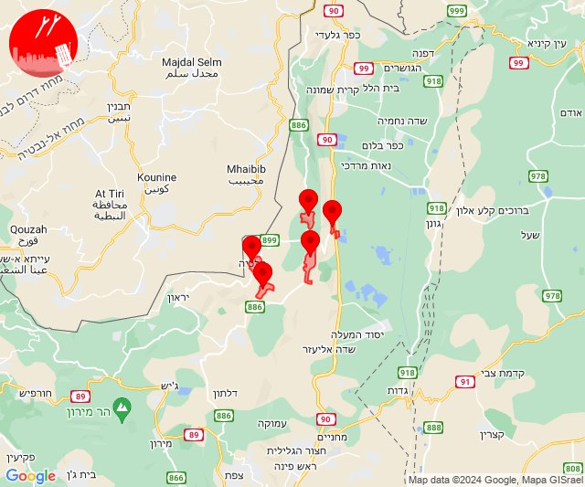
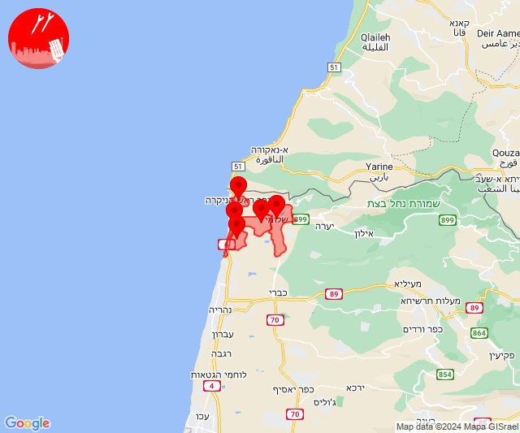
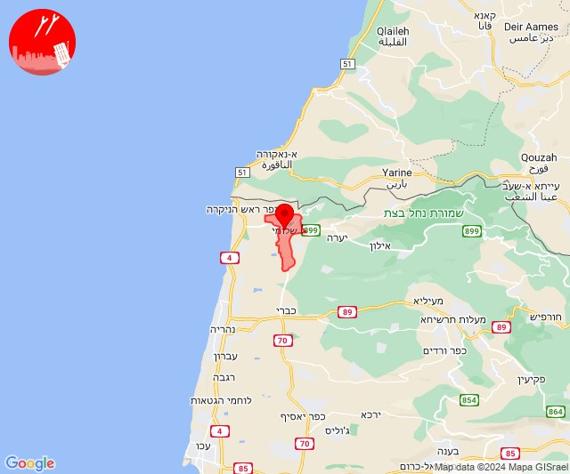
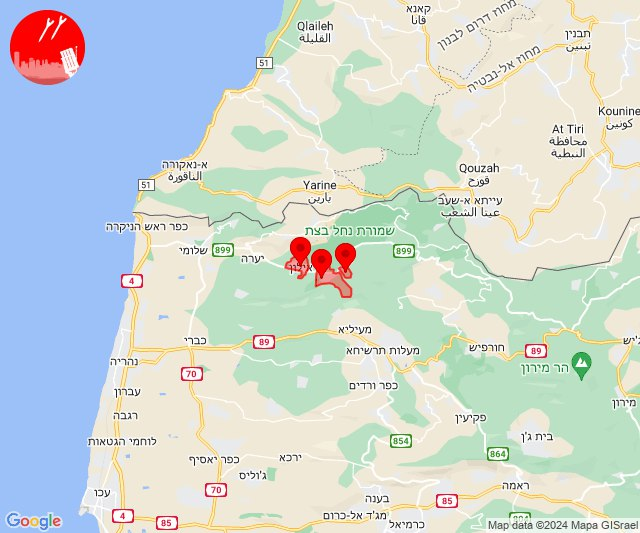

# Alerts for 2024-03-28

## 04:54

🔴 צבע אדום (28/03/2024):

06:54:
• קו העימות: גורן, גורנות הגליל (מיידי)

צופר - צבע אדום

## 04:54

## 05:55

🔴 צבע אדום (28/03/2024):

07:55:
• קו העימות: ראש הנקרה (מיידי)

צופר - צבע אדום

## 05:55

## 06:00

🔴 צבע אדום (28/03/2024):

08:00:
• קו העימות: גורן, גורנות הגליל (מיידי)

צופר - צבע אדום

## 06:00

## 08:01

🔴 צבע אדום (28/03/2024):

10:00:
• קו העימות: בצת, שלומי, חניתה, שלומי (מיידי)

10:01:
• קו העימות: חניתה (מיידי)

צופר - צבע אדום

## 08:01

## 08:31

✈️ חדירת כלי טיס עוין (28/03/2024):

10:31:
• קו העימות: דישון, יפתח, מלכיה, מרכז אזורי מבואות חרמון, רמות נפתלי 

צופר - צבע אדום

## 08:31

## 12:03

🔴 צבע אדום (28/03/2024):

14:03:
• קו העימות: אזור תעשייה אכזיב מילואות, בצת, לימן, ראש הנקרה, שלומי (מיידי)

צופר - צבע אדום

## 12:03

## 15:48

🔴 צבע אדום (28/03/2024):

17:48:
• קו העימות: שלומי (מיידי)

צופר - צבע אדום

## 15:48

## 15:54

🔴 צבע אדום (28/03/2024):

17:54:
• קו העימות: שלומי (מיידי)

צופר - צבע אדום

## 15:54

## 16:02

🔴 צבע אדום (28/03/2024):

18:01:
• קו העימות: גורן (מיידי)

18:02:
• קו העימות: אילון, גורנות הגליל (מיידי)

צופר - צבע אדום

## 16:02

