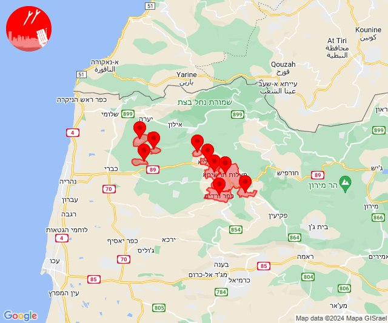
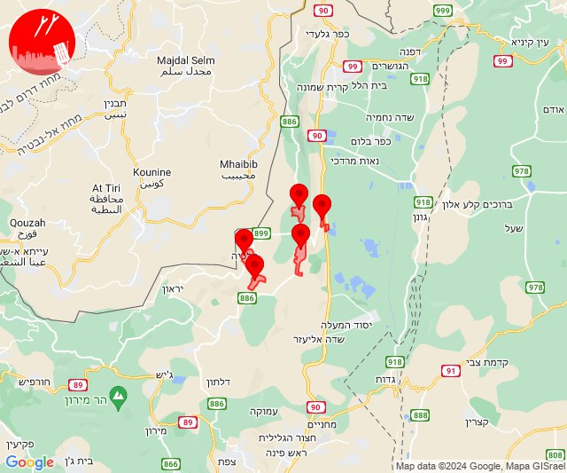
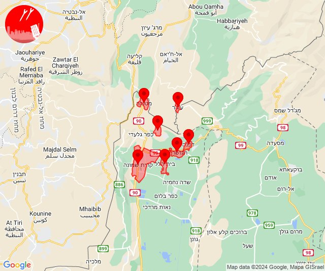

# Alerts for 2024-03-30

## 13:33

✈️ חדירת כלי טיס עוין (30/03/2024):

16:33:
• קו העימות: הילה, חוסן, כפר ורדים, מעונה, מעיליא, מעלות תרשיחא, מנות, נווה זיו, עבדון 

צופר - צבע אדום

## 13:33

## 13:48

✈️ חדירת כלי טיס עוין (30/03/2024):

16:48:
• קו העימות: יפתח, מרכז אזורי מבואות חרמון, רמות נפתלי, דישון, מלכיה 

צופר - צבע אדום

## 13:48

## 14:04

🔴 צבע אדום (30/03/2024):

17:03:
• קו העימות: מטולה (מיידי)

17:04:
• קו העימות: ע'ג'ר, כפר יובל, קריית שמונה, דפנה, הגושרים, בית הלל (מיידי)

צופר - צבע אדום

## 14:04

