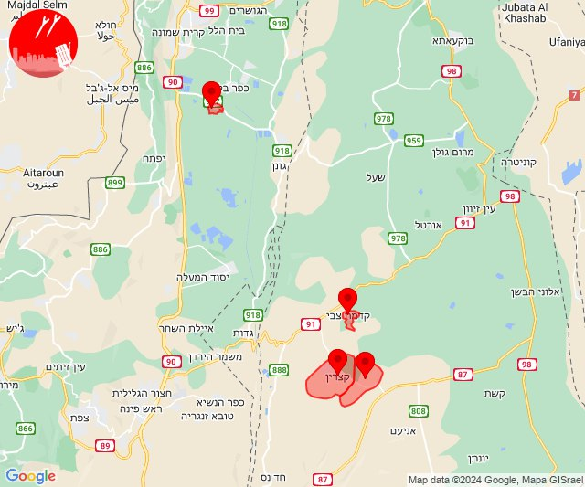
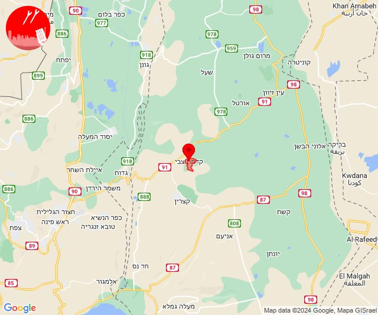
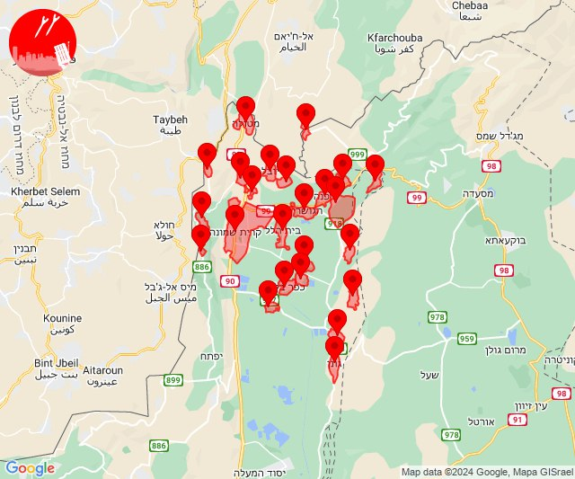
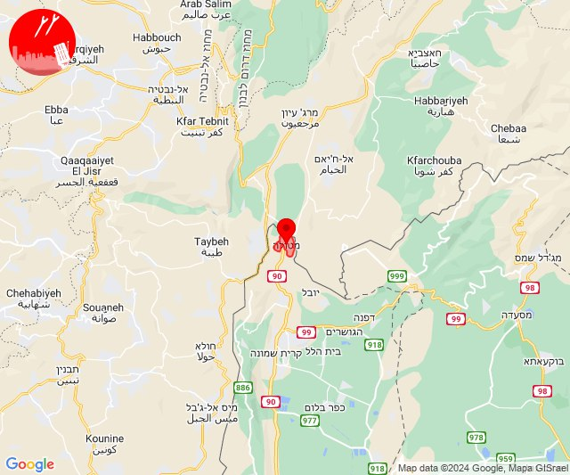
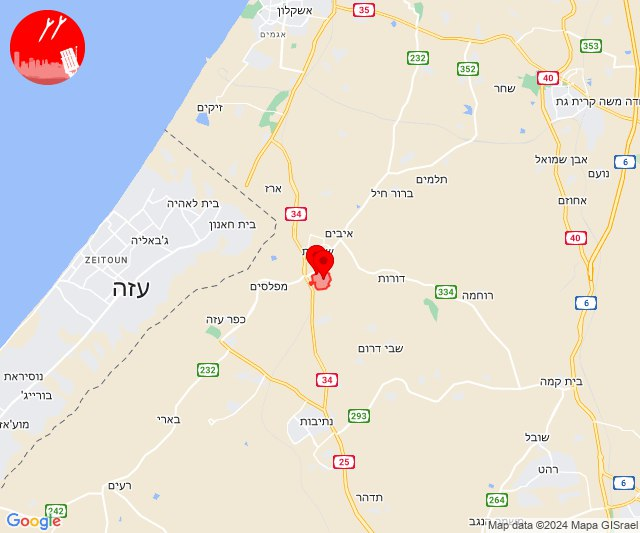
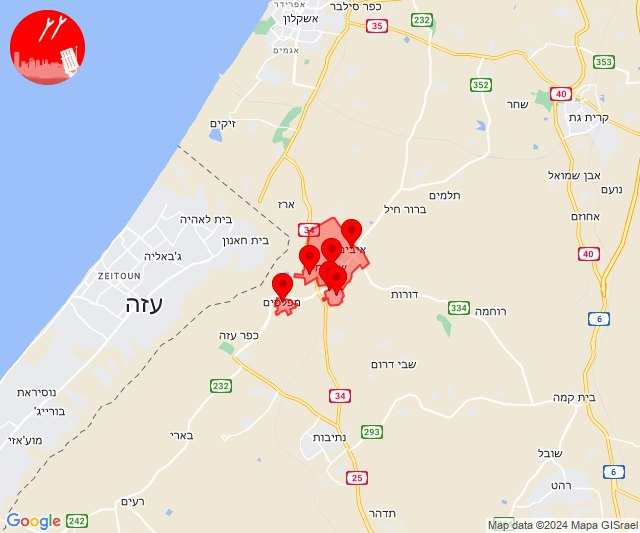

# Alerts for 2024-05-06

## 06:02

🔴 צבע אדום (06/05/2024):

09:01:
• דרום הגולן: קדמת צבי (15 שניות)
• קו העימות: נאות מרדכי (מיידי)

09:02:
• דרום הגולן: קדמת צבי, קצרין - אזור תעשייה, קצרין (15 שניות, 30 שניות)

צופר - צבע אדום

## 06:02

## 06:06

🔴 צבע אדום (06/05/2024):

09:06:
• דרום הגולן: קדמת צבי (15 שניות)

צופר - צבע אדום

## 06:06

## 08:28

✈️ חדירת כלי טיס עוין (06/05/2024):

11:27:
• קו העימות: בית הלל, כפר גלעדי, כפר יובל, מטולה, מנרה, מעיין ברוך, מרגליות, משגב עם, קריית שמונה, תל חי 

11:28:
• קו העימות: גונן, דפנה, הגושרים, כפר בלום, כפר סאלד, להבות הבשן, נאות מרדכי, ע'ג'ר, עמיר, קיבוץ דן, שאר ישוב, שדה נחמיה, שמיר, שניר 

צופר - צבע אדום

## 08:28

## 08:30

🔴 צבע אדום (06/05/2024):

11:30:
• קו העימות: מטולה (מיידי)

צופר - צבע אדום

## 08:30

## 09:10

✈️ חדירת כלי טיס עוין (06/05/2024):

12:09:
• קו העימות: בית הלל, כפר גלעדי, כפר יובל, מטולה, מנרה, מעיין ברוך, מרגליות, משגב עם, קריית שמונה, תל חי 

12:10:
• קו העימות: גונן, דפנה, הגושרים, כפר בלום, כפר סאלד, להבות הבשן, נאות מרדכי, ע'ג'ר, עמיר, קיבוץ דן, שאר ישוב, שדה נחמיה, שמיר, שניר 

צופר - צבע אדום

## 09:10

## 16:00

🔴 צבע אדום (06/05/2024):

19:00:
• עוטף עזה: גבים, מכללת ספיר (15 שניות)

צופר - צבע אדום

## 16:00

## 20:00

🔴 צבע אדום (06/05/2024):

22:59:
• עוטף עזה: שדרות, איבים, ניר עם (15 שניות)

23:00:
• עוטף עזה: מפלסים, גבים, מכללת ספיר (15 שניות)

צופר - צבע אדום

## 20:00

