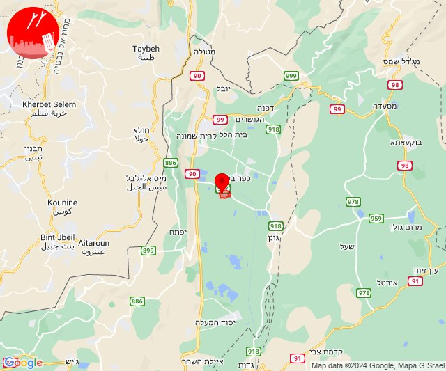

# Alerts for 2024-05-07

## 07:59

🔴 צבע אדום (07/05/2024):

10:59:
• עוטף עזה: כרם שלום (15 שניות)

צופר - צבע אדום

## 07:59

## 09:42

✈️ חדירת כלי טיס עוין (07/05/2024):

12:42:
• קו העימות: בית הלל, כפר גלעדי, כפר יובל, מטולה, מנרה, מעיין ברוך, מרגליות, משגב עם, קריית שמונה, תל חי, דישון, יפתח, מלכיה, מרכז אזורי מבואות חרמון, רמות נפתלי 

צופר - צבע אדום

## 09:42

## 10:10

✈️ חדירת כלי טיס עוין (07/05/2024):

13:10:
• קו העימות: יפתח, מלכיה, רמות נפתלי, דישון, מרכז אזורי מבואות חרמון 

צופר - צבע אדום

## 10:10

## 10:12

🔴 צבע אדום (07/05/2024):

13:12:
• קו העימות: נאות מרדכי (מיידי)

צופר - צבע אדום

## 10:12

## 10:12

✈️ חדירת כלי טיס עוין (07/05/2024):

13:12:
• קו העימות: בית הלל, כפר גלעדי, כפר יובל, מטולה, מנרה, מעיין ברוך, מרגליות, משגב עם, קריית שמונה, תל חי, גונן, כפר בלום, כפר סאלד, להבות הבשן, נאות מרדכי, עמיר, שדה נחמיה, שמיר 

צופר - צבע אדום

## 10:12

## 10:30

✈️ חדירת כלי טיס עוין (07/05/2024):

13:30:
• קו העימות: בית הלל, כפר גלעדי, כפר יובל, מטולה, מנרה, מעיין ברוך, מרגליות, משגב עם, קריית שמונה, תל חי, דישון, יפתח, מלכיה, מרכז אזורי מבואות חרמון, רמות נפתלי 

צופר - צבע אדום

## 10:30

## 10:33

✈️ חדירת כלי טיס עוין (07/05/2024):

13:33:
• קו העימות: מלכיה, רמות נפתלי, מרכז אזורי מבואות חרמון, יפתח, דישון 

צופר - צבע אדום

## 10:33

## 11:15

🔴 צבע אדום (07/05/2024):

14:14:
• קו העימות: הילה, מעיליא (מיידי)

14:15:
• קו העימות: גורן, גורנות הגליל (מיידי)

צופר - צבע אדום

## 11:15

## 12:05

✈️ חדירת כלי טיס עוין (07/05/2024):

15:05:
• קו העימות: דפנה, הגושרים, ע'ג'ר, קיבוץ דן, שאר ישוב, שניר 
• צפון הגולן: קלע, שעל 

צופר - צבע אדום

## 12:06

## 12:18

🔴 צבע אדום (07/05/2024):

15:18:
• עוטף עזה: אבשלום, יתד, דקל, חולית, שדה אברהם (15 שניות)

צופר - צבע אדום

## 12:18

## 14:57

🔴 צבע אדום (07/05/2024):

17:57:
• עוטף עזה: כיסופים, עין השלושה, רעים (15 שניות)

צופר - צבע אדום

## 14:57

## 20:05

🔴 צבע אדום (07/05/2024):

23:05:
• קו העימות: אביבים, יראון (מיידי)

צופר - צבע אדום

## 20:05

## 20:15

🔴 צבע אדום (07/05/2024):

23:15:
• קו העימות: כפר גלעדי, כפר יובל, מרגליות, משגב עם, קריית שמונה, תל חי (מיידי)

צופר - צבע אדום

## 20:15

