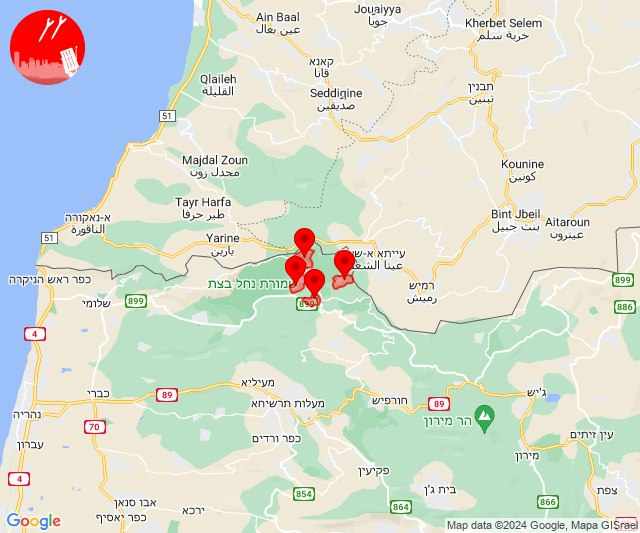
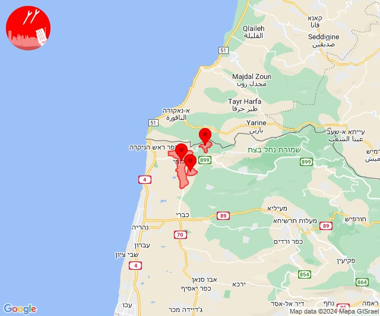
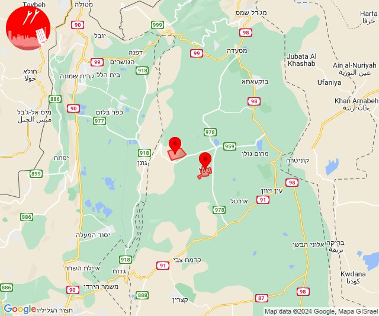
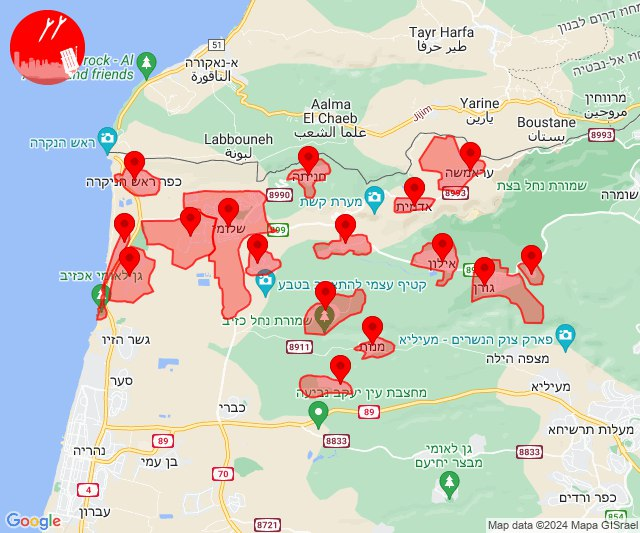
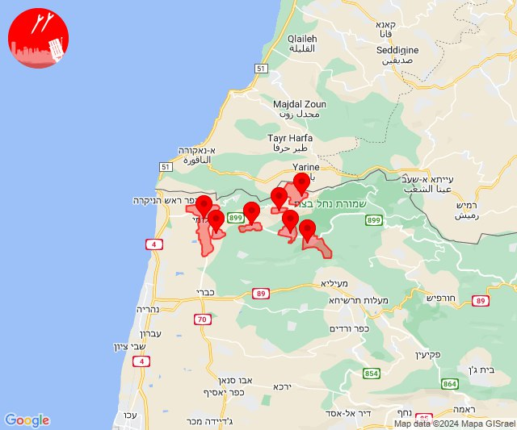
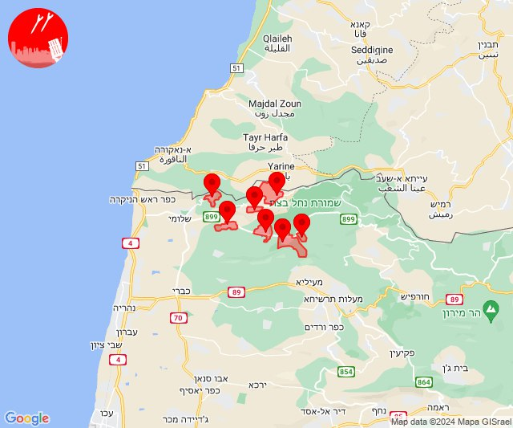
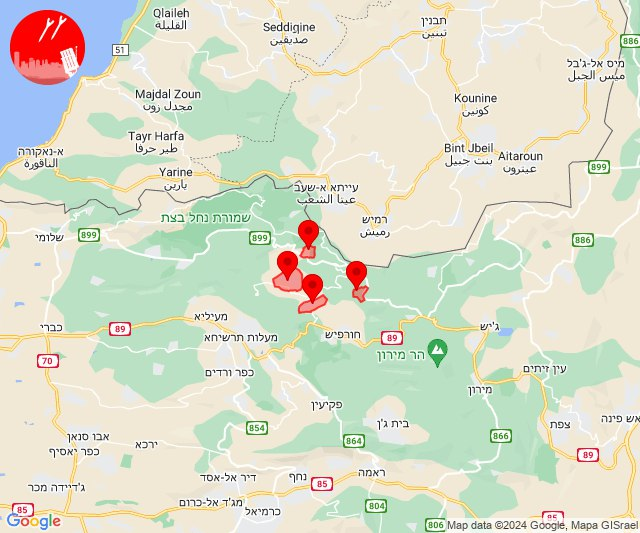
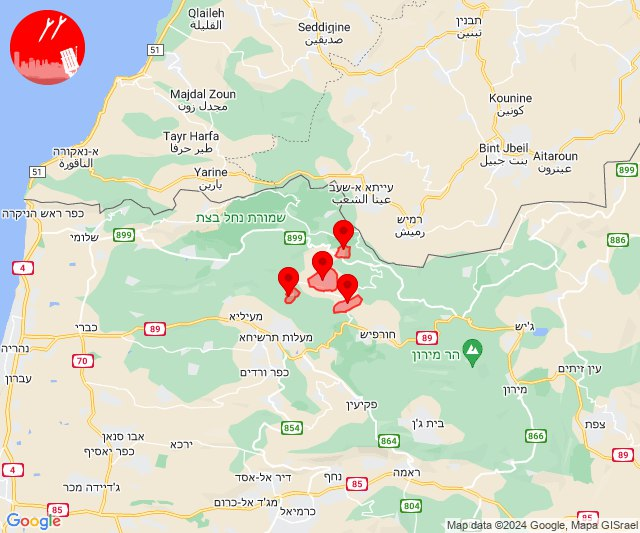
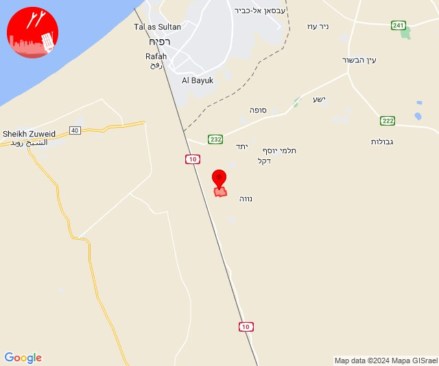
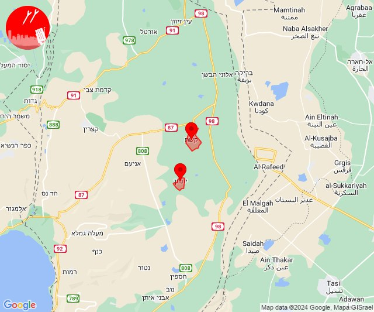

# Alerts for 2024-05-08

## 08:01

🔴 צבע אדום (08/05/2024):

11:01:
• קו העימות: אבן מנחם, זרעית, שומרה, שתולה (מיידי)

צופר - צבע אדום

## 08:01

## 08:36

🔴 צבע אדום (08/05/2024):

11:36:
• קו העימות: חניתה, מצובה, שלומי (מיידי)

צופר - צבע אדום

## 08:36

## 12:14

✈️ חדירת כלי טיס עוין (08/05/2024):

15:14:
• צפון הגולן: קלע, שעל 

צופר - צבע אדום

## 12:14

## 12:21

✈️ חדירת כלי טיס עוין (08/05/2024):

15:19:
• קו העימות: אדמית, אילון, גורן, גורנות הגליל, חניתה, יערה, ערב אל עראמשה 

15:20:
• קו העימות: מנות, נווה זיו, עבדון 

15:21:
• קו העימות: אזור תעשייה אכזיב מילואות, בצת, לימן, מצובה, ראש הנקרה, שלומי 

צופר - צבע אדום

## 12:21

## 12:21

🔴 צבע אדום (08/05/2024):

15:19:
• קו העימות: ערב אל עראמשה (מיידי)

15:20:
• קו העימות: אילון, גורן (מיידי)

15:21:
• קו העימות: מצובה, שלומי, יערה, אדמית (מיידי)

צופר - צבע אדום

## 12:21

## 12:23

✈️ חדירת כלי טיס עוין (08/05/2024):

15:23:
• קו העימות: גורנות הגליל, אילון, גורן, אדמית, חניתה, יערה, ערב אל עראמשה 

צופר - צבע אדום

## 12:23

## 13:15

🔴 צבע אדום (08/05/2024):

16:15:
• קו העימות: אלקוש, מתת, נטועה, פסוטה (מיידי)

צופר - צבע אדום

## 13:15

## 13:16

✈️ חדירת כלי טיס עוין (08/05/2024):

16:16:
• קו העימות: אבירים, אלקוש, נטועה, פסוטה 

צופר - צבע אדום

## 13:16

## 13:45

🔴 צבע אדום (08/05/2024):

16:45:
• עוטף עזה: שלומית (30 שניות)

צופר - צבע אדום

## 13:45

## 15:32

🔴 צבע אדום (08/05/2024):

18:32:
• עוטף עזה: כרם שלום (15 שניות)

צופר - צבע אדום

## 15:32

## 19:34

✈️ חדירת כלי טיס עוין (08/05/2024):

22:34:
• דרום הגולן: יונתן, קשת 

צופר - צבע אדום

## 19:34

