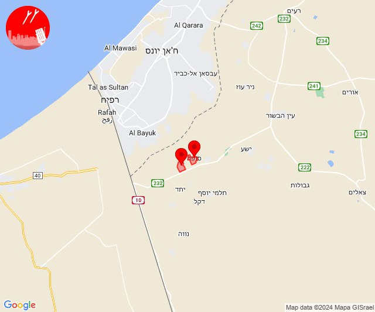
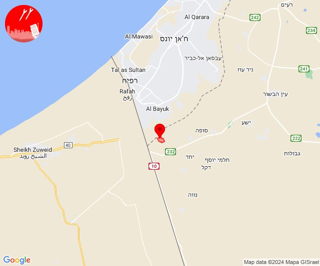
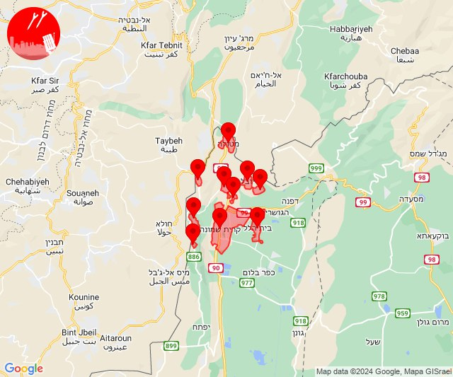
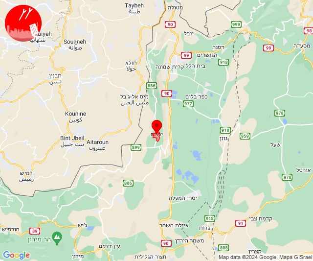
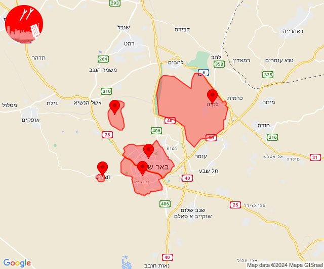
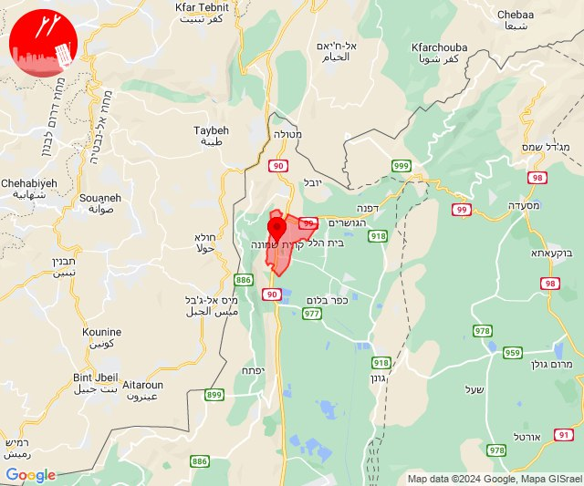
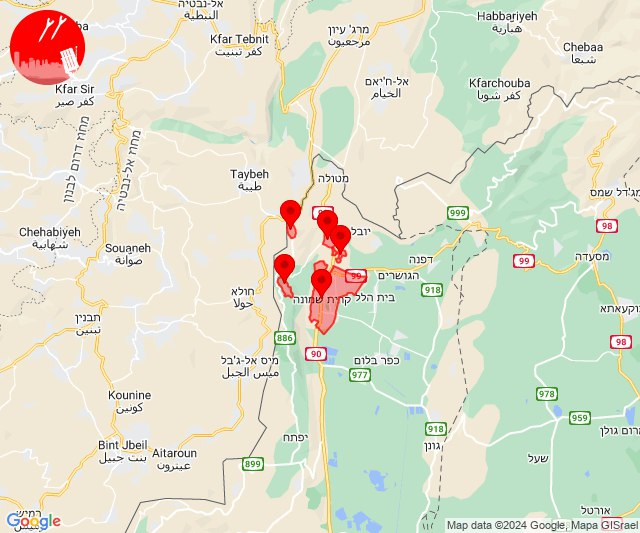
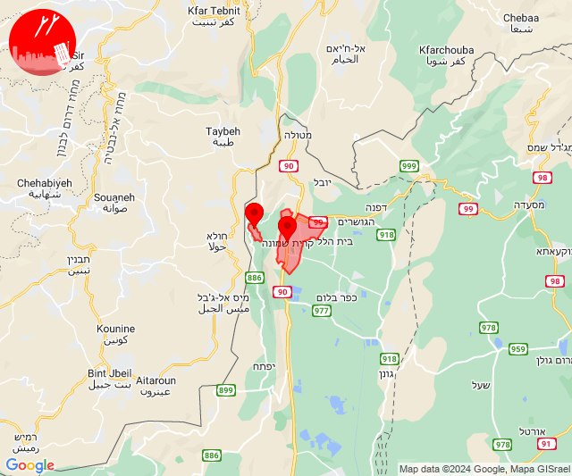
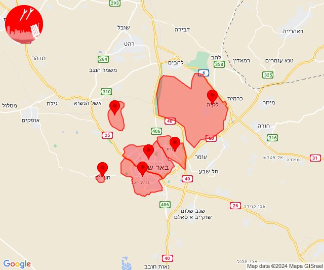

# Alerts for 2024-05-10

## 06:03

🔴 צבע אדום (10/05/2024):

09:03:
• עוטף עזה: סופה, חולית (15 שניות)

צופר - צבע אדום

## 06:03

## 06:48

🔴 צבע אדום (10/05/2024):

09:48:
• עוטף עזה: כרם שלום (15 שניות)

צופר - צבע אדום

## 06:48

## 06:57

🔴 צבע אדום (10/05/2024):

09:57:
• עוטף עזה: כרם שלום (15 שניות)

צופר - צבע אדום

## 06:57

## 11:20

✈️ חדירת כלי טיס עוין (10/05/2024):

14:20:
• קו העימות: בית הלל, כפר גלעדי, כפר יובל, מטולה, מנרה, מעיין ברוך, מרגליות, משגב עם, קריית שמונה, תל חי 

צופר - צבע אדום

## 11:20

## 14:30

🔴 צבע אדום (10/05/2024):

17:30:
• קו העימות: יפתח (מיידי)

צופר - צבע אדום

## 14:30

## 14:33

🔴 צבע אדום (10/05/2024):

17:33:
• מרכז הנגב: חצרים, באר שבע - דרום, באר שבע - מערב, אתר דודאים, לקיה והפזורה (דקה, 45 שניות)

צופר - צבע אדום

## 14:33

## 14:40

🔴 צבע אדום (10/05/2024):

17:40:
• קו העימות: קריית שמונה (מיידי)

צופר - צבע אדום

## 14:40

## 14:46

🔴 צבע אדום (10/05/2024):

17:45:
• קו העימות: קריית שמונה (מיידי)

17:46:
• קו העימות: משגב עם, כפר גלעדי, תל חי, קריית שמונה, מרגליות (מיידי)

צופר - צבע אדום

## 14:46

## 15:30

🔴 צבע אדום (10/05/2024):

18:30:
• קו העימות: קריית שמונה, מרגליות (מיידי)

צופר - צבע אדום

## 15:30

## 16:16

🔴 צבע אדום (10/05/2024):

19:15:
• מרכז הנגב: באר שבע - דרום, באר שבע - מערב, חצרים, באר שבע - צפון (דקה)

19:16:
• מרכז הנגב: לקיה והפזורה, אתר דודאים (דקה, 45 שניות)

צופר - צבע אדום

## 16:16

