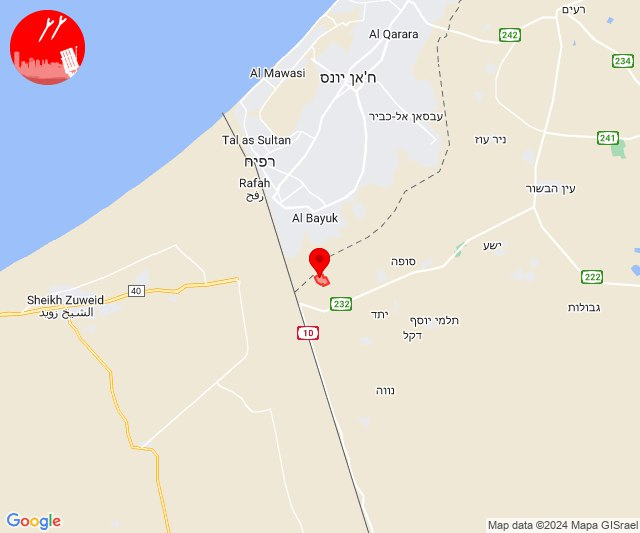
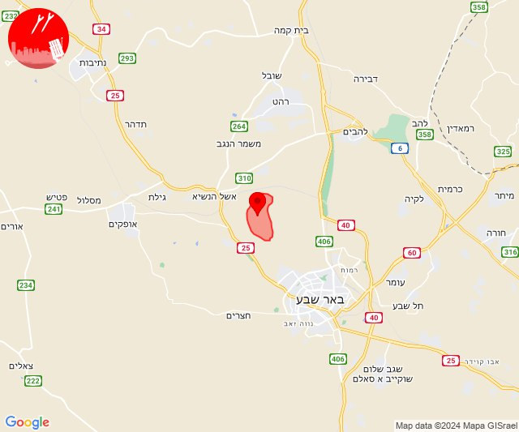
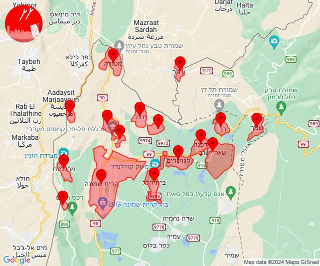
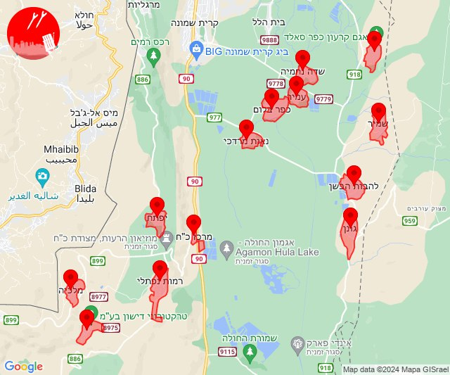
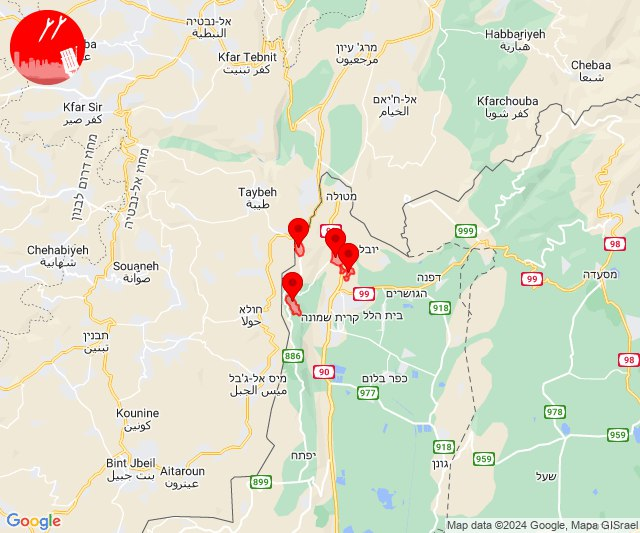
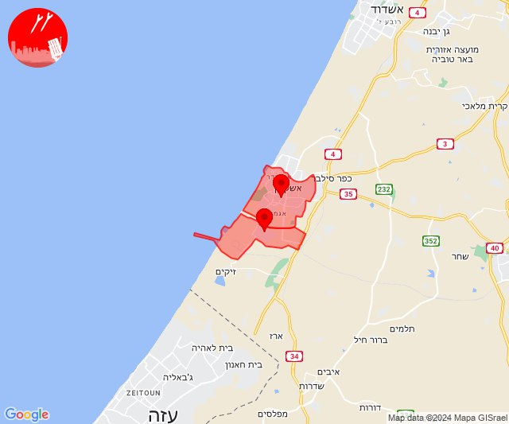

# Alerts for 2024-05-11

## 12:00

🔴 צבע אדום (11/05/2024):

15:00:
• עוטף עזה: כרם שלום (15 שניות)

צופר - צבע אדום

## 12:00

## 15:13

🔴 צבע אדום (11/05/2024):

18:13:
• מרכז הנגב: אתר דודאים (45 שניות)

צופר - צבע אדום

## 15:13

## 16:11

✈️ חדירת כלי טיס עוין (11/05/2024):

19:10:
• קו העימות: בית הלל, כפר גלעדי, כפר יובל, מטולה, מנרה, מעיין ברוך, מרגליות, משגב עם, קריית שמונה, תל חי 

19:11:
• קו העימות: דפנה, הגושרים, ע'ג'ר, קיבוץ דן, שאר ישוב, שניר 

צופר - צבע אדום

## 16:11

## 16:14

✈️ חדירת כלי טיס עוין (11/05/2024):

19:14:
• קו העימות: ע'ג'ר, כפר גלעדי, מנרה, תל חי, בית הלל, הגושרים, מרגליות, מעיין ברוך, קיבוץ דן, דפנה, שניר, כפר יובל, שאר ישוב, משגב עם, קריית שמונה, מטולה 

צופר - צבע אדום

## 16:14

## 16:18

✈️ חדירת כלי טיס עוין (11/05/2024):

19:18:
• קו העימות: גונן, דישון, יפתח, כפר בלום, כפר סאלד, להבות הבשן, מלכיה, מרכז אזורי מבואות חרמון, נאות מרדכי, עמיר, רמות נפתלי, שדה נחמיה, שמיר 

צופר - צבע אדום

## 16:18

## 20:39

🔴 צבע אדום (11/05/2024):

23:39:
• קו העימות: כפר גלעדי, מרגליות, משגב עם, תל חי (מיידי)

צופר - צבע אדום

## 20:39

## 22:10

🔴 צבע אדום (12/05/2024):

01:10:
• מערב לכיש: אשקלון - דרום, אזור תעשייה הדרומי אשקלון (30 שניות)

צופר - צבע אדום

## 22:10

