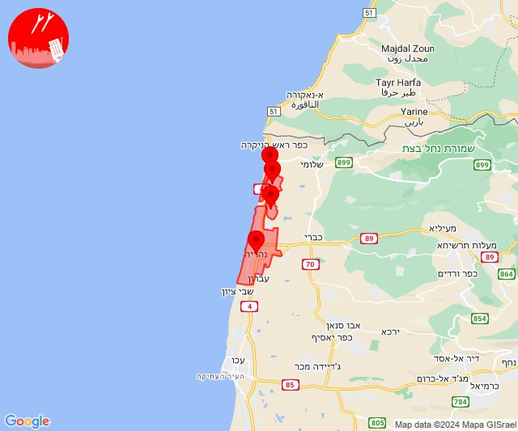
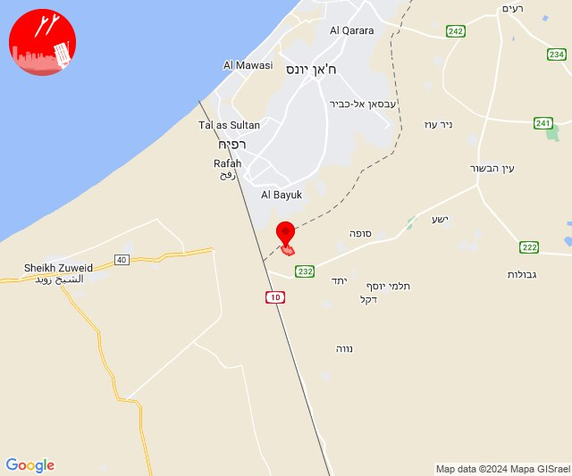
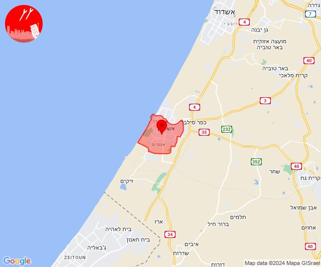
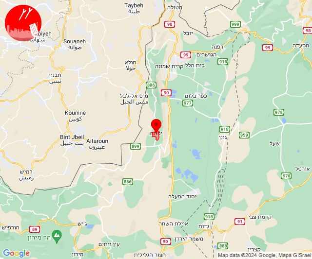
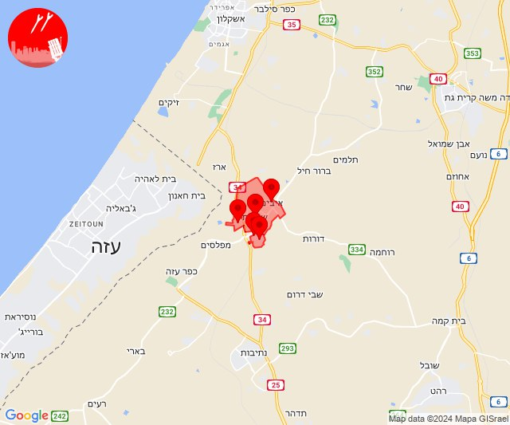
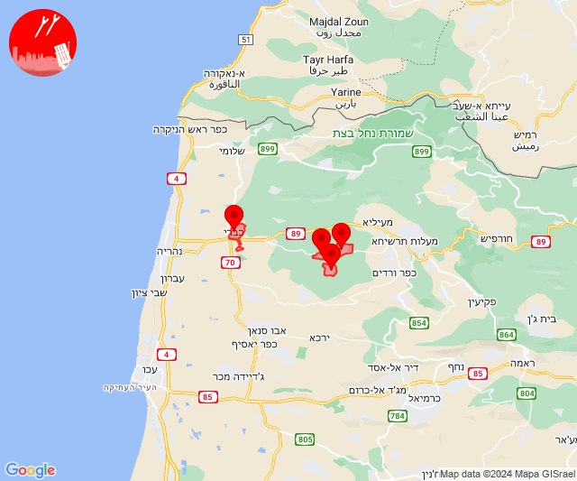
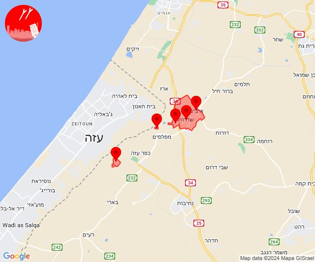
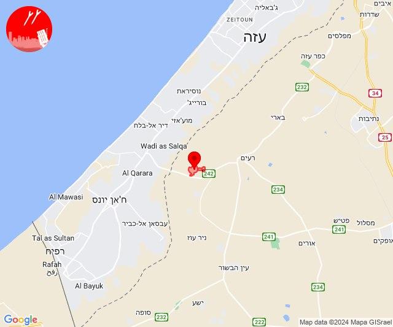
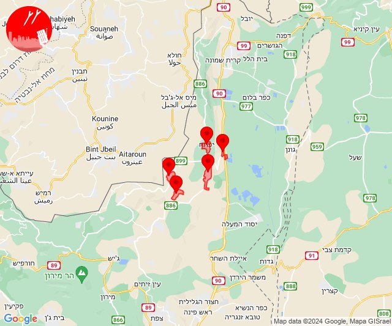

# Alerts for 2024-05-12

## 03:45

🔴 צבע אדום (12/05/2024):

06:44:
• קו העימות: נהריה, אזור תעשייה אכזיב מילואות, לימן (15 שניות, מיידי)

06:45:
• קו העימות: גשר הזיו (מיידי)

צופר - צבע אדום

## 03:45

## 10:40

🔴 צבע אדום (12/05/2024):

13:40:
• עוטף עזה: כרם שלום (15 שניות)

צופר - צבע אדום

## 10:40

## 11:12

🔴 צבע אדום (12/05/2024):

14:12:
• מערב לכיש: אשקלון - דרום (30 שניות)

צופר - צבע אדום

## 11:12

## 12:52

🔴 צבע אדום (12/05/2024):

15:52:
• קו העימות: יפתח (מיידי)

צופר - צבע אדום

## 12:52

## 13:00

🔴 צבע אדום (12/05/2024):

16:00:
• עוטף עזה: גבים, מכללת ספיר, שדרות, איבים, ניר עם (15 שניות)

צופר - צבע אדום

## 13:00

## 13:48

✈️ חדירת כלי טיס עוין (12/05/2024):

16:48:
• קו העימות: געתון, יחיעם, כברי, עין יעקב 

צופר - צבע אדום

## 13:48

## 14:05

🔴 צבע אדום (12/05/2024):

17:05:
• עוטף עזה: שדרות, איבים, ניר עם (15 שניות)

צופר - צבע אדום

## 14:05

## 17:06

🔴 צבע אדום (12/05/2024):

20:06:
• עוטף עזה: מטווח ניר עם, שדרות, איבים, ניר עם, נחל עוז (15 שניות)

צופר - צבע אדום

## 17:06

## 18:06

🔴 צבע אדום (12/05/2024):

21:06:
• עוטף עזה: כיסופים (15 שניות)

צופר - צבע אדום

## 18:06

## 20:09

✈️ חדירת כלי טיס עוין (12/05/2024):

23:09:
• קו העימות: דישון, יפתח, מלכיה, מרכז אזורי מבואות חרמון, רמות נפתלי 

צופר - צבע אדום

## 20:09

