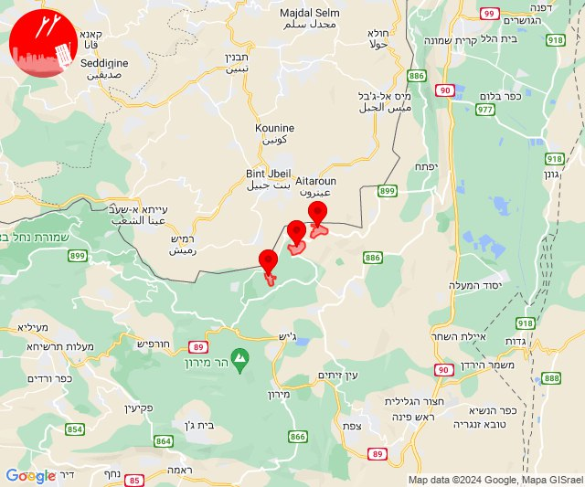
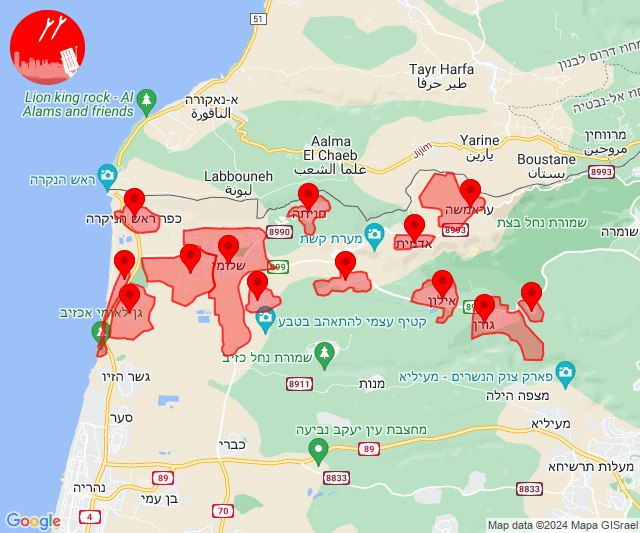
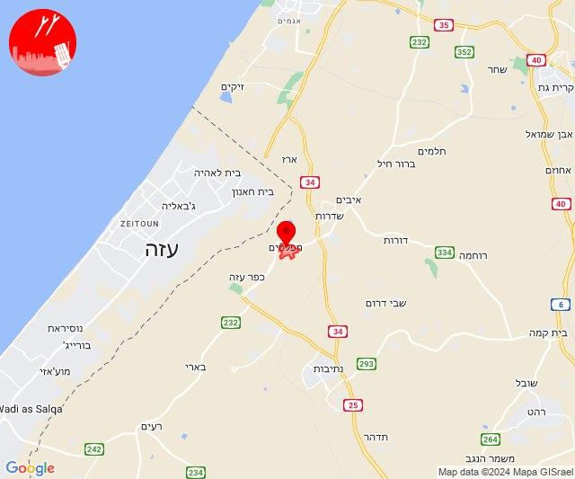
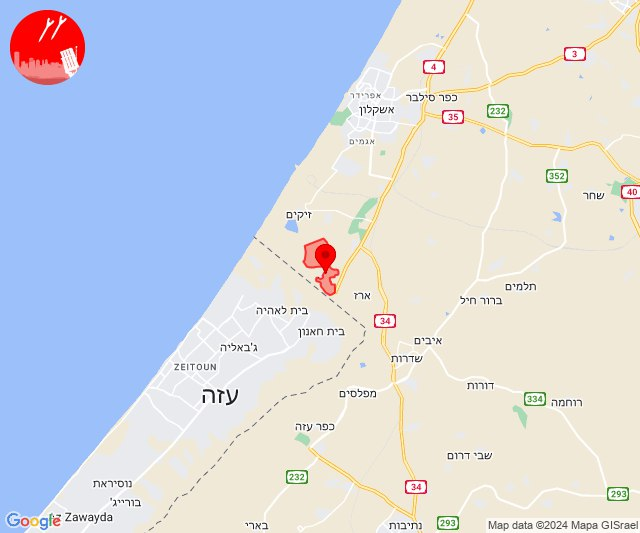
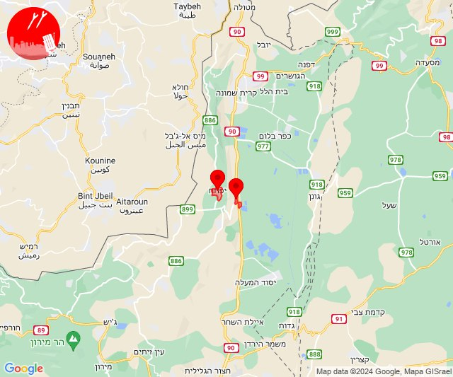
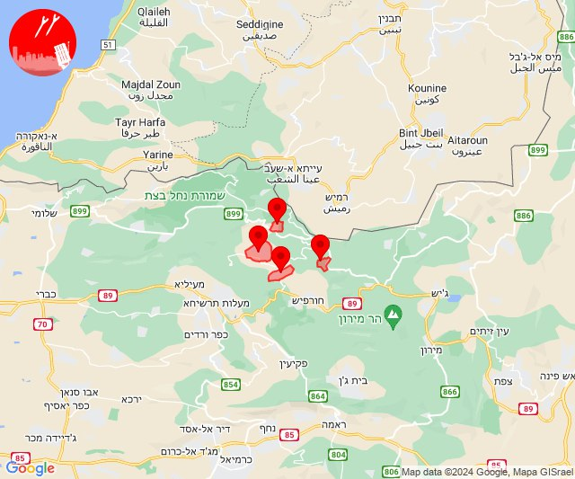
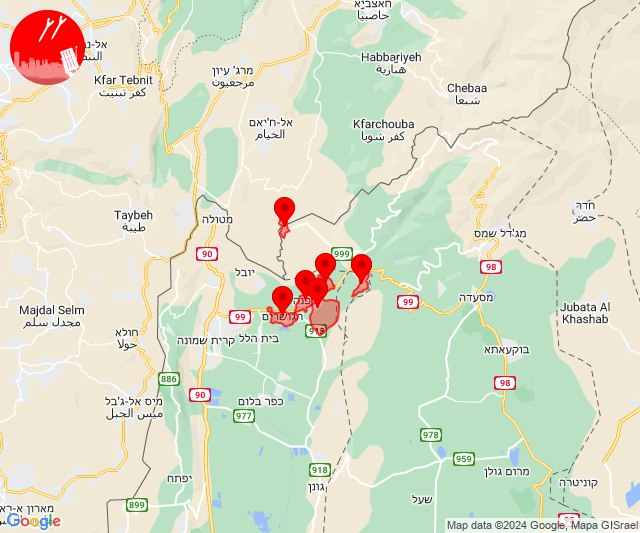
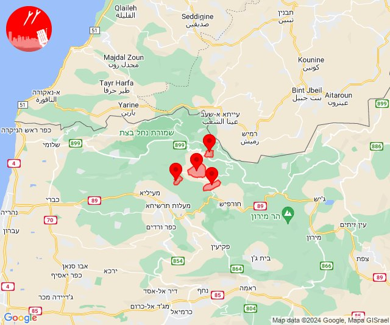
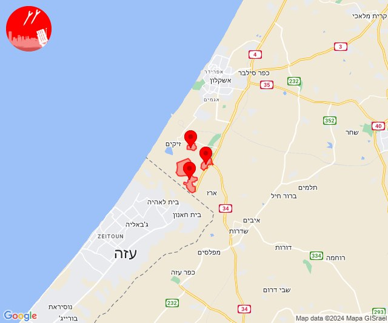

# Alerts for 2024-05-13

## 04:27

✈️ חדירת כלי טיס עוין (13/05/2024):

07:27:
• קו העימות: יראון, ברעם, אביבים 

צופר - צבע אדום

## 04:27

## 05:21

✈️ חדירת כלי טיס עוין (13/05/2024):

08:20:
• קו העימות: אזור תעשייה אכזיב מילואות, בצת, לימן, מצובה, ראש הנקרה, שלומי 

08:21:
• קו העימות: אדמית, אילון, גורן, גורנות הגליל, חניתה, יערה, ערב אל עראמשה 

צופר - צבע אדום

## 05:21

## 05:50

🔴 צבע אדום (13/05/2024):

08:50:
• עוטף עזה: מפלסים (15 שניות)

צופר - צבע אדום

## 05:50

## 05:55

🔴 צבע אדום (13/05/2024):

08:55:
• עוטף עזה: נתיב העשרה (15 שניות)

צופר - צבע אדום

## 05:55

## 07:38

🔴 צבע אדום (13/05/2024):

10:38:
• קו העימות: יפתח, מרכז אזורי מבואות חרמון (מיידי)

צופר - צבע אדום

## 07:38

## 10:00

🔴 צבע אדום (13/05/2024):

13:00:
• קו העימות: נטועה, אלקוש, פסוטה, מתת (מיידי)

צופר - צבע אדום

## 10:00

## 11:47

✈️ חדירת כלי טיס עוין (13/05/2024):

14:47:
• קו העימות: דפנה, הגושרים, ע'ג'ר, קיבוץ דן, שאר ישוב, שניר 

צופר - צבע אדום

## 11:47

## 13:58

✈️ חדירת כלי טיס עוין (13/05/2024):

16:58:
• קו העימות: אבירים, אלקוש, נטועה, פסוטה 

צופר - צבע אדום

## 13:58

## 15:56

🔴 צבע אדום (13/05/2024):

18:56:
• עוטף עזה: יד מרדכי, כרמיה, נתיב העשרה (15 שניות)

צופר - צבע אדום

## 15:56

