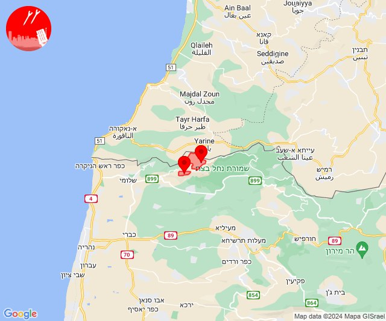
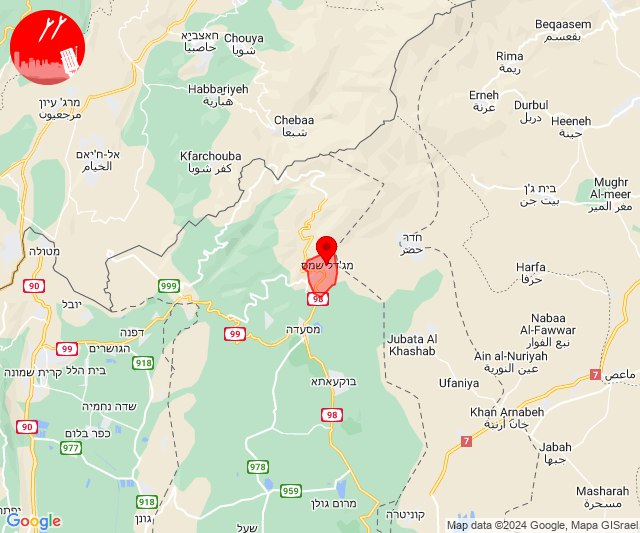

# Alerts for 2024-05-14

## 04:58

🔴 צבע אדום (14/05/2024):

07:58:
• מערב לכיש: אשקלון - דרום, אזור תעשייה הדרומי אשקלון, מבקיעים (30 שניות)
• עוטף עזה: זיקים, כרמיה (15 שניות)

צופר - צבע אדום

## 04:58

## 10:00

🔴 צבע אדום (14/05/2024):

13:00:
• קו העימות: ערב אל עראמשה (מיידי)

צופר - צבע אדום

## 10:00

## 10:03

🔴 צבע אדום (14/05/2024):

13:02:
• קו העימות: ערב אל עראמשה (מיידי)

13:03:
• קו העימות: אדמית (מיידי)

צופר - צבע אדום

## 10:03

## 10:17

🔴 צבע אדום (14/05/2024):

13:17:
• קו העימות: אדמית, חניתה, יערה, אילון, גורן, ערב אל עראמשה (מיידי)

צופר - צבע אדום

## 10:17

## 11:04

🔴 צבע אדום (14/05/2024):

14:04:
• עוטף עזה: שדרות, איבים, ניר עם (15 שניות)

צופר - צבע אדום

## 11:05

## 12:58

🔴 צבע אדום (14/05/2024):

15:58:
• צפון הגולן: מג'דל שמס (מיידי)

צופר - צבע אדום

## 12:58

