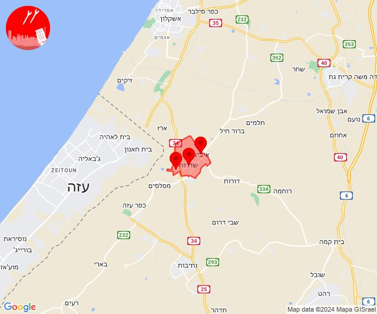
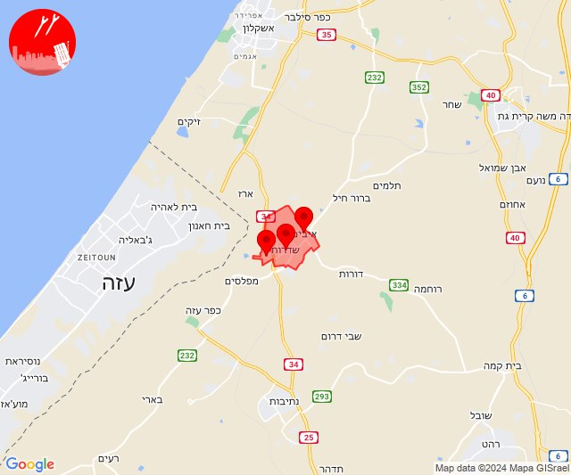
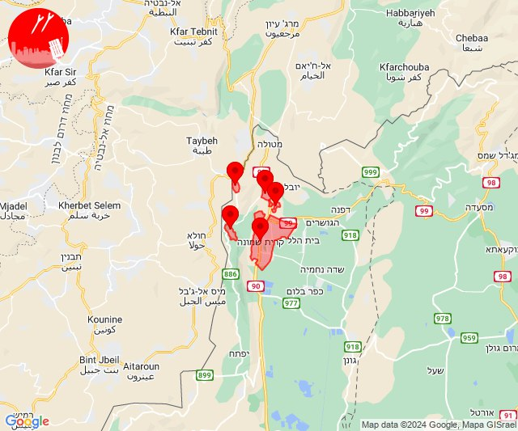
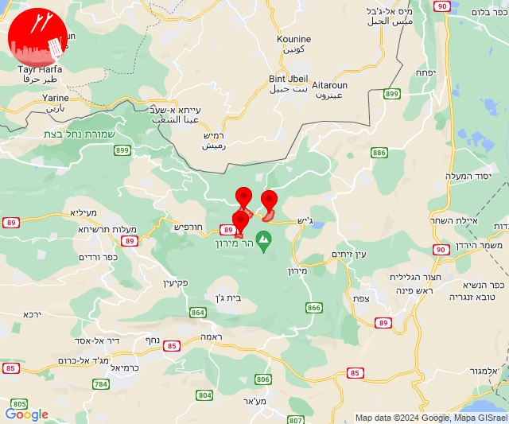
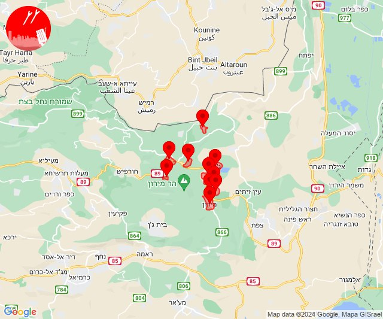
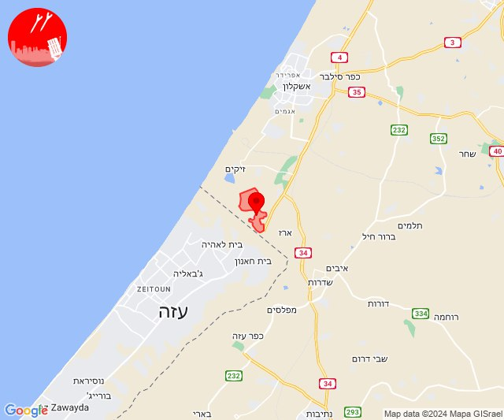
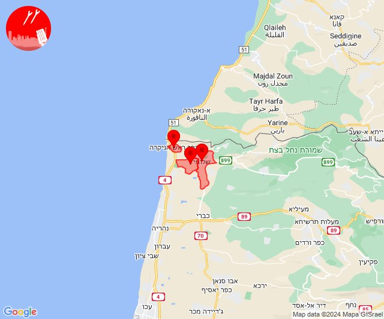
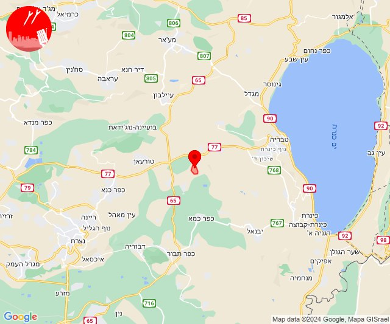

# Alerts for 2024-05-15

## 06:04

🔴 צבע אדום (15/05/2024):

09:04:
• עוטף עזה: שדרות, איבים, ניר עם (15 שניות)

צופר - צבע אדום

## 06:04

## 07:00

🔴 צבע אדום (15/05/2024):

10:00:
• עוטף עזה: שדרות, איבים, ניר עם (15 שניות)

צופר - צבע אדום

## 07:00

## 08:48

🔴 צבע אדום (15/05/2024):

11:48:
• קו העימות: כפר גלעדי, מרגליות, משגב עם, קריית שמונה, תל חי (מיידי)

צופר - צבע אדום

## 08:48

## 08:50

🔴 צבע אדום (15/05/2024):

11:50:
• קו העימות: בית ספר שדה מירון, סאסא, צבעון (מיידי)

צופר - צבע אדום

## 08:50

## 09:02

🔴 צבע אדום (15/05/2024):

12:00:
• גליל עליון: מירון (30 שניות)
• קו העימות: ברעם (מיידי)

12:01:
• קו העימות: צבעון (מיידי)
• גליל עליון: בר יוחאי, מירון, מרכז אזורי מרום גליל (30 שניות)

12:02:
• קו העימות: בית ספר שדה מירון, סאסא, צבעון, ג'ש - גוש חלב (מיידי)
• גליל עליון: אור הגנוז, ספסופה - כפר חושן (30 שניות)

צופר - צבע אדום

## 09:02

## 09:19

🔴 צבע אדום (15/05/2024):

12:19:
• עוטף עזה: נתיב העשרה (15 שניות)

צופר - צבע אדום

## 09:19

## 13:20

🔴 צבע אדום (15/05/2024):

16:19:
• קו העימות: בצת, שלומי, ראש הנקרה (מיידי)

צופר - צבע אדום

## 13:20

## 14:01

🔴 צבע אדום (15/05/2024):

17:01:
• עוטף עזה: שדרות, איבים, ניר עם (15 שניות)

צופר - צבע אדום

## 14:01

## 16:52

✈️ חדירת כלי טיס עוין (15/05/2024):

19:52:
• גליל תחתון: כפר נהר הירדן 

צופר - צבע אדום

## 16:52

