# Alerts for 2024-05-16

## 03:06

🔴 צבע אדום (16/05/2024):

06:06:
• קו העימות: מטולה (מיידי)

צופר - צבע אדום

## 03:06

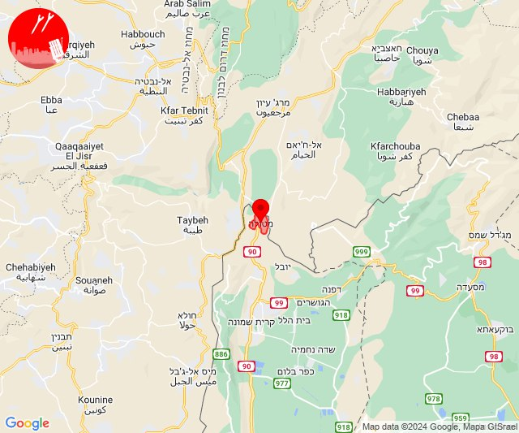

## 04:21

✈️ חדירת כלי טיס עוין (16/05/2024):

07:21:
• קו העימות: בית הלל, כפר גלעדי, כפר יובל, מטולה, מנרה, מעיין ברוך, מרגליות, משגב עם, קריית שמונה, תל חי 

צופר - צבע אדום

## 04:21

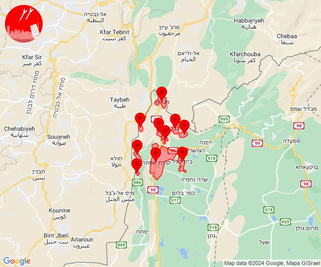

## 05:27

🔴 צבע אדום (16/05/2024):

08:27:
• קו העימות: מתת, חורפיש (מיידי)

צופר - צבע אדום

## 05:27

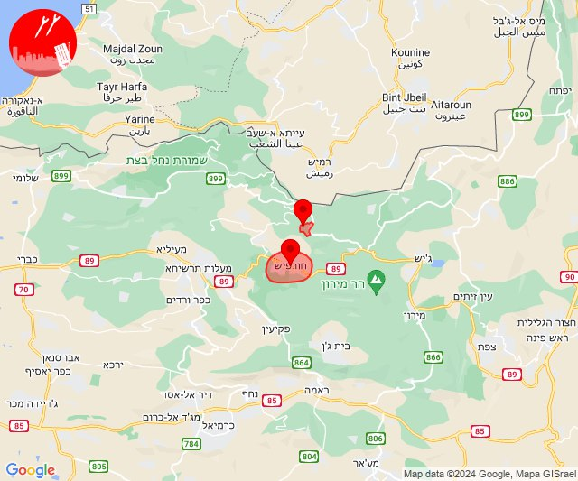

## 05:27

✈️ חדירת כלי טיס עוין (16/05/2024):

08:27:
• קו העימות: דוב''ב, מתת, סאסא 

צופר - צבע אדום

## 05:27

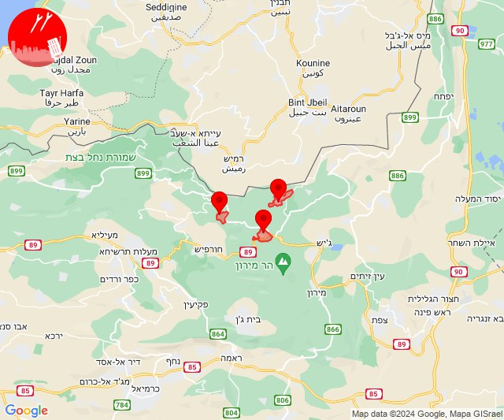

## 05:30

🔴 צבע אדום (16/05/2024):

08:30:
• קו העימות: חורפיש, בית ספר שדה מירון (מיידי)

צופר - צבע אדום

## 05:30

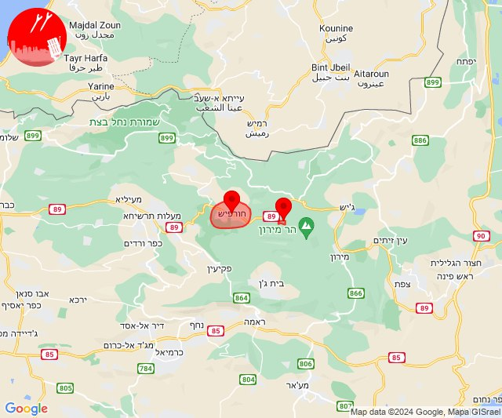

## 05:31

✈️ חדירת כלי טיס עוין (16/05/2024):

08:30:
• קו העימות: דוב''ב, מתת, סאסא 

08:31:
• קו העימות: בית ספר שדה מירון, חורפיש, פקיעין, צבעון, צוריאל 

צופר - צבע אדום

## 05:31

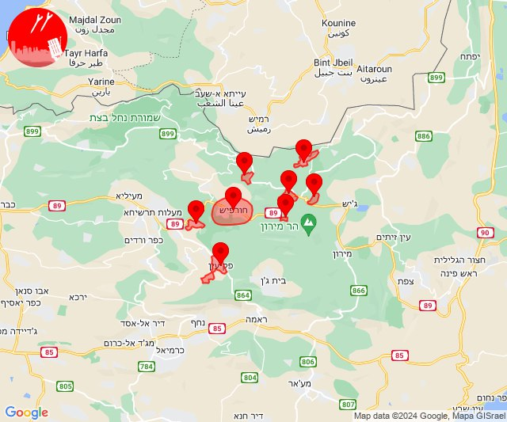

## 07:03

🔴 צבע אדום (16/05/2024):

10:03:
• צפון הגולן: קלע, קלע (15 שניות)
• קו העימות: להבות הבשן (15 שניות)

צופר - צבע אדום

## 07:03

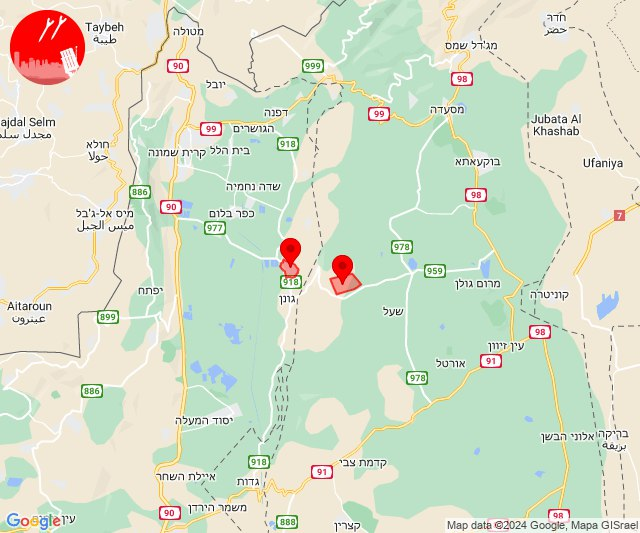

## 08:04

🔴 צבע אדום (16/05/2024):

11:04:
• קו העימות: זרעית (מיידי)

צופר - צבע אדום

## 08:04

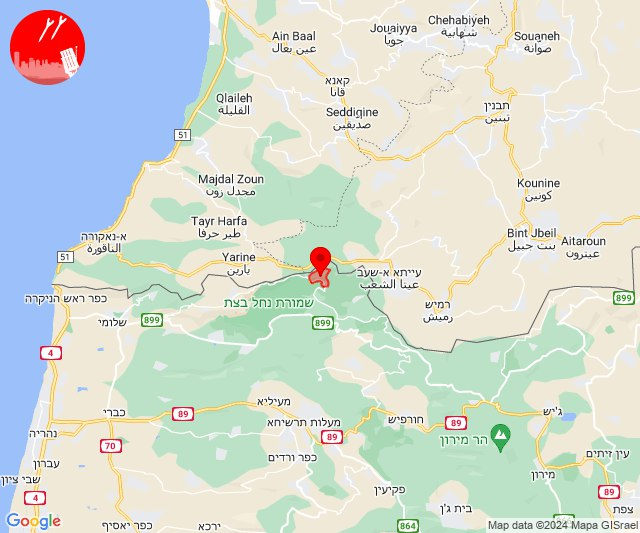

## 08:06

✈️ חדירת כלי טיס עוין (16/05/2024):

11:06:
• קו העימות: שומרה, זרעית, שתולה, אבן מנחם 

צופר - צבע אדום

## 08:06

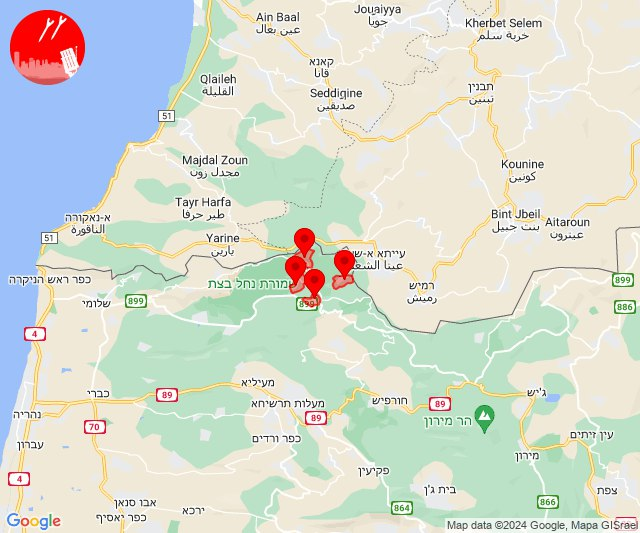

## 08:10

🔴 צבע אדום (16/05/2024):

11:07:
• קו העימות: זרעית, זרעית (מיידי)

11:08:
• קו העימות: זרעית (מיידי)

11:09:
• קו העימות: זרעית (מיידי)

11:10:
• קו העימות: זרעית (מיידי)

צופר - צבע אדום

## 08:10

## 08:31

🔴 צבע אדום (16/05/2024):

11:31:
• עוטף עזה: נחל עוז (15 שניות)

צופר - צבע אדום

## 08:31

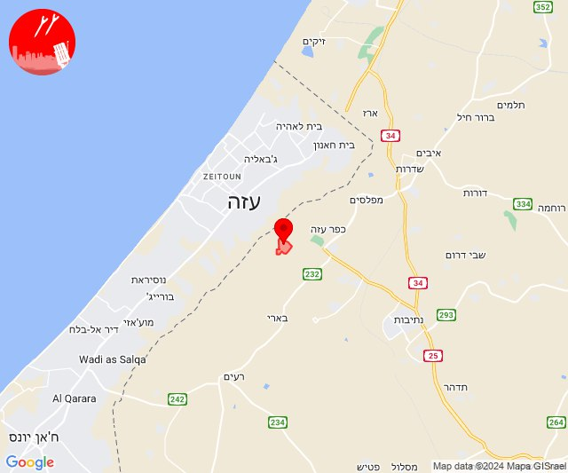

## 09:18

🔴 צבע אדום (16/05/2024):

12:18:
• עוטף עזה: כרם שלום (15 שניות)

צופר - צבע אדום

## 09:18

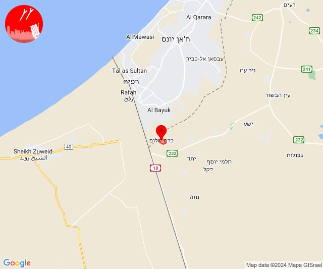

## 12:33

✈️ חדירת כלי טיס עוין (16/05/2024):

15:33:
• קו העימות: בית הלל, כפר גלעדי, כפר יובל, מטולה, מנרה, מעיין ברוך, מרגליות, משגב עם, קריית שמונה, תל חי, דפנה, הגושרים, ע'ג'ר, קיבוץ דן, שאר ישוב, שניר 

צופר - צבע אדום

## 12:33

## 13:25

✈️ חדירת כלי טיס עוין (16/05/2024):

16:25:
• קו העימות: ע'ג'ר, דפנה, מנרה, משגב עם, מרגליות, קריית שמונה, תל חי, מטולה, כפר גלעדי, כפר יובל, הגושרים, מעיין ברוך, שניר, קיבוץ דן, בית הלל, שאר ישוב 

צופר - צבע אדום

## 13:25

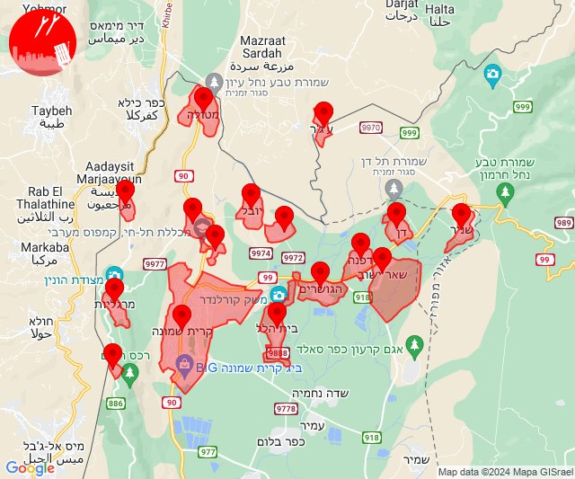

## 14:02

🔴 צבע אדום (16/05/2024):

17:02:
• קו העימות: כפר גלעדי, מרגליות, משגב עם, קריית שמונה, תל חי (מיידי)

צופר - צבע אדום

## 14:02

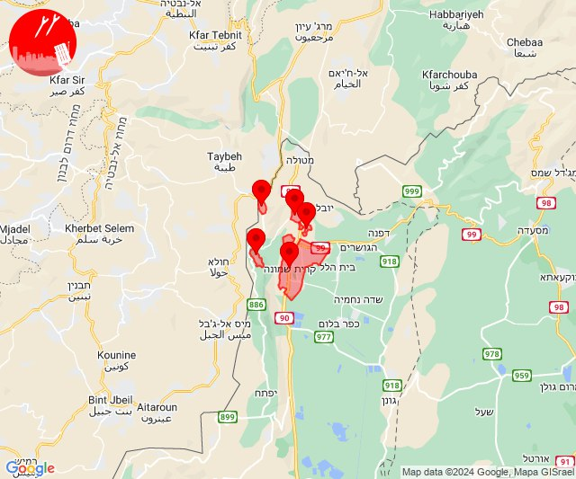

## 14:32

🔴 צבע אדום (16/05/2024):

17:31:
• קו העימות: אדמית, חניתה, יערה, מצובה, שלומי (מיידי)

17:32:
• קו העימות: בצת, חניתה, יערה, לימן, מצובה, ראש הנקרה, שלומי (מיידי)

צופר - צבע אדום

## 14:32

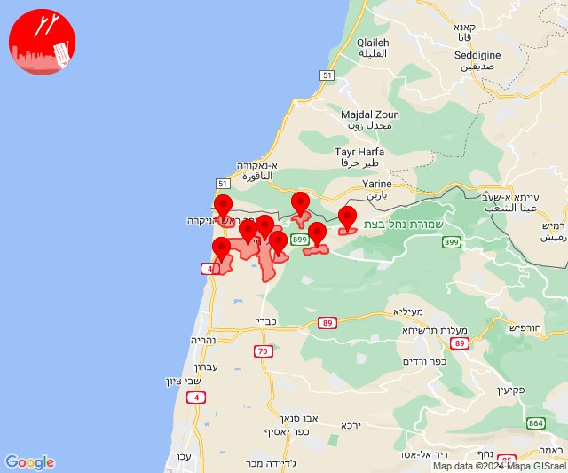

## 15:17

✈️ חדירת כלי טיס עוין (16/05/2024):

18:17:
• קו העימות: אזור תעשייה אכזיב מילואות, אילון, מצובה, אדמית, בצת, חניתה, יערה, ערב אל עראמשה, גורנות הגליל, לימן, גורן, שלומי, ראש הנקרה 

צופר - צבע אדום

## 15:17

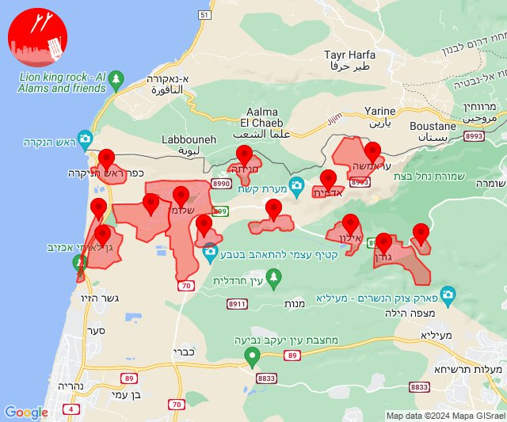

## 15:54

✈️ חדירת כלי טיס עוין (16/05/2024):

18:52:
• קו העימות: מנרה, משגב עם, מרגליות, קריית שמונה, תל חי, מטולה, כפר גלעדי, כפר יובל, מעיין ברוך, בית הלל 

18:53:
• קו העימות: דישון, יפתח, מלכיה, מרכז אזורי מבואות חרמון, רמות נפתלי 

18:54:
• קו העימות: דפנה, הגושרים, ע'ג'ר, קיבוץ דן, שאר ישוב, שניר, נאות מרדכי, שדה נחמיה, שמיר, כפר בלום, עמיר, כפר סאלד, להבות הבשן, גונן 

צופר - צבע אדום

## 15:54

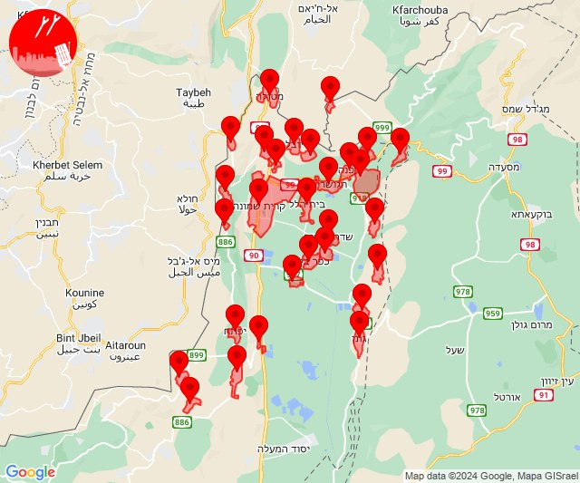

## 16:44

🔴 צבע אדום (16/05/2024):

19:44:
• עוטף עזה: כרם שלום (15 שניות)

צופר - צבע אדום

## 16:44

## 18:00

🔴 צבע אדום (16/05/2024):

21:00:
• עוטף עזה: מטווח ניר עם, מפלסים (15 שניות)

צופר - צבע אדום

## 18:00

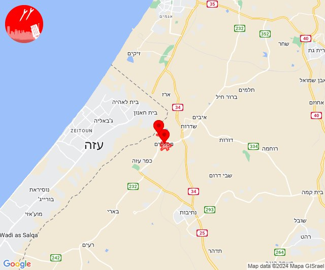

## 19:16

✈️ חדירת כלי טיס עוין (16/05/2024):

22:16:
• קו העימות: דפנה, הגושרים, ע'ג'ר, קיבוץ דן, שאר ישוב, שניר 

צופר - צבע אדום

## 19:16

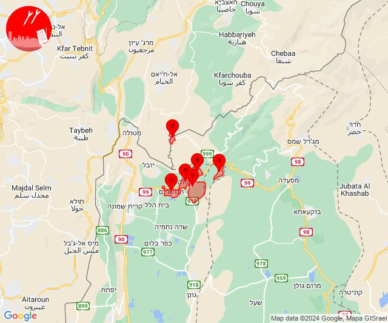

## 19:17

🔴 צבע אדום (16/05/2024):

22:17:
• קו העימות: דפנה, קיבוץ דן, שאר ישוב (מיידי)

צופר - צבע אדום

## 19:17

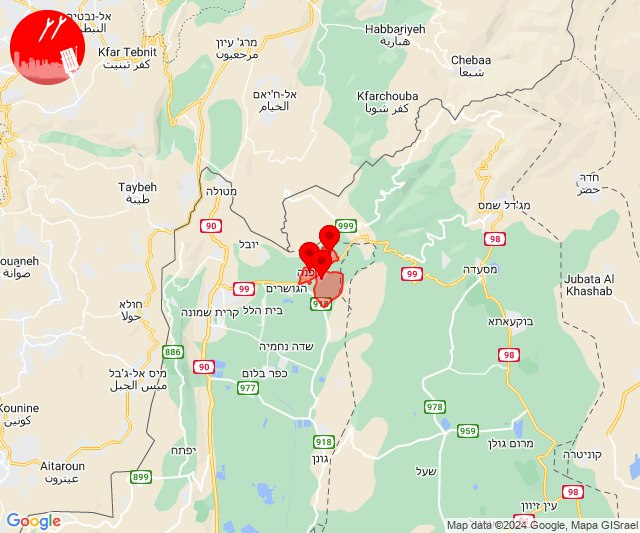

## 19:29

✈️ חדירת כלי טיס עוין (16/05/2024):

22:29:
• קו העימות: אבן מנחם, אדמית, אילון, גורן, גורנות הגליל, זרעית, חניתה, יערה, ערב אל עראמשה, שומרה, שתולה 

צופר - צבע אדום

## 19:29

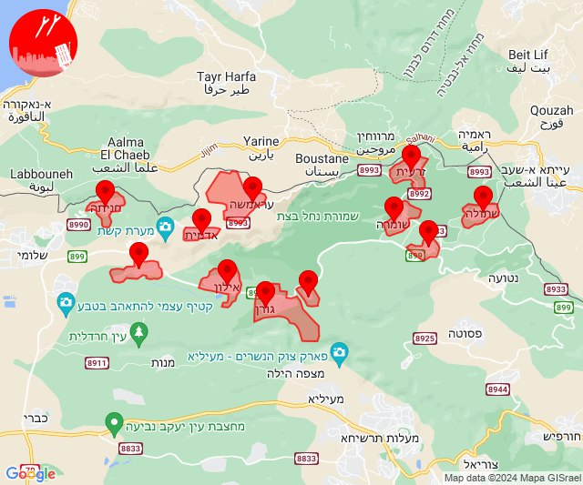

## 19:48

🔴 צבע אדום (16/05/2024):

22:48:
• קו העימות: מרגליות (מיידי)

צופר - צבע אדום

## 19:48

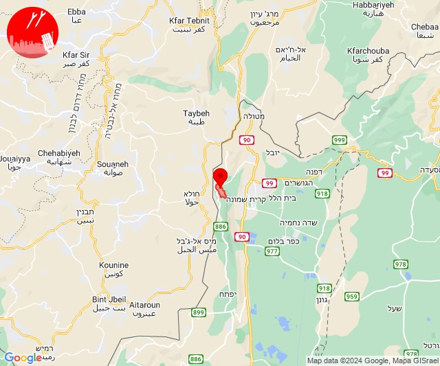

