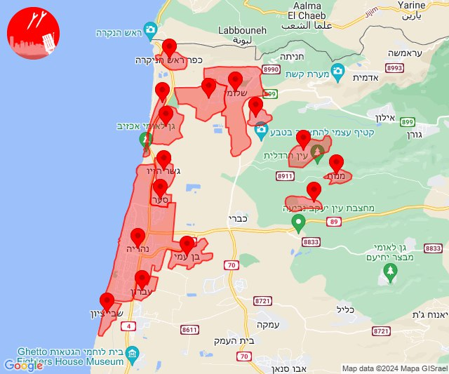
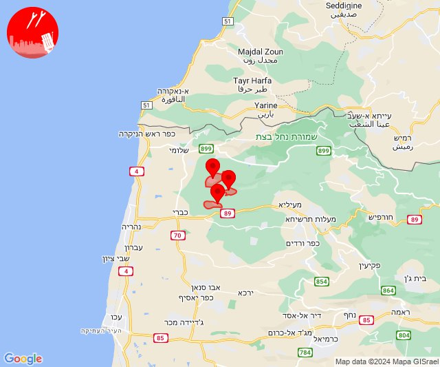

# Alerts for 2024-05-17

## 02:22

✈️ חדירת כלי טיס עוין (17/05/2024):

05:21:
• קו העימות: בן עמי, גשר הזיו, נהריה, סער, עברון 
• גליל עליון: שבי ציון 

05:22:
• קו העימות: שלומי, מצובה, בצת, אזור תעשייה אכזיב מילואות, לימן, ראש הנקרה 

צופר - צבע אדום

## 02:22

## 02:24

✈️ חדירת כלי טיס עוין (17/05/2024):

05:24:
• קו העימות: בן עמי, אזור תעשייה אכזיב מילואות, סער, שלומי, בצת, לימן, מצובה, ראש הנקרה, גשר הזיו, עברון, נהריה, מנות, נווה זיו, עבדון 
• גליל עליון: שבי ציון 

צופר - צבע אדום

## 02:24

## 02:29

✈️ חדירת כלי טיס עוין (17/05/2024):

05:29:
• קו העימות: בן עמי, גשר הזיו, נהריה, סער, עברון 
• גליל עליון: שבי ציון 

צופר - צבע אדום

## 02:29

## 02:30

🔴 צבע אדום (17/05/2024):

05:30:
• קו העימות: נהריה, אזור תעשייה אכזיב מילואות (15 שניות, מיידי)

צופר - צבע אדום

## 02:30

## 02:31

✈️ חדירת כלי טיס עוין (17/05/2024):

05:31:
• קו העימות: געתון, יחיעם, כברי, מנות, נווה זיו, עבדון, עין יעקב 

צופר - צבע אדום

## 02:31

## 02:33

✈️ חדירת כלי טיס עוין (17/05/2024):

05:33:
• קו העימות: געתון, כברי, יחיעם, עין יעקב, עבדון, נווה זיו, מנות 

צופר - צבע אדום

## 02:33

## 02:36

✈️ חדירת כלי טיס עוין (17/05/2024):

05:36:
• קו העימות: געתון, יחיעם, כברי, עין יעקב 

צופר - צבע אדום

## 02:36

## 03:16

✈️ חדירת כלי טיס עוין (17/05/2024):

06:16:
• קו העימות: אדמית, אילון, גורן, גורנות הגליל, חניתה, יערה, ערב אל עראמשה 

צופר - צבע אדום

## 03:16

## 07:44

🔴 צבע אדום (17/05/2024):

10:44:
• עוטף עזה: ארז, יד מרדכי, כרמיה, נתיב העשרה (15 שניות)

צופר - צבע אדום

## 07:44

## 09:29

🔴 צבע אדום (17/05/2024):

12:29:
• עוטף עזה: שדרות, איבים, ניר עם (15 שניות)

צופר - צבע אדום

## 09:29

## 10:36

🔴 צבע אדום (17/05/2024):

13:35:
• קו העימות: אזור תעשייה רמת דלתון, דלתון (מיידי)

13:36:
• קו העימות: אזור תעשייה רמת דלתון, דלתון, כרם בן זמרה, ריחאנייה (מיידי)
• גליל עליון: קדיתא (30 שניות)

צופר - צבע אדום

## 10:36

## 11:32

🔴 צבע אדום (17/05/2024):

14:30:
• קו העימות: דפנה, הגושרים, קיבוץ דן, שאר ישוב, שניר (מיידי)

14:31:
• דרום הגולן: קצרין, קצרין (30 שניות)
• קו העימות: מעיין ברוך, דפנה, הגושרים, קיבוץ דן, שאר ישוב, שניר (מיידי)

14:32:
• גליל עליון: גדות (30 שניות)
• דרום הגולן: קצרין (30 שניות)

צופר - צבע אדום

## 11:32

## 12:12

✈️ חדירת כלי טיס עוין (17/05/2024):

15:11:
• קו העימות: כפר גלעדי, מנרה, תל חי, בית הלל, מרגליות, מעיין ברוך, כפר יובל, משגב עם, קריית שמונה, מטולה 

15:12:
• קו העימות: דפנה, הגושרים, ע'ג'ר, קיבוץ דן, שאר ישוב, שניר 

צופר - צבע אדום

## 12:12

## 12:35

🔴 צבע אדום (17/05/2024):

15:35:
• קו העימות: פסוטה (מיידי)
• עוטף עזה: עלומים (15 שניות)

צופר - צבע אדום

## 12:35

## 13:01

🔴 צבע אדום (17/05/2024):

16:01:
• עוטף עזה: שדרות, איבים, ניר עם (15 שניות)

צופר - צבע אדום

## 13:01

## 13:26

🔴 צבע אדום (17/05/2024):

16:26:
• דרום הגולן: קצרין (30 שניות)

צופר - צבע אדום

## 13:26

## 14:11

🔴 צבע אדום (17/05/2024):

17:11:
• קו העימות: מעיין ברוך (מיידי)

צופר - צבע אדום

## 14:11

## 16:10

🔴 צבע אדום (17/05/2024):

19:10:
• קו העימות: מטולה (מיידי)

צופר - צבע אדום

## 16:10

## 16:11

✈️ חדירת כלי טיס עוין (17/05/2024):

19:09:
• קו העימות: בית הלל, כפר גלעדי, כפר יובל, מטולה, מנרה, מעיין ברוך, מרגליות, משגב עם, קריית שמונה, תל חי 

19:10:
• קו העימות: דפנה, הגושרים, ע'ג'ר, קיבוץ דן, שאר ישוב, שניר 

צופר - צבע אדום

## 16:11

## 16:12

✈️ חדירת כלי טיס עוין (17/05/2024):

19:12:
• קו העימות: נאות מרדכי, שדה נחמיה, שמיר, כפר בלום, עמיר, כפר סאלד, להבות הבשן, גונן 

צופר - צבע אדום

## 16:12

## 16:13

✈️ חדירת כלי טיס עוין (17/05/2024):

19:13:
• קו העימות: נווה זיו, מנות, עבדון 

צופר - צבע אדום

## 16:13

