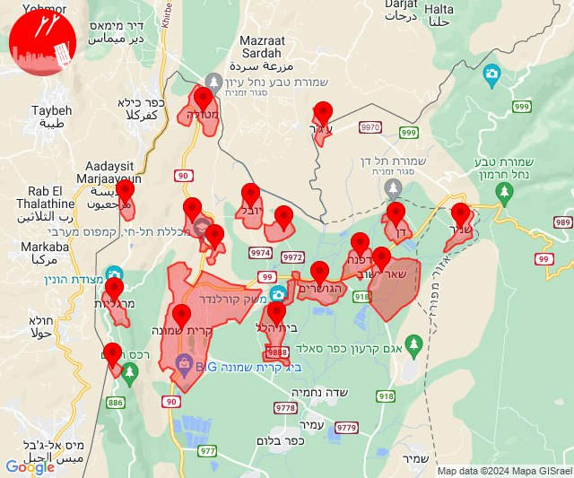

# Alerts for 2024-05-18

## 04:15

✈️ חדירת כלי טיס עוין (18/05/2024):

07:15:
• קו העימות: כפר גלעדי, מנרה, תל חי, בית הלל, מרגליות, מעיין ברוך, כפר יובל, משגב עם, קריית שמונה, מטולה 

צופר - צבע אדום

## 04:15

## 04:22

✈️ חדירת כלי טיס עוין (18/05/2024):

07:22:
• קו העימות: מנרה, משגב עם, מרגליות, קריית שמונה, תל חי, מטולה, כפר גלעדי, כפר יובל, מעיין ברוך, בית הלל, גונן, כפר בלום, כפר סאלד, להבות הבשן, נאות מרדכי, עמיר, שדה נחמיה, שמיר 

צופר - צבע אדום

## 04:22

## 04:38

✈️ חדירת כלי טיס עוין (18/05/2024):

07:38:
• קו העימות: בית הלל, כפר גלעדי, כפר יובל, מטולה, מנרה, מעיין ברוך, מרגליות, משגב עם, קריית שמונה, תל חי, דפנה, הגושרים, ע'ג'ר, קיבוץ דן, שאר ישוב, שניר 

צופר - צבע אדום

## 04:38

## 04:56

✈️ חדירת כלי טיס עוין (18/05/2024):

07:56:
• קו העימות: כפר גלעדי, מנרה, תל חי, בית הלל, מרגליות, מעיין ברוך, כפר יובל, משגב עם, קריית שמונה, מטולה 

צופר - צבע אדום

## 04:56

## 10:57

✈️ חדירת כלי טיס עוין (18/05/2024):

13:57:
• קו העימות: דישון, יפתח, מלכיה, מרכז אזורי מבואות חרמון, רמות נפתלי 

צופר - צבע אדום

## 10:57

## 11:31

✈️ חדירת כלי טיס עוין (18/05/2024):

14:31:
• קו העימות: אזור תעשייה אכזיב מילואות, בצת, לימן, מצובה, ראש הנקרה, שלומי 

צופר - צבע אדום

## 11:31

## 12:54

✈️ חדירת כלי טיס עוין (18/05/2024):

15:54:
• קו העימות: מלכיה, רמות נפתלי, מרכז אזורי מבואות חרמון, יפתח, דישון 

צופר - צבע אדום

## 12:54

## 13:02

🔴 צבע אדום (18/05/2024):

16:02:
• מערב לכיש: אזור תעשייה הדרומי אשקלון (30 שניות)
• עוטף עזה: זיקים (15 שניות)

צופר - צבע אדום

## 13:02

## 14:13

✈️ חדירת כלי טיס עוין (18/05/2024):

17:13:
• קו העימות: דוב''ב, מתת, סאסא 

צופר - צבע אדום

## 14:13

## 14:28

✈️ חדירת כלי טיס עוין (18/05/2024):

17:28:
• קו העימות: מנרה, משגב עם, מרגליות, קריית שמונה, תל חי, מטולה, כפר גלעדי, כפר יובל, מעיין ברוך, בית הלל 

צופר - צבע אדום

## 14:28

## 14:47

✈️ חדירת כלי טיס עוין (18/05/2024):

17:47:
• קו העימות: אביבים, ברעם, יראון 

צופר - צבע אדום

## 14:47

## 15:00

🔴 צבע אדום (18/05/2024):

18:00:
• קו העימות: שתולה (מיידי)

צופר - צבע אדום

## 15:00

## 15:06

✈️ חדירת כלי טיס עוין (18/05/2024):

18:06:
• קו העימות: ערב אל עראמשה, אדמית, אזור תעשייה אכזיב מילואות, גורן, בצת, לימן, חניתה, ראש הנקרה, גורנות הגליל, אילון, שלומי, מצובה, יערה 

צופר - צבע אדום

## 15:06

## 15:51

✈️ חדירת כלי טיס עוין (18/05/2024):

18:51:
• קו העימות: יראון, ברעם, אביבים 

צופר - צבע אדום

## 15:51

## 16:57

✈️ חדירת כלי טיס עוין (18/05/2024):

19:57:
• קו העימות: בית הלל, כפר גלעדי, כפר יובל, מטולה, מנרה, מעיין ברוך, מרגליות, משגב עם, קריית שמונה, תל חי 

צופר - צבע אדום

## 16:57

## 18:40

🔴 צבע אדום (18/05/2024):

21:40:
• מערב לכיש: אשקלון - דרום (30 שניות)

צופר - צבע אדום

## 18:40

