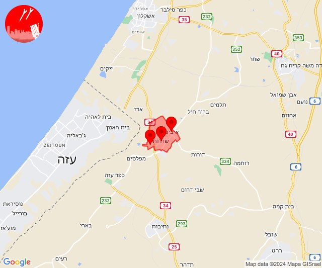

# Alerts for 2024-05-19

## 03:28

🔴 צבע אדום (19/05/2024):

06:28:
• עוטף עזה: כפר עזה (15 שניות)

צופר - צבע אדום

## 03:28

## 06:02

🔴 צבע אדום (19/05/2024):

09:02:
• עוטף עזה: שדרות, איבים, ניר עם (15 שניות)

צופר - צבע אדום

## 06:02

## 07:04

🔴 צבע אדום (19/05/2024):

10:04:
• קו העימות: מלכיה (מיידי)

צופר - צבע אדום

## 07:04

## 07:05

✈️ חדירת כלי טיס עוין (19/05/2024):

10:05:
• קו העימות: דישון, יפתח, מלכיה, מרכז אזורי מבואות חרמון, רמות נפתלי 

צופר - צבע אדום

## 07:05

## 07:34

✈️ חדירת כלי טיס עוין (19/05/2024):

10:34:
• קו העימות: אביבים, ברעם, יראון 

צופר - צבע אדום

## 07:34

## 08:55

✈️ חדירת כלי טיס עוין (19/05/2024):

11:55:
• קו העימות: בית הלל, כפר גלעדי, כפר יובל, מטולה, מנרה, מעיין ברוך, מרגליות, משגב עם, קריית שמונה, תל חי, דפנה, הגושרים, ע'ג'ר, קיבוץ דן, שאר ישוב, שניר 

צופר - צבע אדום

## 08:55

## 13:44

✈️ חדירת כלי טיס עוין (19/05/2024):

16:44:
• קו העימות: אביבים, אזור תעשייה רמת דלתון, ברעם, ג'ש - גוש חלב, דלתון, יראון, כרם בן זמרה, עלמה, ריחאנייה 

צופר - צבע אדום

## 13:44

## 14:50

🔴 צבע אדום (19/05/2024):

17:50:
• קו העימות: מלכיה (מיידי)

צופר - צבע אדום

## 14:50

## 16:26

✈️ חדירת כלי טיס עוין (19/05/2024):

19:26:
• קו העימות: בית הלל, כפר גלעדי, כפר יובל, מטולה, מנרה, מעיין ברוך, מרגליות, משגב עם, קריית שמונה, תל חי 

צופר - צבע אדום

## 16:26

## 16:27

✈️ חדירת כלי טיס עוין (19/05/2024):

19:27:
• קו העימות: בית הלל, כפר גלעדי, כפר יובל, מטולה, מנרה, מעיין ברוך, מרגליות, משגב עם, קריית שמונה, תל חי 

צופר - צבע אדום

## 16:27

## 16:52

✈️ חדירת כלי טיס עוין (19/05/2024):

19:52:
• קו העימות: כפר גלעדי, מנרה, תל חי, בית הלל, מרגליות, מעיין ברוך, כפר יובל, משגב עם, קריית שמונה, מטולה 

צופר - צבע אדום

## 16:52

## 17:05

✈️ חדירת כלי טיס עוין (19/05/2024):

20:05:
• קו העימות: ע'ג'ר, דפנה, הגושרים, שניר, קיבוץ דן, שאר ישוב 

צופר - צבע אדום

## 17:05

## 18:02

🔴 צבע אדום (19/05/2024):

21:02:
• עוטף עזה: נחל עוז, זמרת, שובה, סעד (15 שניות)

צופר - צבע אדום

## 18:02

## 20:28

🔴 צבע אדום (19/05/2024):

23:28:
• קו העימות: מטולה (מיידי)

צופר - צבע אדום

## 20:28

## 20:35

🔴 צבע אדום (19/05/2024):

23:35:
• קו העימות: מטולה (מיידי)

צופר - צבע אדום

## 20:35

