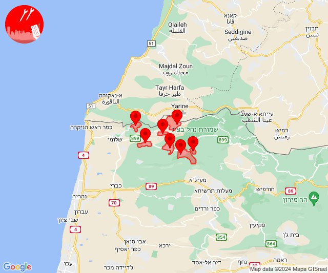

# Alerts for 2024-05-21

## 06:30

✈️ חדירת כלי טיס עוין (21/05/2024):

09:30:
• קו העימות: אדמית, אילון, גורן, גורנות הגליל, חניתה, יערה, ערב אל עראמשה 

צופר - צבע אדום

## 06:30

## 06:32

✈️ חדירת כלי טיס עוין (21/05/2024):

09:32:
• קו העימות: אדמית, אילון, גורן, גורנות הגליל, חניתה, יערה, ערב אל עראמשה 

צופר - צבע אדום

## 06:32

## 13:59

🔴 צבע אדום (21/05/2024):

16:59:
• מערב לכיש: אזור תעשייה הדרומי אשקלון (30 שניות)
• עוטף עזה: זיקים (15 שניות)

צופר - צבע אדום

## 13:59

## 14:17

🔴 צבע אדום (21/05/2024):

17:17:
• קו העימות: ברעם (מיידי)

צופר - צבע אדום

## 14:17

## 20:40

🔴 צבע אדום (21/05/2024):

23:39:
• קו העימות: מעיין ברוך (מיידי)

23:40:
• קו העימות: דפנה (מיידי)

צופר - צבע אדום

## 20:40

