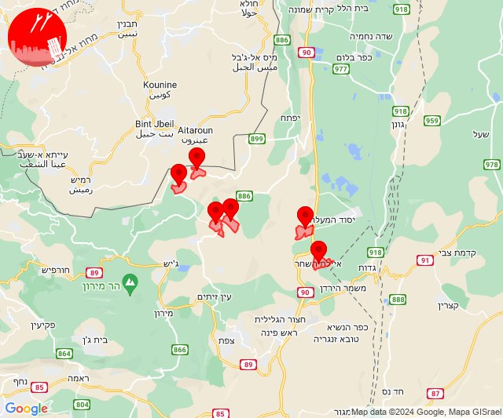

# Alerts for 2024-05-23

## 05:20

🔴 צבע אדום (23/05/2024):

08:20:
• קו העימות: מטולה (מיידי)

צופר - צבע אדום

## 05:20

## 08:38

✈️ חדירת כלי טיס עוין (23/05/2024):

11:38:
• קו העימות: בית הלל, כפר גלעדי, כפר יובל, מטולה, מנרה, מעיין ברוך, מרגליות, משגב עם, קריית שמונה, תל חי 

צופר - צבע אדום

## 08:38

## 08:51

🔴 צבע אדום (23/05/2024):

11:50:
• גליל עליון: איילת השחר, איילת השחר (30 שניות)
• קו העימות: עלמה, ריחאנייה, אביבים, יראון, עלמה (מיידי)

11:51:
• גליל עליון: שדה אליעזר (30 שניות)

צופר - צבע אדום

## 08:51

## 09:47

✈️ חדירת כלי טיס עוין (23/05/2024):

12:47:
• קו העימות: בית הלל, כפר גלעדי, כפר יובל, מטולה, מנרה, מעיין ברוך, מרגליות, משגב עם, קריית שמונה, תל חי 

צופר - צבע אדום

## 09:47

## 11:30

🔴 צבע אדום (23/05/2024):

14:30:
• קו העימות: בית הלל, מעיין ברוך, הגושרים, קריית שמונה (מיידי)

צופר - צבע אדום

## 11:30

## 11:34

🔴 צבע אדום (23/05/2024):

14:34:
• קו העימות: בית הלל, הגושרים, קריית שמונה, מעיין ברוך, כפר גלעדי, תל חי (מיידי)

צופר - צבע אדום

## 11:34

## 11:40

🔴 צבע אדום (23/05/2024):

14:40:
• עוטף עזה: כרם שלום (15 שניות)

צופר - צבע אדום

## 11:40

## 11:42

🔴 צבע אדום (23/05/2024):

14:42:
• עוטף עזה: כרם שלום (15 שניות)

צופר - צבע אדום

## 11:42

## 12:35

🔴 צבע אדום (23/05/2024):

15:35:
• קו העימות: כפר גלעדי, מרגליות, משגב עם, קריית שמונה, תל חי (מיידי)

צופר - צבע אדום

## 12:35

## 12:37

🔴 צבע אדום (23/05/2024):

15:37:
• קו העימות: כפר גלעדי, מרגליות, משגב עם, קריית שמונה, תל חי (מיידי)

צופר - צבע אדום

## 12:37

## 13:35

✈️ חדירת כלי טיס עוין (23/05/2024):

16:35:
• קו העימות: בית הלל, כפר גלעדי, כפר יובל, מטולה, מנרה, מעיין ברוך, מרגליות, משגב עם, קריית שמונה, תל חי, דפנה, הגושרים, ע'ג'ר, קיבוץ דן, שאר ישוב, שניר 

צופר - צבע אדום

## 13:35

## 14:03

🔴 צבע אדום (23/05/2024):

17:03:
• קו העימות: כפר גלעדי (מיידי)

צופר - צבע אדום

## 14:03

## 15:38

✈️ חדירת כלי טיס עוין (23/05/2024):

18:34:
• קו העימות: ע'ג'ר, דפנה, הגושרים, שניר, קיבוץ דן, שאר ישוב 

18:35:
• קו העימות: בית הלל, כפר גלעדי, כפר יובל, מטולה, מנרה, מעיין ברוך, מרגליות, משגב עם, קריית שמונה, תל חי 

18:36:
• קו העימות: בית הלל, כפר גלעדי, כפר יובל, מטולה, מנרה, מעיין ברוך, מרגליות, משגב עם, קריית שמונה, תל חי, דפנה, הגושרים, ע'ג'ר, קיבוץ דן, שאר ישוב, שניר, נאות מרדכי, שדה נחמיה, שמיר, כפר בלום, עמיר, כפר סאלד, להבות הבשן, גונן 

18:37:
• קו העימות: גונן, דישון, יפתח, כפר בלום, כפר סאלד, להבות הבשן, מלכיה, מרכז אזורי מבואות חרמון, נאות מרדכי, עמיר, רמות נפתלי, שדה נחמיה, שמיר 

18:38:
• קו העימות: בית הלל, כפר גלעדי, כפר יובל, מטולה, מנרה, מעיין ברוך, מרגליות, משגב עם, קריית שמונה, תל חי, דפנה, הגושרים, ע'ג'ר, קיבוץ דן, שאר ישוב, שניר 

צופר - צבע אדום

## 15:38

## 15:43

✈️ חדירת כלי טיס עוין (23/05/2024):

18:42:
• קו העימות: בית הלל, כפר גלעדי, כפר יובל, מטולה, מנרה, מעיין ברוך, מרגליות, משגב עם, קריית שמונה, תל חי, דפנה, הגושרים, ע'ג'ר, קיבוץ דן, שאר ישוב, שניר 

18:43:
• קו העימות: דפנה, הגושרים, ע'ג'ר, קיבוץ דן, שאר ישוב, שניר 

צופר - צבע אדום

## 15:43

## 18:03

🔴 צבע אדום (23/05/2024):

21:03:
• מערב הנגב: ברוש, תאשור, תדהר, בטחה (30 שניות, 45 שניות)

צופר - צבע אדום

## 18:03

## 20:35

🔴 צבע אדום (23/05/2024):

23:35:
• קו העימות: ברעם, סאסא, דוב''ב, צבעון (מיידי)

צופר - צבע אדום

## 20:35

