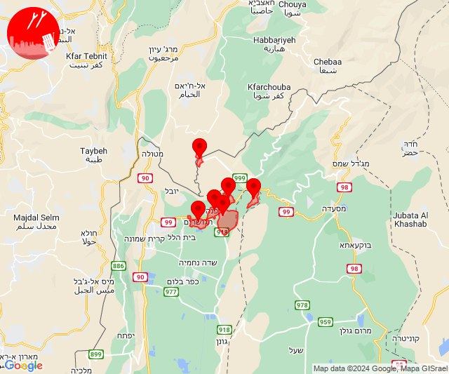

# Alerts for 2024-05-24

## 08:33

✈️ חדירת כלי טיס עוין (24/05/2024):

11:33:
• קו העימות: שניר, ע'ג'ר, שאר ישוב, הגושרים, קיבוץ דן, דפנה 

צופר - צבע אדום

## 08:33

## 08:52

🔴 צבע אדום (24/05/2024):

11:50:
• קו העימות: משגב עם, כפר גלעדי, תל חי, קריית שמונה, מרגליות (מיידי)

11:52:
• קו העימות: מלכיה (מיידי)

צופר - צבע אדום

## 08:52

## 09:16

✈️ חדירת כלי טיס עוין (24/05/2024):

12:16:
• קו העימות: גונן, כפר בלום, כפר סאלד, להבות הבשן, נאות מרדכי, עמיר, שדה נחמיה, שמיר 

צופר - צבע אדום

## 09:16

## 14:19

🔴 צבע אדום (24/05/2024):

17:19:
• קו העימות: מלכיה (מיידי)

צופר - צבע אדום

## 14:19

## 14:37

🔴 צבע אדום (24/05/2024):

17:37:
• קו העימות: קריית שמונה (מיידי)

צופר - צבע אדום

## 14:37

## 15:24

✈️ חדירת כלי טיס עוין (24/05/2024):

18:24:
• צפון הגולן: קלע, שעל 

צופר - צבע אדום

## 15:24

## 15:31

🔴 צבע אדום (24/05/2024):

18:31:
• קו העימות: דוב''ב (מיידי)

צופר - צבע אדום

## 15:31

## 15:36

✈️ חדירת כלי טיס עוין (24/05/2024):

18:36:
• צפון הגולן: מג'דל שמס, מסעדה, נווה אטי''ב, נמרוד, עין קנייא, קלע, שעל 

צופר - צבע אדום

## 15:36

## 15:39

✈️ חדירת כלי טיס עוין (24/05/2024):

18:38:
• קו העימות: ע'ג'ר, דפנה, הגושרים, שניר, קיבוץ דן, שאר ישוב 

18:39:
• קו העימות: בית הלל, כפר גלעדי, כפר יובל, מטולה, מנרה, מעיין ברוך, מרגליות, משגב עם, קריית שמונה, תל חי 

צופר - צבע אדום

## 15:39

## 16:16

🔴 צבע אדום (24/05/2024):

19:16:
• קו העימות: דישון (מיידי)

צופר - צבע אדום

## 16:16

## 16:16

✈️ חדירת כלי טיס עוין (24/05/2024):

19:16:
• גליל עליון: איילת השחר, גדות, חולתה, יסוד המעלה, משמר הירדן, עמוקה, שדה אליעזר 
• קו העימות: דישון, יפתח, מלכיה, מרכז אזורי מבואות חרמון, רמות נפתלי, אזור תעשייה רמת דלתון, ג'ש - גוש חלב, דלתון, כרם בן זמרה, עלמה, ריחאנייה 

צופר - צבע אדום

## 16:16

## 17:29

🔴 צבע אדום (24/05/2024):

20:29:
• עוטף עזה: נתיב העשרה (15 שניות)

צופר - צבע אדום

## 17:29

## 19:15

✈️ חדירת כלי טיס עוין (24/05/2024):

22:15:
• קו העימות: אביבים, ברעם, יראון, אזור תעשייה רמת דלתון, ג'ש - גוש חלב, דלתון, כרם בן זמרה, עלמה, ריחאנייה 

צופר - צבע אדום

## 19:15

