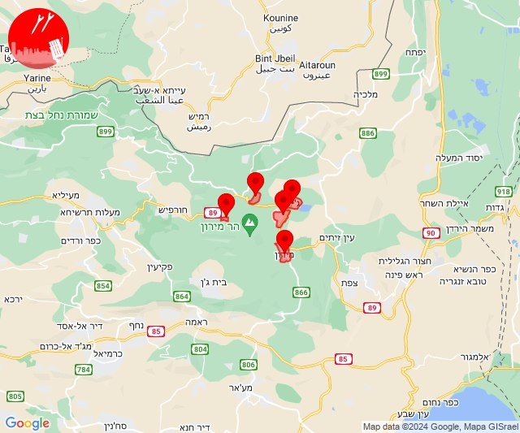

# Alerts for 2024-05-27

## 09:49

✈️ חדירת כלי טיס עוין (27/05/2024):

12:47:
• קו העימות: דפנה, הגושרים, ע'ג'ר, קיבוץ דן, שאר ישוב, שניר 

12:48:
• קו העימות: דפנה, הגושרים, ע'ג'ר, קיבוץ דן, שאר ישוב, שניר 

12:49:
• קו העימות: בית הלל, כפר גלעדי, כפר יובל, מטולה, מנרה, מעיין ברוך, מרגליות, משגב עם, קריית שמונה, תל חי 

צופר - צבע אדום

## 09:49

## 14:00

🔴 צבע אדום (27/05/2024):

16:58:
• קו העימות: צבעון, ג'ש - גוש חלב (מיידי)
• גליל עליון: ספסופה - כפר חושן (30 שניות)

16:59:
• גליל עליון: מירון (30 שניות)
• קו העימות: צבעון (מיידי)

17:00:
• קו העימות: בית ספר שדה מירון (מיידי)

צופר - צבע אדום

## 14:00

## 15:29

🔴 צבע אדום (27/05/2024):

18:29:
• קו העימות: קריית שמונה, תל חי, כפר גלעדי, משגב עם (מיידי)

צופר - צבע אדום

## 15:29

## 15:31

🔴 צבע אדום (27/05/2024):

18:30:
• קו העימות: כפר גלעדי, מנרה, מרגליות, קריית שמונה, תל חי (מיידי)

18:31:
• קו העימות: בית הלל, קריית שמונה, מרגליות (מיידי)

צופר - צבע אדום

## 15:31

## 18:00

🔴 צבע אדום (27/05/2024):

20:59:
• עוטף עזה: סעד (15 שניות)

21:00:
• עוטף עזה: נחל עוז (15 שניות)

צופר - צבע אדום

## 18:00

## 18:14

🔴 צבע אדום (27/05/2024):

21:14:
• קו העימות: עבדון, שלומי (מיידי)

צופר - צבע אדום

## 18:14

## 18:17

🔴 צבע אדום (27/05/2024):

21:17:
• קו העימות: מנות (מיידי)

צופר - צבע אדום

## 18:17

## 20:31

✈️ חדירת כלי טיס עוין (27/05/2024):

23:31:
• אילת: אילות, אילת, אזור תעשייה שחורת 

צופר - צבע אדום

## 20:31

## 20:34

✈️ חדירת כלי טיס עוין (27/05/2024):

23:34:
• אילת: אילות, אילת, אזור תעשייה שחורת 

צופר - צבע אדום

## 20:34

