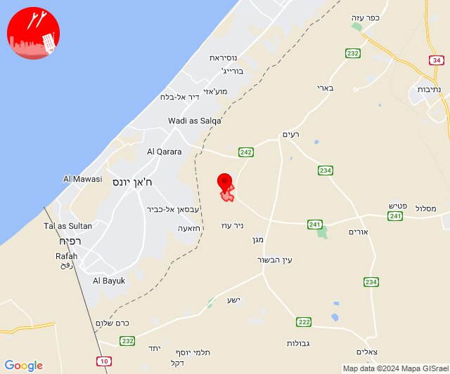
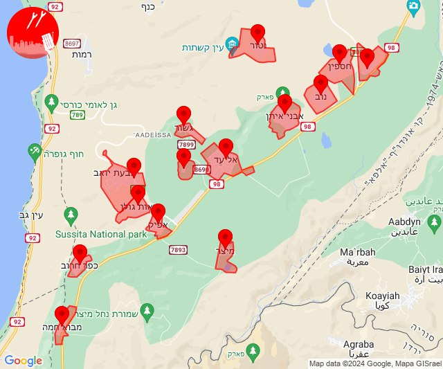
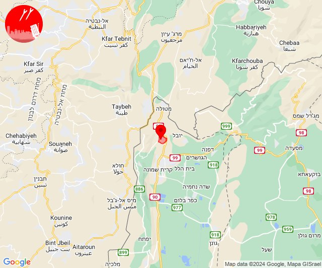
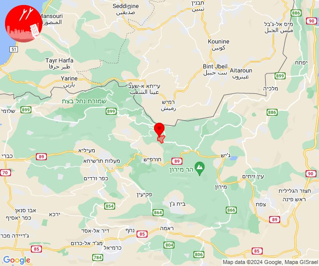
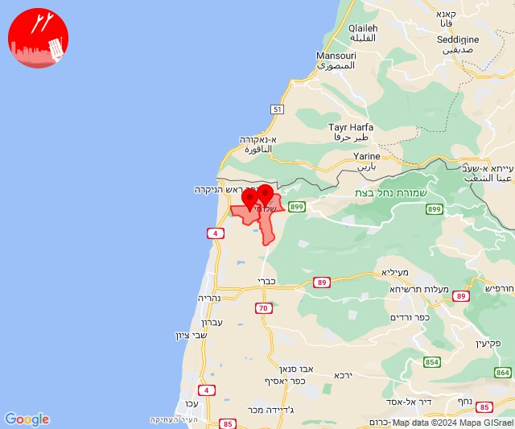
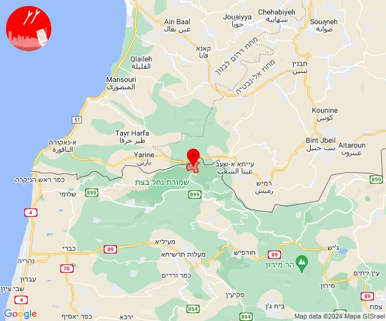
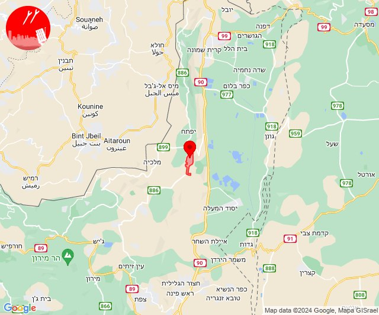

# Alerts for 2024-05-30

## 04:17

🔴 צבע אדום (30/05/2024):

07:17:
• עוטף עזה: נירים (15 שניות)

צופר - צבע אדום

## 04:17

## 05:38

✈️ חדירת כלי טיס עוין (30/05/2024):

08:38:
• דרום הגולן: אבני איתן, אלי עד, אפיק, בני יהודה וגבעת יואב, גשור, חספין, כפר חרוב, מבוא חמה, מיצר, נאות גולן, נוב, נטור, רמת מגשימים, אזור תעשייה בני יהודה 

צופר - צבע אדום

## 05:38

## 07:44

🔴 צבע אדום (30/05/2024):

10:44:
• קו העימות: מרגליות (מיידי)

צופר - צבע אדום

## 07:44

## 09:18

✈️ חדירת כלי טיס עוין (30/05/2024):

12:18:
• קו העימות: בית הלל, כפר גלעדי, כפר יובל, מטולה, מנרה, מעיין ברוך, מרגליות, משגב עם, קריית שמונה, תל חי 

צופר - צבע אדום

## 09:18

## 09:19

🔴 צבע אדום (30/05/2024):

12:19:
• קו העימות: כפר גלעדי (מיידי)

צופר - צבע אדום

## 09:19

## 09:25

✈️ חדירת כלי טיס עוין (30/05/2024):

12:25:
• קו העימות: בית הלל, מרגליות, כפר גלעדי, מנרה, מטולה, מעיין ברוך, תל חי, כפר יובל, קריית שמונה, משגב עם 

צופר - צבע אדום

## 09:25

## 09:46

✈️ חדירת כלי טיס עוין (30/05/2024):

12:46:
• קו העימות: מטולה, מעיין ברוך, מרגליות, משגב עם, בית הלל, מנרה, תל חי, קריית שמונה, כפר גלעדי, כפר יובל 

צופר - צבע אדום

## 09:46

## 10:05

🔴 צבע אדום (30/05/2024):

13:05:
• קו העימות: מתת (מיידי)

צופר - צבע אדום

## 10:05

## 11:52

🔴 צבע אדום (30/05/2024):

14:52:
• קו העימות: בצת, שלומי (מיידי)

צופר - צבע אדום

## 11:52

## 17:02

🔴 צבע אדום (30/05/2024):

20:01:
• קו העימות: זרעית (מיידי)

20:02:
• קו העימות: זרעית (מיידי)

צופר - צבע אדום

## 17:02

## 20:28

🔴 צבע אדום (30/05/2024):

23:28:
• קו העימות: רמות נפתלי (מיידי)

צופר - צבע אדום

## 20:29

