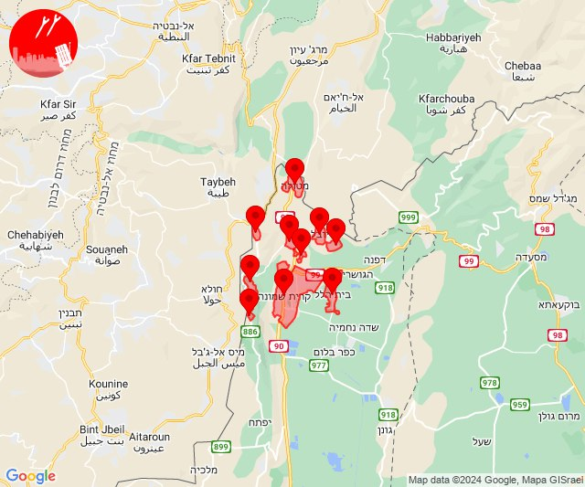

# Alerts for 2024-05-31

## 08:44

🔴 צבע אדום (31/05/2024):

11:44:
• קו העימות: מטולה (מיידי)

צופר - צבע אדום

## 08:44

## 09:13

✈️ חדירת כלי טיס עוין (31/05/2024):

12:13:
• צפון הגולן: קלע, שעל 

צופר - צבע אדום

## 09:13

## 09:52

✈️ חדירת כלי טיס עוין (31/05/2024):

12:52:
• צפון הגולן: אודם, אל רום, בוקעתא, קלע, שעל 

צופר - צבע אדום

## 09:52

## 10:17

✈️ חדירת כלי טיס עוין (31/05/2024):

13:17:
• קו העימות: בית הלל, כפר גלעדי, כפר יובל, מטולה, מנרה, מעיין ברוך, מרגליות, משגב עם, קריית שמונה, תל חי 

צופר - צבע אדום

## 10:17

## 13:01

🔴 צבע אדום (31/05/2024):

16:00:
• קו העימות: מעיין ברוך (מיידי)

16:01:
• קו העימות: מעיין ברוך (מיידי)

צופר - צבע אדום

## 13:01

## 14:59

🔴 צבע אדום (31/05/2024):

17:59:
• גליל עליון: ג'דידה מכר, עכו (30 שניות)

צופר - צבע אדום

## 14:59

## 15:29

🔴 צבע אדום (31/05/2024):

18:29:
• קו העימות: עין יעקב, געתון (15 שניות)
• גליל עליון: כליל (30 שניות)

צופר - צבע אדום

## 15:29

## 15:40

🔴 צבע אדום (31/05/2024):

18:40:
• קו העימות: פקיעין, אלקוש, חורפיש, פסוטה, צוריאל, חוסן, מעלות תרשיחא, פקיעין, חורפיש, צוריאל, אלקוש (15 שניות, מיידי)
• גליל עליון: כיסרא סמיע, חרשים (30 שניות)

צופר - צבע אדום

## 15:40

## 19:37

🔴 צבע אדום (31/05/2024):

22:37:
• קו העימות: בית הלל, קריית שמונה (מיידי)

צופר - צבע אדום

## 19:37

## 19:45

🔴 צבע אדום (31/05/2024):

22:45:
• עוטף עזה: כיסופים (15 שניות)

צופר - צבע אדום

## 19:45

