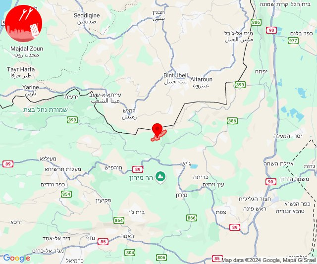

# Alerts for 2024-11-01

## 00:08

🔴 צבע אדום (01/11/2024):

02:08:
• קו העימות: כפר בלום, נאות מרדכי (מיידי)

צופר - צבע אדום

## 00:08

## 04:33

🔴 צבע אדום (01/11/2024):

06:33:
• קו העימות: מנרה, קריית שמונה, כפר בלום, נאות מרדכי (מיידי)

צופר - צבע אדום

## 04:33

## 04:39

🔴 צבע אדום (01/11/2024):

06:39:
• קו העימות: כפר בלום, עמיר, שדה נחמיה, בית הלל, קריית שמונה, הגושרים, כפר יובל, מעיין ברוך, תל חי, כפר גלעדי (מיידי, 15 שניות)
• גליל עליון: שדה אליעזר (30 שניות)

צופר - צבע אדום

## 04:39

## 05:04

🔴 צבע אדום (01/11/2024):

07:04:
• גליל עליון: בית ג'אן (30 שניות)
• קו העימות: פקיעין (15 שניות)

צופר - צבע אדום

## 05:04

## 06:16

✈️ חדירת כלי טיס עוין (01/11/2024):

08:16:
• קו העימות: ע'ג'ר 

צופר - צבע אדום

## 06:16

## 06:35

🔴 צבע אדום (01/11/2024):

08:35:
• קו העימות: אבן מנחם, שומרה, שתולה, אבן מנחם (מיידי)

צופר - צבע אדום

## 06:35

## 08:43

🔴 צבע אדום (01/11/2024):

10:43:
• קו העימות: דוב''ב (מיידי)

צופר - צבע אדום

## 08:43

## 11:37

🔴 צבע אדום (01/11/2024):

13:35:
• מרכז הגליל: יעד, שעב, עצמון - שגב, יובלים, שורשים, אזור תעשייה תרדיון, מרכז אזורי משגב (דקה)

13:36:
• מרכז הגליל: ערב אל נעים, אשחר, סכנין, רקפת (30 שניות, דקה)
• גליל עליון: בענה, דיר אל-אסד, כרמיאל, מג'דל כרום, כישור, פלך, תובל, צורית גילון, מגדל תפן, בענה, דיר אל-אסד, לבון, מג'דל כרום, כישור, לפידות, תובל (30 שניות)
• קו העימות: זרעית, אבן מנחם, שומרה, חוסן, כפר ורדים, מעונה, מעיליא, מעלות תרשיחא, צוריאל (מיידי, 15 שניות)

13:37:
• גליל עליון: כרמיאל (30 שניות)

צופר - צבע אדום

## 11:37

## 15:05

✈️ חדירת כלי טיס עוין (01/11/2024):

17:05:
• המפרץ: חיפה - מפרץ 

צופר - צבע אדום

## 15:05

## 19:14

🔴 צבע אדום (01/11/2024):

21:14:
• עוטף עזה: מפלסים (15 שניות)

צופר - צבע אדום

## 19:14

