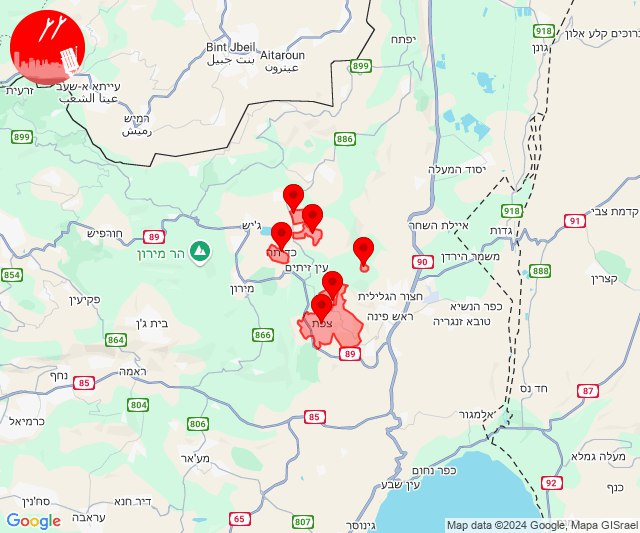

# Alerts for 2024-11-02

## 00:17

🔴 צבע אדום (02/11/2024):

02:17:
• שרון: בית ברל, טירה, כפר הס, כפר עבודה, משמרת, רמת הכובש, חרות, צופית, שדה ורבורג, כפר סבא, נווה ימין, ניר אליהו, גבעת חן, רעננה, אייל, אלישמע, ג'לג'וליה, גן חיים, גני עם, הוד השרון, חגור, ירחיב, ירקונה, כוכב יאיר - צור יגאל, כפר מל''ל, מתן, רמות השבים, שדי חמד, בצרה, אזור תעשייה טירה (דקה וחצי)
• דן: הרצליה - מרכז וגליל ים (דקה וחצי)

צופר - צבע אדום

## 00:17

## 04:53

🔴 צבע אדום (02/11/2024):

06:51:
• גליל עליון: ביריה, צפת - עיר (30 שניות)

06:52:
• קו העימות: דלתון (מיידי)
• גליל עליון: צפת - עיר, אזור תעשייה חצור הגלילית, חצור הגלילית, מחניים, איילת השחר, משמר הירדן, מנחת מחניים, טובא זנגריה, כפר הנשיא, ביריה (30 שניות)

06:53:
• גליל עליון: גדות, חולתה, רפטינג נהר הירדן (30 שניות)

צופר - צבע אדום

## 04:53

## 05:01

🔴 צבע אדום (02/11/2024):

07:01:
• גליל עליון: מלון אחוזת ירדן, איילת השחר, שדה אליעזר (30 שניות)

צופר - צבע אדום

## 05:01

## 05:16

🔴 צבע אדום (02/11/2024):

07:15:
• המפרץ: קריית ביאליק, קריית ים, קריית מוצקין, אזור תעשייה קריית ביאליק (דקה)
• גליל עליון: אזור תעשייה שער נעמן, אפק, ג'דידה מכר, בית העלמין החדש עכו, כפר מסריק (דקה, 30 שניות)
• מרכז הגליל: טמרה, כאבול, מצפה אבי''ב, מנוף, אזור תעשייה טמרה, אעבלין, שפרעם (דקה)
• קו העימות: מצובה, שלומי, נהריה, סער (מיידי, 15 שניות)

07:16:
• גליל עליון: עין המפרץ, עכו - אזור תעשייה (30 שניות)

צופר - צבע אדום

## 05:16

## 06:08

🔴 צבע אדום (02/11/2024):

08:08:
• קו העימות: איזור תעשייה מילואות צפון, חוף בצת, לימן (מיידי)

צופר - צבע אדום

## 06:08

## 06:16

🔴 צבע אדום (02/11/2024):

08:16:
• צפון הגולן: רמת טראמפ, מצוק עורבים (15 שניות)

צופר - צבע אדום

## 06:16

## 06:27

✈️ חדירת כלי טיס עוין (02/11/2024):

08:08:
• קו העימות: גשר הזיו, נהריה 

08:09:
• קו העימות: סער 

08:10:
• קו העימות: איזור תעשייה מילואות צפון, לימן 

08:11:
• גליל עליון: שבי ציון, מזרעה 
• קו העימות: עברון 

08:12:
• גליל עליון: רגבה 

08:13:
• גליל עליון: שבי ציון, בוסתן הגליל, מזרעה, רגבה, בית העמק, נס עמים, נתיב השיירה 
• קו העימות: עברון 

08:14:
• גליל עליון: עכו, שומרת, לוחמי הגטאות 
• קו העימות: גורן, גורנות הגליל 

08:16:
• גליל עליון: כפר מסריק, עין המפרץ, עכו - אזור תעשייה, עכו 
• קו העימות: הילה, מעיליא, מעלות תרשיחא, מעונה 

08:17:
• גליל עליון: עכו - אזור תעשייה, כפר מסריק, אזור תעשייה שער נעמן 

08:18:
• המפרץ: אזור תעשייה קריית ביאליק 
• גליל עליון: ג'דידה מכר, בית העלמין החדש עכו 

08:19:
• המפרץ: קריית ים, קריית מוצקין 

08:20:
• המפרץ: חיפה - קריית חיים ושמואל 

08:21:
• המפרץ: חיפה - מפרץ, קריית ים, כפר ביאליק, קריית ביאליק, קריית מוצקין 
• גליל עליון: ג'דידה מכר, בית העלמין החדש עכו, אחיהוד 

08:22:
• המפרץ: קריית אתא, חיפה - קריית חיים ושמואל 
• גליל עליון: טל - אל, אזור תעשייה בר-לב 

08:23:
• המפרץ: אושה, כפר המכבי, רמת יוחנן 

08:24:
• המפרץ: קריית אתא, קריית ביאליק 

08:27:
• קו העימות: בית הלל, הגושרים 

צופר - צבע אדום

## 06:27

## 06:34

✈️ חדירת כלי טיס עוין (02/11/2024):

08:34:
• העמקים: כפר יהושע 

צופר - צבע אדום

## 06:34

## 07:17

🔴 צבע אדום (02/11/2024):

09:16:
• המפרץ: קריית אתא (דקה)
• מרכז הגליל: אזור תעשייה טמרה, טמרה, שפרעם, אעבלין (דקה)

09:17:
• מרכז הגליל: כאבול (דקה)
• גליל עליון: דיר אל-אסד, מג'דל כרום, ירכא, כישור, פלך, תובל, צורית גילון (30 שניות)

צופר - צבע אדום

## 07:18

## 07:50

🔴 צבע אדום (02/11/2024):

09:50:
• קו העימות: לב החולה, מרכז אזורי מבואות חרמון, רמות נפתלי, יפתח (מיידי)
• גליל עליון: חולתה, יסוד המעלה (30 שניות)

צופר - צבע אדום

## 07:50

## 08:08

🔴 צבע אדום (02/11/2024):

10:08:
• קו העימות: דוב''ב (מיידי)

צופר - צבע אדום

## 08:08

## 09:05

🔴 צבע אדום (02/11/2024):

11:05:
• המפרץ: קריית אתא, אושה, כפר המכבי, קריית ביאליק, רמת יוחנן, בית עלמין תל רגב, קריית ים, קריית מוצקין, אזור תעשייה קריית ביאליק (דקה)
• מרכז הגליל: אזור תעשייה טמרה, אעבלין, טמרה, שפרעם, ביר אלמכסור, דמיידה, מצפה אבי''ב (דקה)
• העמקים: נופית, ראס עלי, חוואלד, הרדוף, עדי, ח'וואלד, סואעד חמירה (דקה)
• גליל עליון: אפק, בוסתן הגליל, נס עמים, עכו, שבי ציון, שומרת, לוחמי הגטאות, מזרעה, רגבה, אזור תעשייה שער נעמן, יסעור, אזור תעשייה בר-לב, אחיהוד, ג'וליס, טל - אל, ירכא (דקה, 30 שניות)
• קו העימות: נהריה, עברון, בן עמי (15 שניות, מיידי)

צופר - צבע אדום

## 09:05

## 10:03

🔴 צבע אדום (02/11/2024):

12:03:
• קו העימות: אביבים, יראון (מיידי)

צופר - צבע אדום

## 10:03

## 10:37

🔴 צבע אדום (02/11/2024):

12:37:
• קו העימות: ג'ש - גוש חלב, דלתון, כרם בן זמרה, דישון, צבעון, ברעם, דוב''ב (מיידי)
• גליל עליון: קדיתא, אמירים, כפר שמאי, מירון, שפר, ספסופה - כפר חושן, מרכז אזורי מרום גליל (30 שניות)

צופר - צבע אדום

## 10:37

## 10:45

🔴 צבע אדום (02/11/2024):

12:45:
• גליל עליון: ג'דידה מכר, עכו, עין המפרץ, עכו - אזור תעשייה, בוסתן הגליל, נס עמים, שבי ציון, שומרת, לוחמי הגטאות, מזרעה, רגבה (30 שניות)
• קו העימות: נהריה, עברון (15 שניות)

צופר - צבע אדום

## 10:45

## 11:38

🔴 צבע אדום (02/11/2024):

13:38:
• גליל עליון: צפת - עיר, ביריה, עמוקה, קדיתא, צפת - עיר (30 שניות)
• קו העימות: אזור תעשייה רמת דלתון, דלתון (מיידי)

צופר - צבע אדום

## 11:38

## 11:59

🔴 צבע אדום (02/11/2024):

13:57:
• מרכז הגליל: מרכז אזורי משגב, עצמון - שגב, רקפת, אזור תעשייה תרדיון, יודפת, יובלים, ערב אל נעים, סכנין, אשבל, אשחר, קורנית, שכניה (דקה, 30 שניות)

13:58:
• גליל עליון: בענה, דיר אל-אסד, כרמיאל, לבון, מג'דל כרום, צורית גילון, כישור, לפידות, פלך, תובל, אזור תעשייה כרמיאל (30 שניות)
• מרכז הגליל: יעד, שורשים, שעב, חוסנייה (דקה)

13:59:
• קו העימות: מנרה, מרגליות (מיידי)

צופר - צבע אדום

## 11:59

## 12:15

🔴 צבע אדום (02/11/2024):

14:15:
• קו העימות: מרגליות (מיידי)

צופר - צבע אדום

## 12:15

## 13:05

🔴 צבע אדום (02/11/2024):

15:05:
• קו העימות: מנרה, מרגליות, קריית שמונה (מיידי)

צופר - צבע אדום

## 13:05

## 13:55

🔴 צבע אדום (02/11/2024):

15:53:
• קו העימות: מצובה, שלומי, נהריה, גשר הזיו, סער, איזור תעשייה מילואות צפון, כברי, לימן, בצת, חניתה, יערה, עבדון, בן עמי (מיידי, 15 שניות)
• גליל עליון: שבי ציון (30 שניות)

15:54:
• קו העימות: עברון, שלומי, מצובה, נהריה, לימן, איזור תעשייה מילואות צפון, בית העלמין החדש נהריה, סער, כברי, גשר הזיו, בן עמי, בצת, עבדון, יערה, עברון (15 שניות, מיידי, 30 שניות)
• גליל עליון: מזרעה, שבי ציון, בוסתן הגליל, לוחמי הגטאות, רגבה, מזרעה (30 שניות)

15:55:
• קו העימות: נהריה (15 שניות)

צופר - צבע אדום

## 13:55

## 14:30

✈️ חדירת כלי טיס עוין (02/11/2024):

16:16:
• קו העימות: מצובה, שלומי 

16:17:
• קו העימות: בצת, לימן 

16:18:
• קו העימות: גשר הזיו, איזור תעשייה מילואות צפון, נהריה, סער 

16:20:
• קו העימות: בן עמי, נהריה, עברון 
• גליל עליון: שבי ציון, מזרעה 

16:21:
• גליל עליון: רגבה, לוחמי הגטאות, מזרעה, נס עמים 

16:22:
• גליל עליון: שומרת, רגבה, בוסתן הגליל, עכו 

16:24:
• גליל עליון: עין המפרץ, עכו - אזור תעשייה, כפר מסריק, עכו 

16:25:
• גליל עליון: אזור תעשייה שער נעמן 
• המפרץ: אזור תעשייה קריית ביאליק 

16:26:
• המפרץ: קריית ביאליק, קריית ים, קריית מוצקין 

16:27:
• המפרץ: חיפה - קריית חיים ושמואל, כפר ביאליק 

16:28:
• המפרץ: חיפה - מפרץ, קריית אתא 

16:30:
• המפרץ: נשר 

צופר - צבע אדום

## 14:30

## 14:47

✈️ חדירת כלי טיס עוין (02/11/2024):

16:38:
• ואדי ערה: יקנעם עילית, אזור תעשייה יקנעם עילית 

16:40:
• ואדי ערה: אליקים 

16:42:
• הכרמל: בת שלמה 

16:44:
• מנשה: זכרון יעקב 

16:45:
• מנשה: מעיין צבי, רמת הנדיב 

16:46:
• מנשה: בית ספר אורט בנימינה 

16:47:
• מנשה: בנימינה 

צופר - צבע אדום

## 14:47

## 16:27

🔴 צבע אדום (02/11/2024):

18:27:
• קו העימות: מצובה (מיידי)

צופר - צבע אדום

## 16:27

## 18:37

🔴 צבע אדום (02/11/2024):

20:37:
• קו העימות: אביבים, ריחאנייה, יראון (מיידי)

צופר - צבע אדום

## 18:37

## 19:02

🔴 צבע אדום (02/11/2024):

21:02:
• עוטף עזה: מפלסים, שדרות, איבים (15 שניות)

צופר - צבע אדום

## 19:02

## 20:01

🔴 צבע אדום (02/11/2024):

22:00:
• קו העימות: מנות (מיידי)

22:01:
• קו העימות: אילון (מיידי)

צופר - צבע אדום

## 20:01

