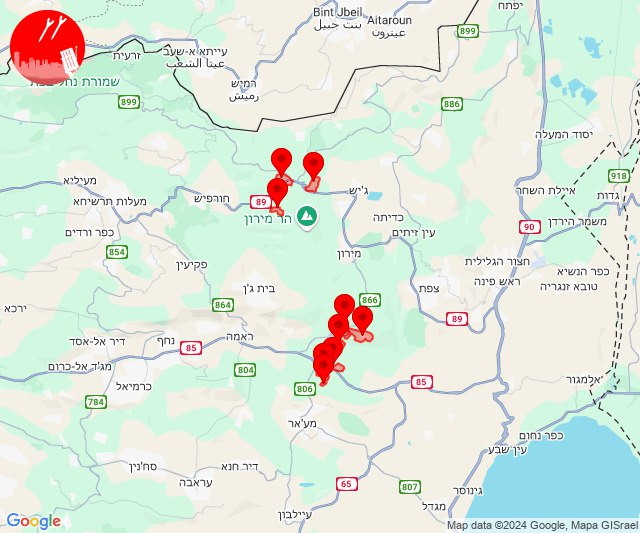
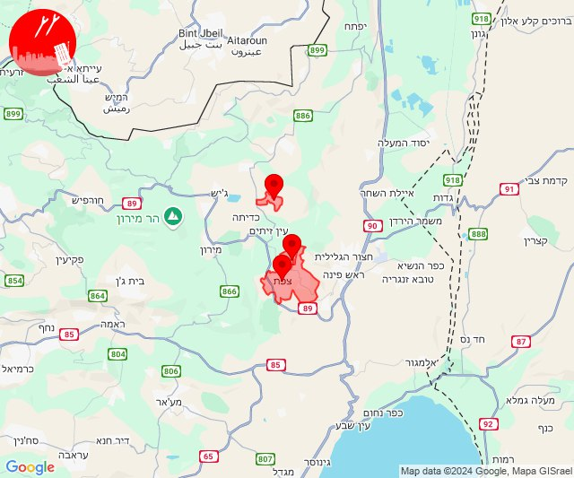

# Alerts for 2024-11-03

## 04:29

✈️ חדירת כלי טיס עוין (03/11/2024):

06:20:
• דרום הגולן: רמת מגשימים 

06:21:
• דרום הגולן: חספין 

06:22:
• דרום הגולן: נוב 

06:23:
• דרום הגולן: אבני איתן 

06:28:
• דרום הגולן: אלי עד, בני יהודה וגבעת יואב 

06:29:
• דרום הגולן: נאות גולן 

צופר - צבע אדום

## 04:29

## 05:27

🔴 צבע אדום (03/11/2024):

07:26:
• קו העימות: דוב''ב (מיידי)

07:27:
• קו העימות: ברעם, דוב''ב, צבעון, סאסא (מיידי)

צופר - צבע אדום

## 05:27

## 05:29

🔴 צבע אדום (03/11/2024):

07:29:
• קו העימות: זרעית, שומרה (מיידי)

צופר - צבע אדום

## 05:29

## 06:05

🔴 צבע אדום (03/11/2024):

08:05:
• גליל עליון: אזור תעשייה שער נעמן, עכו - אזור תעשייה, כפר מסריק, ג'דידה מכר, עין המפרץ, עכו, בית העלמין החדש עכו (דקה, 30 שניות)
• המפרץ: קריית ביאליק, אזור תעשייה קריית ביאליק, קריית ים, קריית מוצקין (דקה)

צופר - צבע אדום

## 06:05

## 07:02

🔴 צבע אדום (03/11/2024):

08:58:
• מנשה: תלמי אלעזר (דקה וחצי)

08:59:
• הכרמל: גבע כרמל, דור, הבונים, נווה ים, נחשולים, עין איילה, עין כרמל, עתלית, צרופה (דקה)

09:00:
• קו העימות: לב החולה, מנות, עבדון, בצת, שלומי, יערה, אדמית (מיידי)

09:01:
• קו העימות: ראש הנקרה, שלומי, חניתה, בצת, מצובה (מיידי)

09:02:
• קו העימות: שלומי, חניתה (מיידי)

צופר - צבע אדום

## 07:02

## 07:02

✈️ חדירת כלי טיס עוין (03/11/2024):

09:01:
• צפון הגולן: בוקעתא 

09:02:
• צפון הגולן: אל רום, בוקעתא 

צופר - צבע אדום

## 07:02

## 09:13

🔴 צבע אדום (03/11/2024):

11:11:
• קו העימות: גשר הזיו, נהריה, סער, ראש הנקרה, איזור תעשייה מילואות צפון, בצת, לימן, מצובה, שלומי (מיידי, 15 שניות)

11:12:
• דרום הגולן: קצרין - אזור תעשייה, קצרין (30 שניות)

11:13:
• דרום הגולן: אניעם (15 שניות)

צופר - צבע אדום

## 09:13

## 09:43

🔴 צבע אדום (03/11/2024):

11:43:
• קו העימות: מנרה (מיידי)

צופר - צבע אדום

## 09:43

## 10:07

🔴 צבע אדום (03/11/2024):

12:07:
• גליל עליון: ג'דידה מכר, בית העלמין החדש עכו (30 שניות)

צופר - צבע אדום

## 10:07

## 12:22

🔴 צבע אדום (03/11/2024):

14:22:
• קו העימות: גונן, להבות הבשן (15 שניות)

צופר - צבע אדום

## 12:22

## 12:28

🔴 צבע אדום (03/11/2024):

14:27:
• גליל תחתון: הודיות, כפר נהר הירדן, גבעת אבני, לביא (דקה)
• מרכז הגליל: מסד, עילבון (דקה)

14:28:
• מרכז הגליל: בועיינה-נוג'ידאת, מצפה נטופה, חזון, טפחות, מע'אר, דיר חנא (דקה)
• גליל תחתון: אזור תעשייה קדמת גליל, נבי שועייב, אתר ההנצחה גולני (דקה)
• העמקים: אילניה (דקה)

צופר - צבע אדום

## 12:28

## 12:35

✈️ חדירת כלי טיס עוין (03/11/2024):

14:35:
• קו העימות: לב החולה 

צופר - צבע אדום

## 12:35

## 13:43

🔴 צבע אדום (03/11/2024):

15:43:
• קו העימות: מטולה (מיידי)

צופר - צבע אדום

## 13:43

## 13:54

🔴 צבע אדום (03/11/2024):

15:54:
• קו העימות: מטולה (מיידי)

צופר - צבע אדום

## 13:54

## 14:55

🔴 צבע אדום (03/11/2024):

16:55:
• המפרץ: חיפה - כרמל, הדר ועיר תחתית, חיפה - מערב (דקה)

צופר - צבע אדום

## 14:55

## 15:27

🔴 צבע אדום (03/11/2024):

17:26:
• גליל עליון: לוחמי הגטאות (30 שניות)

17:27:
• גליל עליון: בוסתן הגליל (30 שניות)

צופר - צבע אדום

## 15:27

## 15:38

🔴 צבע אדום (03/11/2024):

17:38:
• קו העימות: אביבים (מיידי)

צופר - צבע אדום

## 15:38

## 15:47

✈️ חדירת כלי טיס עוין (03/11/2024):

17:21:
• קו העימות: גשר הזיו, איזור תעשייה מילואות צפון, לימן, נהריה, סער 

17:23:
• קו העימות: בן עמי, נהריה, עברון 

17:24:
• גליל עליון: מזרעה, רגבה 

17:25:
• גליל עליון: לוחמי הגטאות 

17:26:
• גליל עליון: שומרת, עכו 

17:27:
• גליל עליון: ג'דידה מכר 

17:28:
• גליל עליון: עין המפרץ, עכו - אזור תעשייה 

17:30:
• גליל עליון: כפר מסריק, אזור תעשייה שער נעמן, עין המפרץ, עכו - אזור תעשייה, אזור תעשייה בר-לב, אחיהוד 
• המפרץ: אזור תעשייה קריית ביאליק 

17:31:
• המפרץ: קריית ביאליק, קריית ים, קריית מוצקין 

17:33:
• המפרץ: חיפה - קריית חיים ושמואל, כפר ביאליק 

17:34:
• המפרץ: קריית אתא, חיפה - מפרץ 

17:36:
• המפרץ: אושה, כפר המכבי, קריית אתא, רמת יוחנן 
• גליל עליון: אפק 

17:37:
• המפרץ: כפר חסידים, רכסים, יגור 

17:38:
• המפרץ: איבטין 

17:39:
• המפרץ: כפר חסידים 
• העמקים: שער העמקים, קריית טבעון - בית זייד 
• הכרמל: בית סוהר קישון 

17:40:
• העמקים: אורנים 
• ואדי ערה: אליקים 

17:41:
• העמקים: כפר תקווה, קריית טבעון - בית זייד 

17:42:
• ואדי ערה: אזור תעשייה יקנעם עילית, יקנעם המושבה והזורע, יקנעם עילית 

17:44:
• ואדי ערה: אליקים 

17:47:
• ואדי ערה: אליקים, עין העמק 

צופר - צבע אדום

## 15:47

## 22:00

🔴 צבע אדום (04/11/2024):

00:00:
• קו העימות: בית ספר שדה מירון, סאסא, צבעון (מיידי)
• מרכז הגליל: כפר חנניה, עינבר (דקה)
• גליל עליון: אמירים, עין כמונים, פרוד, שפר (30 שניות)

צופר - צבע אדום

## 22:00

## 22:15

🔴 צבע אדום (04/11/2024):

00:14:
• גליל עליון: צפת - עיר, ביריה (30 שניות)

00:15:
• קו העימות: דלתון (מיידי)

צופר - צבע אדום

## 22:15

## 22:21

🔴 צבע אדום (04/11/2024):

00:21:
• גליל עליון: יסוד המעלה (30 שניות)

צופר - צבע אדום

## 22:21

