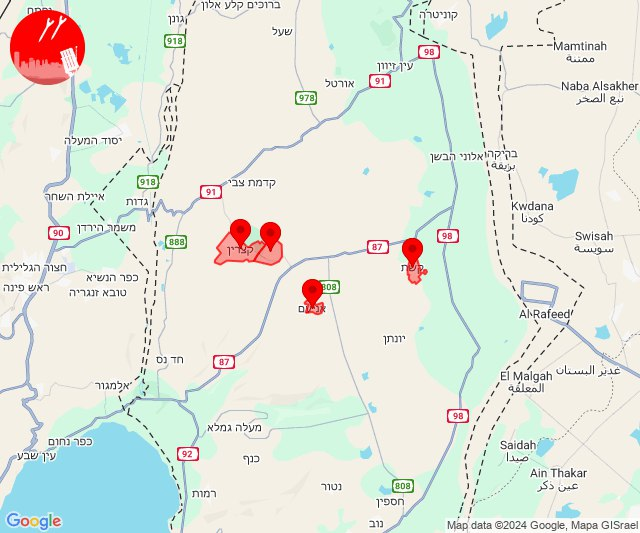
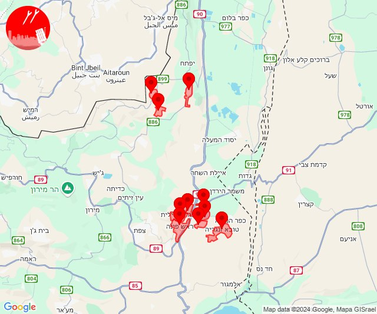
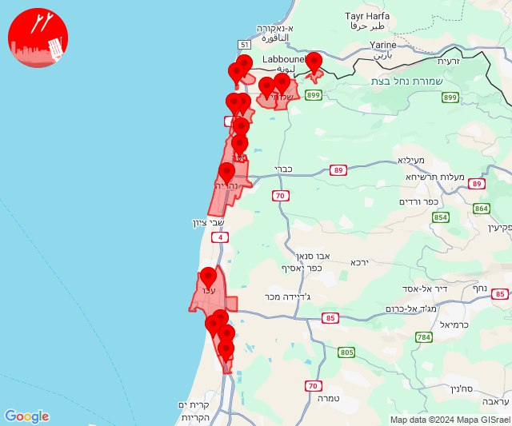
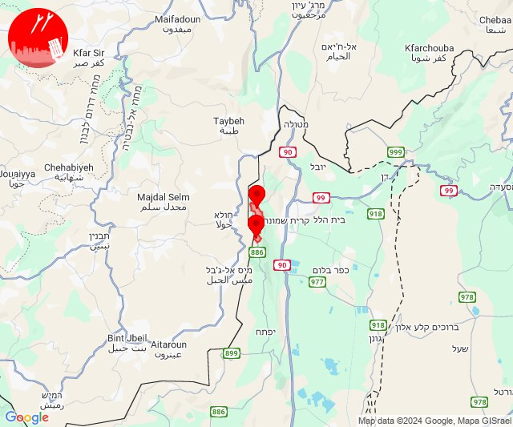
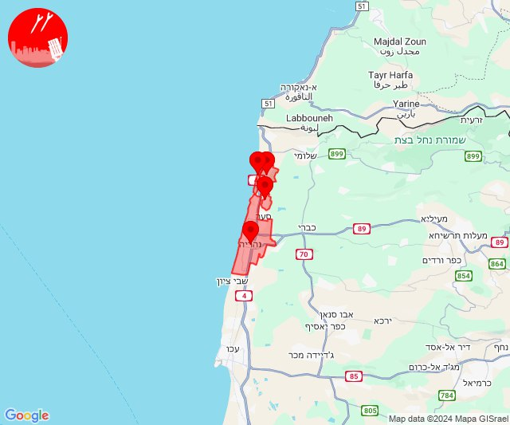
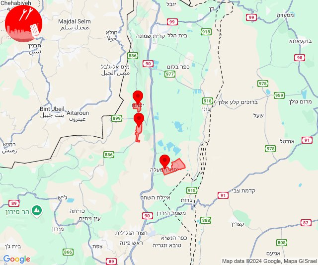
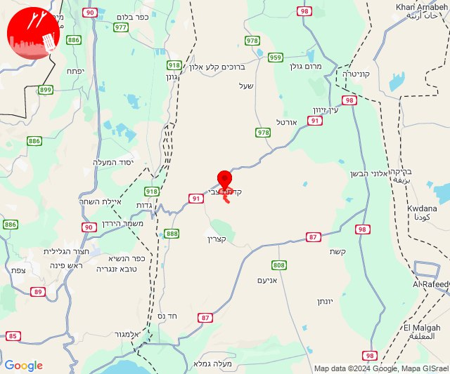
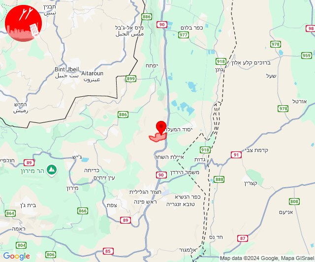
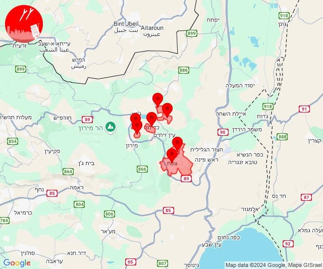

# Alerts for 2024-11-04

## 05:47

✈️ חדירת כלי טיס עוין (04/11/2024):

07:42:
• דרום הגולן: קשת 

07:43:
• דרום הגולן: קשת 

07:46:
• דרום הגולן: אניעם 

07:47:
• דרום הגולן: קצרין - אזור תעשייה, קצרין 

צופר - צבע אדום

## 05:47

## 07:25

🔴 צבע אדום (04/11/2024):

09:25:
• קו העימות: רמות נפתלי, דישון, מלכיה, דישון, מלכיה (מיידי)
• גליל עליון: אזור תעשייה חצור הגלילית, אזור תעשייה צ.ח.ר, חצור הגלילית, טובא זנגריה, מחניים, ראש פינה, מנחת מחניים (30 שניות)

צופר - צבע אדום

## 07:25

## 09:02

🔴 צבע אדום (04/11/2024):

10:58:
• קו העימות: נהריה (15 שניות)

11:00:
• קו העימות: גשר הזיו, נהריה, סער, בצת, חניתה, ראש הנקרה, שלומי, איזור תעשייה מילואות צפון, לימן, שלומי, בצת, חוף בצת, ראש הנקרה (מיידי, 15 שניות)
• גליל עליון: אזור תעשייה שער נעמן, כפר מסריק, עין המפרץ, עכו - אזור תעשייה, עכו (דקה, 30 שניות)

11:01:
• קו העימות: איזור תעשייה מילואות צפון, גשר הזיו, נהריה (מיידי, 15 שניות)

11:02:
• קו העימות: שלומי, איזור תעשייה מילואות צפון, לימן (מיידי)

צופר - צבע אדום

## 09:02

## 14:24

🔴 צבע אדום (04/11/2024):

16:24:
• קו העימות: מנרה, מרגליות (מיידי)

צופר - צבע אדום

## 14:24

## 15:14

✈️ חדירת כלי טיס עוין (04/11/2024):

17:13:
• קו העימות: לימן, איזור תעשייה מילואות צפון 

17:14:
• קו העימות: גשר הזיו, נהריה 

צופר - צבע אדום

## 15:14

## 15:19

🔴 צבע אדום (04/11/2024):

17:18:
• קו העימות: רמות נפתלי (מיידי)

17:19:
• קו העימות: יפתח, רמות נפתלי, יפתח (מיידי)
• גליל עליון: יסוד המעלה (30 שניות)

צופר - צבע אדום

## 15:19

## 16:02

🔴 צבע אדום (04/11/2024):

18:02:
• דרום הגולן: קדמת צבי (15 שניות)

צופר - צבע אדום

## 16:02

## 16:10

🔴 צבע אדום (04/11/2024):

18:10:
• גליל עליון: שדה אליעזר (30 שניות)

צופר - צבע אדום

## 16:10

## 19:20

🔴 צבע אדום (04/11/2024):

21:20:
• קו העימות: מנרה (מיידי)

צופר - צבע אדום

## 19:20

## 21:20

🔴 צבע אדום (04/11/2024):

23:19:
• גליל עליון: קדיתא, צפת - עיר (30 שניות)

23:20:
• גליל עליון: ביריה, אור הגנוז, בר יוחאי (30 שניות)
• קו העימות: אזור תעשייה רמת דלתון, דלתון (מיידי)

צופר - צבע אדום

## 21:20

