# Alerts for 2024-11-05

## 04:39

🔴 צבע אדום (05/11/2024):

06:37:
• מנשה: תלמי אלעזר (דקה וחצי)

06:38:
• הכרמל: נווה ים, בית אורן, גבעת וולפסון, דלית אל כרמל, עספיא, אזור תעשייה ניר עציון, בית סוהר קישון, בית צבי, גבע כרמל, כפר הנוער ימין אורד, מגדים, ניר עציון, עין הוד, עין חוד, עין כרמל, עתלית, יערות הכרמל, כלא דמון, דור, הבונים, כרם מהר''ל, מרכז מיר''ב, נחשולים, עופר, עין איילה, פוריידיס, צרופה (דקה)
• המפרץ: אושה, חיפה - כרמל, הדר ועיר תחתית, חיפה - מערב, חיפה - מפרץ, חיפה - נווה שאנן ורמות כרמל, חיפה - קריית חיים ושמואל, כפר ביאליק, כפר המכבי, קריית אתא, קריית ביאליק, קריית ים, קריית מוצקין, נשר, איבטין, החותרים, טירת כרמל, יגור, כפר גלים, כפר חסידים, רכסים (דקה)

06:39:
• העמקים: קריית טבעון - בית זייד (דקה)

צופר - צבע אדום

## 04:39

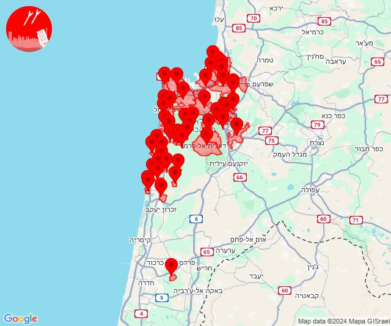

## 05:24

✈️ חדירת כלי טיס עוין (05/11/2024):

07:24:
• ים המלח: מצדה 

צופר - צבע אדום

## 05:24

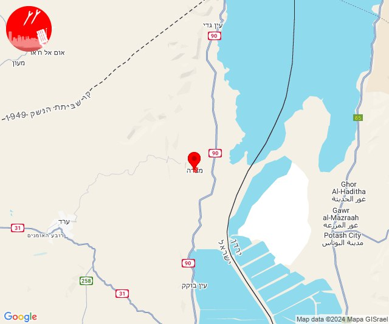

## 05:53

✈️ חדירת כלי טיס עוין (05/11/2024):

07:51:
• קו העימות: כפר גלעדי 

07:53:
• קו העימות: מטולה 

צופר - צבע אדום

## 05:53

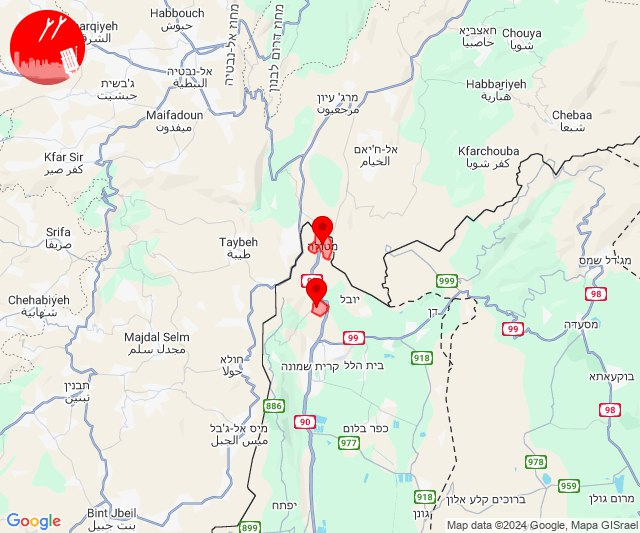

## 05:56

🔴 צבע אדום (05/11/2024):

07:56:
• קו העימות: מנרה (מיידי)

צופר - צבע אדום

## 05:57

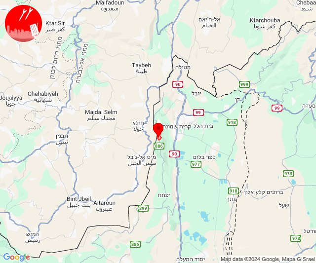

## 07:10

🔴 צבע אדום (05/11/2024):

09:08:
• קו העימות: צבעון, סאסא (מיידי)

09:09:
• קו העימות: דוב''ב, צבעון, סאסא, בית ספר שדה מירון (מיידי)

09:10:
• קו העימות: סאסא, צבעון (מיידי)

צופר - צבע אדום

## 07:10

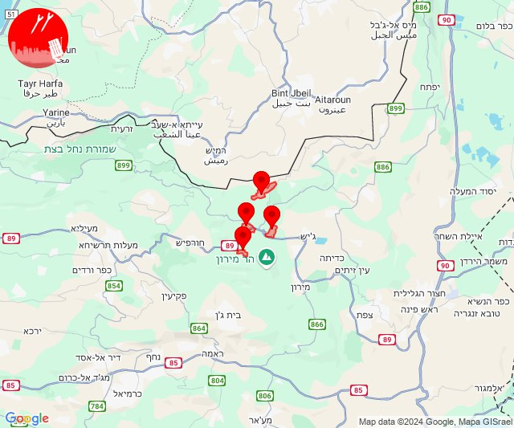

## 08:35

🔴 צבע אדום (05/11/2024):

10:35:
• קו העימות: דלתון, אזור תעשייה רמת דלתון, ג'ש - גוש חלב, כרם בן זמרה, ברעם (מיידי)
• גליל עליון: קדיתא (30 שניות)

צופר - צבע אדום

## 08:35

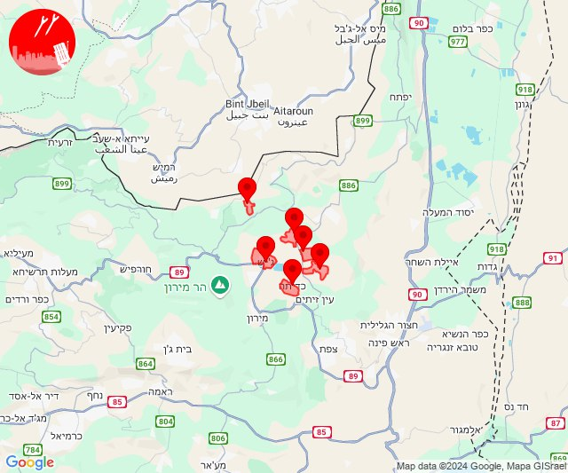

## 10:51

🔴 צבע אדום (05/11/2024):

12:51:
• קו העימות: מרגליות (מיידי)

צופר - צבע אדום

## 10:51

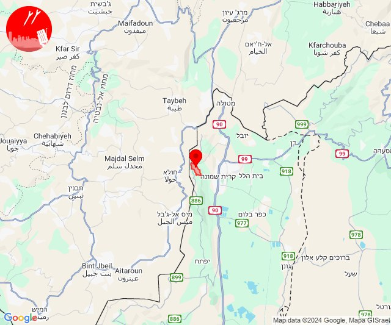

## 11:02

🔴 צבע אדום (05/11/2024):

13:02:
• קו העימות: מרגליות, קריית שמונה, מנרה (מיידי)

צופר - צבע אדום

## 11:02

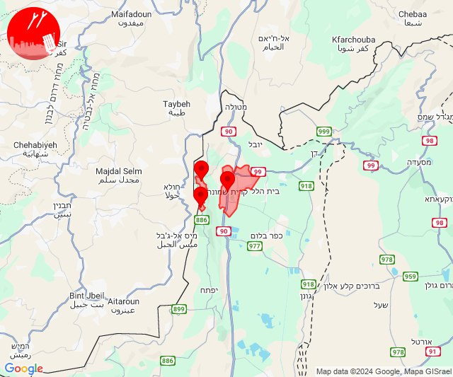

## 11:54

🔴 צבע אדום (05/11/2024):

13:54:
• קו העימות: מנרה (מיידי)

צופר - צבע אדום

## 11:54

## 15:03

🔴 צבע אדום (05/11/2024):

17:03:
• קו העימות: יפתח (מיידי)

צופר - צבע אדום

## 15:03

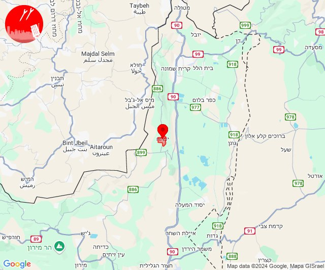

## 15:10

🔴 צבע אדום (05/11/2024):

17:10:
• קו העימות: יראון (מיידי)

צופר - צבע אדום

## 15:10

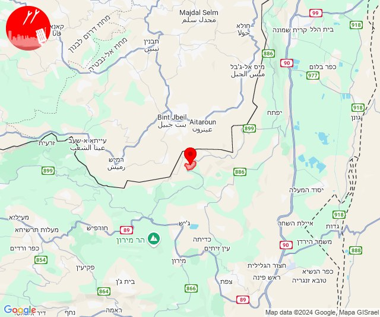

## 15:19

🔴 צבע אדום (05/11/2024):

17:18:
• קו העימות: בית העלמין החדש נהריה, בן עמי, נהריה, עברון, מנות, נווה זיו, עבדון, כברי (30 שניות, מיידי, 15 שניות)
• גליל עליון: נתיב השיירה, שייח' דנון, נס עמים, לוחמי הגטאות, מזרעה, רגבה (30 שניות)

17:19:
• קו העימות: גשר הזיו, סער, מצובה, שלומי, נהריה, איזור תעשייה מילואות צפון, בצת, חוף בצת, לימן, בן עמי, בית העלמין החדש נהריה, כברי, מצובה, נווה זיו, סער, עברון (מיידי, 15 שניות, 30 שניות)
• גליל עליון: נתיב השיירה, שייח' דנון (30 שניות)

צופר - צבע אדום

## 15:19

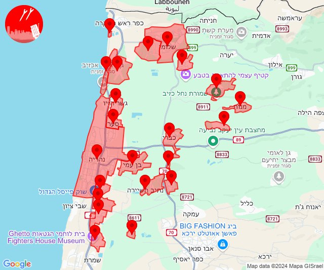

## 20:04

✈️ חדירת כלי טיס עוין (05/11/2024):

22:04:
• ערבה: אליפז ומכרות תמנע 

צופר - צבע אדום

## 20:04

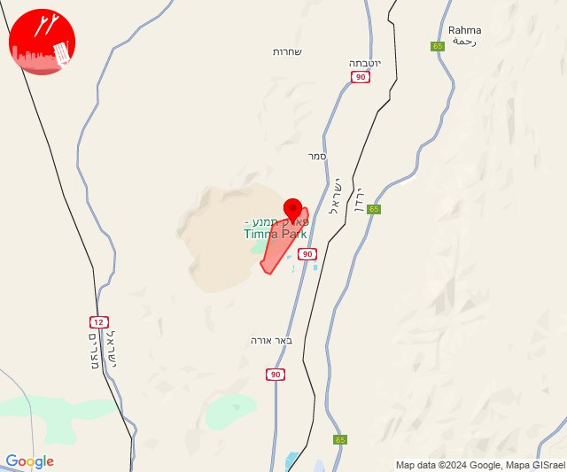

