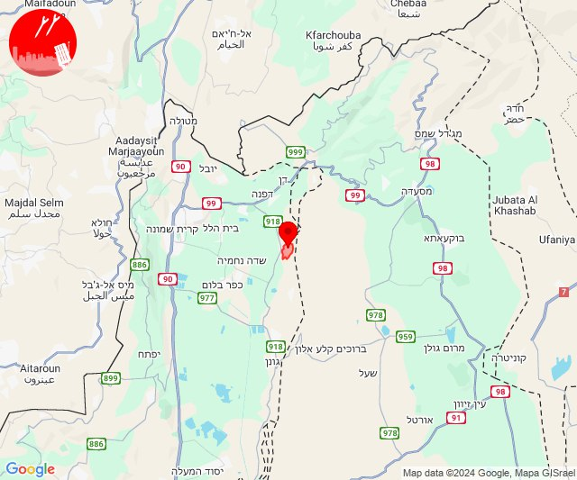

# Alerts for 2024-11-06

## 04:00

🔴 צבע אדום (06/11/2024):

06:00:
• עוטף עזה: נתיב העשרה (15 שניות)

צופר - צבע אדום

## 04:00

## 04:28

✈️ חדירת כלי טיס עוין (06/11/2024):

06:28:
• קו העימות: ע'ג'ר 

צופר - צבע אדום

## 04:28

## 07:01

🔴 צבע אדום (06/11/2024):

09:01:
• קו העימות: קריית שמונה, כפר גלעדי, תל חי, מטולה, בית הלל, כפר יובל, מעיין ברוך, הגושרים (מיידי)

צופר - צבע אדום

## 07:01

## 08:10

🔴 צבע אדום (06/11/2024):

10:09:
• קו העימות: דוב''ב, צבעון, סאסא (מיידי)

10:10:
• קו העימות: דוב''ב, סאסא (מיידי)

צופר - צבע אדום

## 08:10

## 08:46

🔴 צבע אדום (06/11/2024):

10:46:
• קו העימות: שניר (מיידי)
• צפון הגולן: מצוק עורבים, רמת טראמפ, שעל (15 שניות)

צופר - צבע אדום

## 08:46

## 09:21

🔴 צבע אדום (06/11/2024):

11:21:
• שרון: נתניה - מזרח, בני דרור, גאולים, חרות, טייבה, טירה, יעף, כפר הס, כפר יעבץ, כפר עבודה, עזריאל, עין ורד, עין שריד, פורת, פרדסיה, צור משה, קדימה צורן, קלנסווה, שער אפרים, תל מונד, אבן יהודה, אזור תעשייה כפר יונה, בארותיים, בורגתה, בית יצחק - שער חפר, גנות הדר, חניאל, ינוב, כפר יונה, נורדיה, ניצני עוז, עולש, תנובות (דקה וחצי)
• גליל עליון: ירכא, ינוח ג'ת, כליל (30 שניות)
• קו העימות: געתון, יחיעם, עין יעקב (15 שניות)

צופר - צבע אדום

## 09:22

## 09:23

🔴 צבע אדום (06/11/2024):

11:21:
• שרון: נתניה - מזרח, בני דרור, גאולים, חרות, טייבה, טירה, יעף, כפר הס, כפר יעבץ, כפר עבודה, עזריאל, עין ורד, עין שריד, פורת, פרדסיה, צור משה, קדימה צורן, קלנסווה, שער אפרים, תל מונד, אבן יהודה, אזור תעשייה כפר יונה, בארותיים, בורגתה, בית יצחק - שער חפר, גנות הדר, חניאל, ינוב, כפר יונה, נורדיה, ניצני עוז, עולש, תנובות, משמרת, צור יצחק, רמת הכובש, אזור תעשייה טירה, גבעת חן, הוד השרון, רעננה, אלישמע, ג'לג'וליה, גן חיים, גני עם, חגור, חורשים, ירחיב, ירקונה, כפר ברא, כפר מל''ל, כפר סבא, כפר קאסם, מתן, נווה ימין, נווה ירק, עדנים, צופית, רמות השבים, שדי חמד, תחנת רכבת ראש העין, מרכז אזורי דרום השרון (דקה וחצי)
• גליל עליון: ירכא, ינוח ג'ת, כליל, בית העמק, נס עמים, נתיב השיירה, שבי ציון, שייח' דנון, אבו סנאן, אשרת, כפר יאסיף, לוחמי הגטאות, מזרעה, עמקה, רגבה (30 שניות)
• קו העימות: געתון, יחיעם, עין יעקב, בית העלמין החדש נהריה, בן עמי, נהריה, עברון (15 שניות, 30 שניות, מיידי)
• דן: גבעת שמואל, גת רימון, סביון, פתח תקווה, קריית אונו, רמת גן - מזרח, גני תקווה, תל אביב - עבר הירקון, בני ברק, רמת השרון, בית עלמין מורשה, אור יהודה, יהוד מונוסון, גבעת השלושה, הרצליה - מרכז וגליל ים, רמת גן - מערב (דקה וחצי)
• השפלה: באר יעקב, לוד, ניר צבי, תעשיון צריפין, אחיעזר, יגל, כפר חב''ד, צפריה, ראשון לציון - מזרח, נס ציונה, בית דגן (דקה וחצי)
• ירקון: ראש העין, אזור תעשייה אפק ולב הארץ (דקה וחצי)

11:22:
• שרון: בית הלוי, הדר עם, המרכז האקדמי רופין, יד חנה, כפר ידידיה, כפר מונש, גן יאשיה, אמץ, אורנית, בית ברל, שדה ורבורג, בני ציון, בצרה, אלקנה (דקה וחצי)
• השפלה: נצר סרני, חמד, משמר השבעה, גנות, ישרש, רמלה, זיתן, חניון הנתיב מהיר, ראשון לציון - מערב, גינתון, אזור תעשייה נשר - רמלה, אחיסמך, אזור תעשייה רגמ (דקה וחצי)
• ירקון: אלעד, בני עטרות, כפר טרומן, איירפורט סיטי, תעשיון חצב, נחשונים, גבעת כ''ח, מזור, נופך, נחלים, עינת, רינתיה (דקה וחצי)
• דן: אזור, חולון, מעש, כפר סירקין (דקה וחצי)

11:23:
• שרון: אייל, כוכב יאיר - צור יגאל, ניר אליהו, נירית, אלפי מנשה, עץ אפרים, צופים, שערי תקווה (דקה וחצי)
• שומרון: קרני שומרון (דקה וחצי)
• דן: מגשימים, תל אביב - דרום העיר ויפו, תל אביב - מזרח, תל אביב - מרכז העיר, בת ים, גבעתיים, מקווה ישראל (דקה וחצי)
• השפלה: מצליח (דקה וחצי)
• ירקון: בארות יצחק, אזור תעשייה חבל מודיעין, בית עריף, ברקת, חדיד, טירת יהודה, שוהם (דקה וחצי)

צופר - צבע אדום

## 09:23

## 09:48

🔴 צבע אדום (06/11/2024):

11:48:
• קו העימות: אלקוש, פסוטה, חורפיש, מעלות תרשיחא, צוריאל, חוסן (מיידי, 15 שניות)

צופר - צבע אדום

## 09:48

## 11:09

🔴 צבע אדום (06/11/2024):

13:09:
• עוטף עזה: נתיב העשרה (15 שניות)

צופר - צבע אדום

## 11:09

## 12:55

🔴 צבע אדום (06/11/2024):

14:55:
• גליל עליון: צפת - עיר, ביריה, אור הגנוז, בר יוחאי, מרכז אזורי מרום גליל, קדיתא (30 שניות)
• קו העימות: דלתון (מיידי)

צופר - צבע אדום

## 12:55

## 13:01

🔴 צבע אדום (06/11/2024):

15:00:
• קו העימות: כפר סאלד, שמיר, שאר ישוב (15 שניות, מיידי)

15:01:
• קו העימות: מרגליות, מנרה, קריית שמונה (מיידי)

צופר - צבע אדום

## 13:01

## 13:09

🔴 צבע אדום (06/11/2024):

15:07:
• קו העימות: אביבים, אביבים (מיידי)

15:08:
• קו העימות: אביבים (מיידי)

15:09:
• גליל עליון: צפת - עיר, חצור הגלילית, ביריה, ראש פינה, עמוקה, חצור הגלילית, ראש פינה (30 שניות)
• קו העימות: אזור תעשייה רמת דלתון, דלתון (מיידי)

צופר - צבע אדום

## 13:09

## 14:07

🔴 צבע אדום (06/11/2024):

16:07:
• קו העימות: חוות אירוח גורן, אילון, עין יעקב, גורן, גורנות הגליל, געתון, מנות, נווה זיו, יחיעם, הילה, מעיליא (מיידי, 15 שניות)
• גליל עליון: כליל, אבו סנאן, ירכא, עמקה (30 שניות)

צופר - צבע אדום

## 14:07

## 14:14

🔴 צבע אדום (06/11/2024):

16:14:
• קו העימות: עלמה (מיידי)

צופר - צבע אדום

## 14:14

## 14:18

🔴 צבע אדום (06/11/2024):

16:17:
• דן: אור יהודה, גת רימון, יהוד מונוסון, מעש, סביון, פתח תקווה, קריית אונו, גני תקווה, בני ברק, גבעת שמואל, כפר סירקין, רמת גן - מזרח, רמת גן - מערב, מגשימים (דקה וחצי)
• השפלה: צפריה, אחיעזר, בית דגן, חמד, חניון הנתיב מהיר, יגל, כפר חב''ד, משמר השבעה, גנות (דקה וחצי)
• ירקון: בארות יצחק, בני עטרות, גבעת כ''ח, מזור, נופך, נחלים, רינתיה, טירת יהודה, איירפורט סיטי, ברקת, אלעד, נחשונים (דקה וחצי)

16:18:
• השפלה: גינתון, לוד, זיתן (דקה וחצי)
• ירקון: אזור תעשייה חבל מודיעין, בית עריף, חדיד, כפר טרומן, שוהם (דקה וחצי)
• דן: גבעת השלושה (דקה וחצי)

צופר - צבע אדום

## 14:18

## 14:37

🔴 צבע אדום (06/11/2024):

16:37:
• גליל עליון: קדיתא (30 שניות)

צופר - צבע אדום

## 14:37

## 14:54

🔴 צבע אדום (06/11/2024):

16:54:
• קו העימות: כפר סאלד (15 שניות)

צופר - צבע אדום

## 14:54

## 16:03

🔴 צבע אדום (06/11/2024):

18:02:
• גליל עליון: אזור תעשייה שער נעמן, כפר מסריק, עין המפרץ, עכו - אזור תעשייה, אפק, ג'דידה מכר, עכו, בית העלמין החדש עכו, כפר מסריק, עכו - אזור תעשייה (דקה, 30 שניות)
• המפרץ: אזור תעשייה קריית ביאליק, קריית ביאליק, קריית מוצקין (דקה)
• מרכז הגליל: אזור תעשייה טמרה, טמרה (דקה)

18:03:
• גליל עליון: עין המפרץ (30 שניות)

צופר - צבע אדום

## 16:03

## 16:19

🔴 צבע אדום (06/11/2024):

18:19:
• קו העימות: בצת (מיידי)

צופר - צבע אדום

## 16:19

## 16:20

✈️ חדירת כלי טיס עוין (06/11/2024):

18:19:
• קו העימות: חוף בצת, ראש הנקרה, איזור תעשייה מילואות צפון, לימן 

18:20:
• קו העימות: גשר הזיו, נהריה, סער, בן עמי 

צופר - צבע אדום

## 16:20

## 17:34

🔴 צבע אדום (06/11/2024):

19:34:
• קו העימות: יראון, אביבים (מיידי)

צופר - צבע אדום

## 17:34

## 18:17

✈️ חדירת כלי טיס עוין (06/11/2024):

20:16:
• בקעה: שדמות מחולה, רותם 

20:17:
• בקעה: משכיות 

צופר - צבע אדום

## 18:17

## 20:46

🔴 צבע אדום (06/11/2024):

22:46:
• קו העימות: אביבים, יראון, ריחאנייה (מיידי)

צופר - צבע אדום

## 20:46

## 21:11

🔴 צבע אדום (06/11/2024):

23:11:
• קו העימות: זרעית, שומרה, שתולה (מיידי)

צופר - צבע אדום

## 21:11

