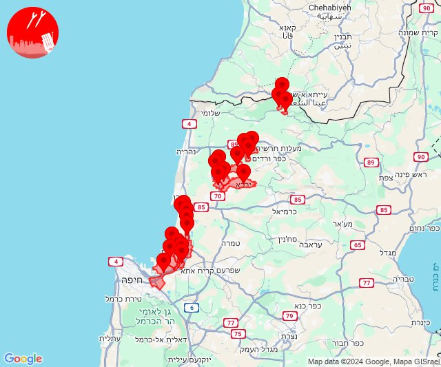

# Alerts for 2024-11-07

## 10:27

🔴 צבע אדום (07/11/2024):

12:27:
• עוטף עזה: נתיב העשרה (15 שניות)

צופר - צבע אדום

## 10:27

## 11:41

🔴 צבע אדום (07/11/2024):

13:41:
• קו העימות: נטועה, שתולה, זרעית, שומרה (מיידי)

צופר - צבע אדום

## 11:41

## 11:48

🔴 צבע אדום (07/11/2024):

13:46:
• גליל עליון: אזור תעשייה שער נעמן, עכו (דקה, 30 שניות)
• המפרץ: קריית ביאליק, קריית מוצקין, אזור תעשייה קריית ביאליק, קריית ים (דקה)
• קו העימות: גשר הזיו, נהריה, סער (מיידי, 15 שניות)

13:47:
• גליל עליון: אפק, עכו - אזור תעשייה, עין המפרץ, כפר מסריק, בוסתן הגליל, שבי ציון, שומרת, לוחמי הגטאות, רגבה, ג'דידה מכר, בית העלמין החדש עכו, כפר מסריק, עין המפרץ, עכו - אזור תעשייה (דקה, 30 שניות)
• קו העימות: שלומי, בצת, מצובה, איזור תעשייה מילואות צפון, לימן (מיידי)
• המפרץ: חיפה - קריית חיים ושמואל (דקה)

13:48:
• קו העימות: חניתה, מצובה (מיידי)

צופר - צבע אדום

## 11:48

## 11:54

🔴 צבע אדום (07/11/2024):

13:54:
• קו העימות: חוף בצת, ראש הנקרה, איזור תעשייה מילואות צפון, בצת, לימן (מיידי)

צופר - צבע אדום

## 11:54

## 12:15

🔴 צבע אדום (07/11/2024):

14:15:
• קו העימות: צבעון, יפתח, דוב''ב (מיידי)

צופר - צבע אדום

## 12:15

## 12:24

🔴 צבע אדום (07/11/2024):

14:24:
• קו העימות: גורנות הגליל, אבירים (מיידי)

צופר - צבע אדום

## 12:24

## 13:03

🔴 צבע אדום (07/11/2024):

15:03:
• מנשה: תלמי אלעזר (דקה וחצי)
• המפרץ: חיפה - כרמל, הדר ועיר תחתית, חיפה - מערב, חיפה - מפרץ, חיפה - נווה שאנן ורמות כרמל, נשר, החותרים, טירת כרמל, כפר גלים (דקה)
• הכרמל: בית אורן, גבעת וולפסון, אזור תעשייה ניר עציון, בית צבי, גבע כרמל, כפר הנוער ימין אורד, מגדים, נווה ים, ניר עציון, עין הוד, עין חוד, עין כרמל, עתלית, יערות הכרמל, כלא דמון (דקה)

צופר - צבע אדום

## 13:03

## 13:15

🔴 צבע אדום (07/11/2024):

15:15:
• קו העימות: מטולה (מיידי)

צופר - צבע אדום

## 13:15

## 13:45

🔴 צבע אדום (07/11/2024):

15:45:
• קו העימות: מרגליות, קריית שמונה (מיידי)

צופר - צבע אדום

## 13:45

## 14:11

🔴 צבע אדום (07/11/2024):

16:10:
• קו העימות: מנרה, מרגליות, קריית שמונה (מיידי)

16:11:
• קו העימות: מנרה (מיידי)

צופר - צבע אדום

## 14:11

## 14:16

🔴 צבע אדום (07/11/2024):

16:14:
• קו העימות: אבן מנחם, שומרה, זרעית (מיידי)
• גליל עליון: אבו סנאן, ירכא, כליל, כפר יאסיף, עמקה (30 שניות)
• המפרץ: חיפה - קריית חיים ושמואל, כפר ביאליק, קריית ביאליק, קריית ים, קריית מוצקין, חיפה - מפרץ, אזור תעשייה קריית ביאליק (דקה)

16:15:
• קו העימות: שומרה, עין יעקב, געתון, יחיעם, שומרה (מיידי, 15 שניות)
• גליל עליון: אבו סנאן, אשרת, עמקה, כליל, ירכא, אזור תעשייה שער נעמן, כפר מסריק, עכו - אזור תעשייה, עין המפרץ (30 שניות, דקה)

16:16:
• גליל עליון: כפר מסריק, עכו - אזור תעשייה (30 שניות)
• המפרץ: חיפה - קריית חיים ושמואל, קריית ביאליק, קריית ים, קריית מוצקין (דקה)

צופר - צבע אדום

## 14:16

## 14:47

✈️ חדירת כלי טיס עוין (07/11/2024):

16:47:
• קו העימות: כפר יובל, מעיין ברוך 

צופר - צבע אדום

## 14:47

## 14:48

🔴 צבע אדום (07/11/2024):

16:48:
• קו העימות: כפר יובל (מיידי)

צופר - צבע אדום

## 14:48

## 16:06

✈️ חדירת כלי טיס עוין (07/11/2024):

18:06:
• קו העימות: נהריה 
• גליל עליון: שבי ציון 

צופר - צבע אדום

## 16:06

## 17:19

🔴 צבע אדום (07/11/2024):

19:19:
• קו העימות: אבירים (מיידי)

צופר - צבע אדום

## 17:19

## 19:13

🔴 צבע אדום (07/11/2024):

21:13:
• קו העימות: מנרה, מרגליות (מיידי)

צופר - צבע אדום

## 19:13

