# Alerts for 2024-11-08

## 04:14

🔴 צבע אדום (08/11/2024):

06:14:
• דרום הנגב: אורון תעשייה ומסחר, אזור תעשייה רותם (דקה וחצי)
• ערבה: אל עמארני, אל מסק, עין חצבה, עיר אובות (דקה וחצי)
• ים המלח: נאות הכיכר, עין תמר (דקה וחצי)

צופר - צבע אדום

## 04:14

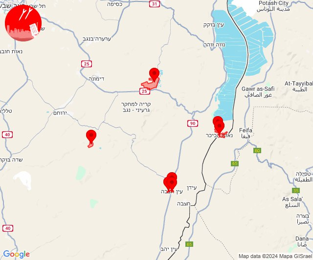

## 04:36

🔴 צבע אדום (08/11/2024):

06:36:
• קו העימות: מרגליות, מנרה, קריית שמונה (מיידי)

צופר - צבע אדום

## 04:36

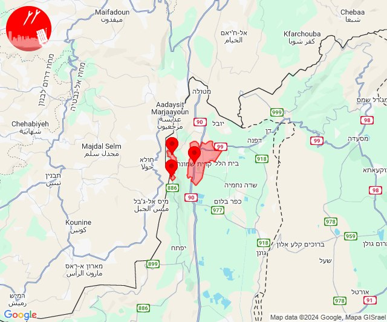

## 04:45

🔴 צבע אדום (08/11/2024):

06:43:
• קו העימות: אדמית, ערב אל עראמשה, ראש הנקרה, גשר הזיו, לימן, כברי (מיידי)

06:44:
• קו העימות: נווה זיו, נהריה, סער, בן עמי, איזור תעשייה מילואות צפון, בצת, שלומי, מצובה, חוף בצת (מיידי, 15 שניות)
• גליל עליון: נתיב השיירה (30 שניות)

06:45:
• קו העימות: חניתה, עבדון, בצת, שלומי, יערה, בן עמי, כברי, גשר הזיו, מצובה, לימן, געתון, יחיעם, מנות, נווה זיו, עין יעקב, נהריה, סער (מיידי, 15 שניות)
• גליל עליון: נתיב השיירה, בית העמק, שייח' דנון, ירכא, כליל, ג'וליס, אבו סנאן, כפר יאסיף, נס עמים, לוחמי הגטאות, אשרת, עמקה (30 שניות)

צופר - צבע אדום

## 04:46

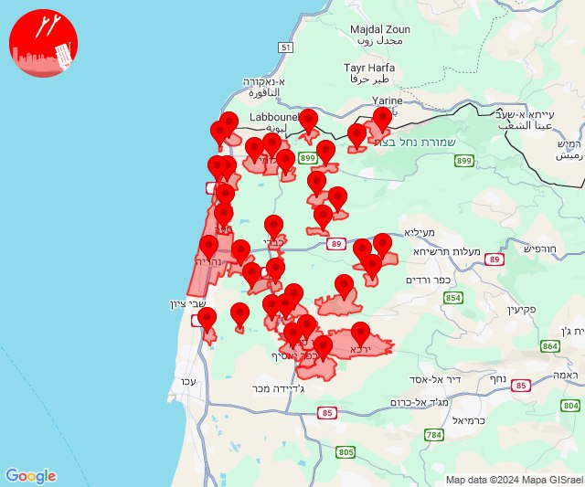

## 05:17

✈️ חדירת כלי טיס עוין (08/11/2024):

07:17:
• הכרמל: פוריידיס, דור, נחשולים 

צופר - צבע אדום

## 05:17

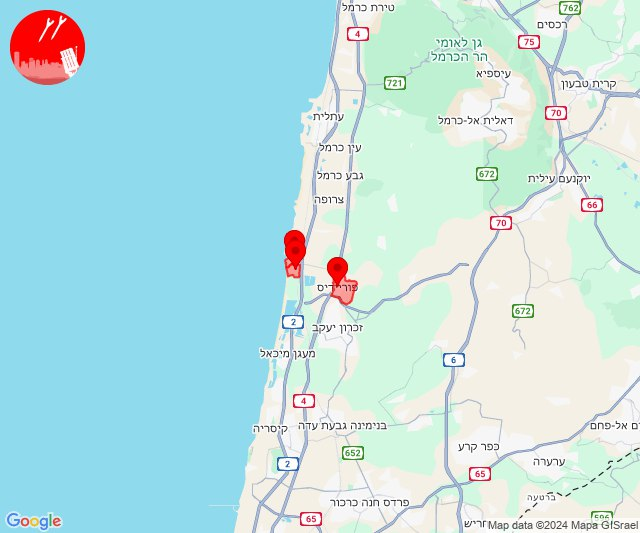

## 05:46

🔴 צבע אדום (08/11/2024):

07:44:
• המפרץ: חיפה - מפרץ, חיפה - קריית חיים ושמואל, קריית ים, חיפה - כרמל, הדר ועיר תחתית (דקה)
• העמקים: הסוללים, גבעת אלה, יפיע, כפר החורש, נצרת, עילוט, ציפורי, ריינה, שמשית, זרזיר, יפעת, מגדל העמק, נהלל, תמרת (דקה)
• מרכז הגליל: חנתון, ביר אלמכסור, כפר מנדא (דקה)

07:45:
• העמקים: גבת, שריד, תחנת רכבת כפר ברוך, רמת דוד, אלון הגליל, חג'אג'רה (דקה)
• המפרץ: כפר ביאליק, קריית ביאליק, קריית מוצקין, אזור תעשייה קריית ביאליק, קריית אתא (דקה)
• גליל עליון: אזור תעשייה שער נעמן, כפר מסריק, עכו - אזור תעשייה, ג'דידה מכר, עין המפרץ, עכו, בית העלמין החדש עכו (דקה, 30 שניות)

07:46:
• גליל עליון: כפר מסריק, אפק (30 שניות, דקה)

צופר - צבע אדום

## 05:46

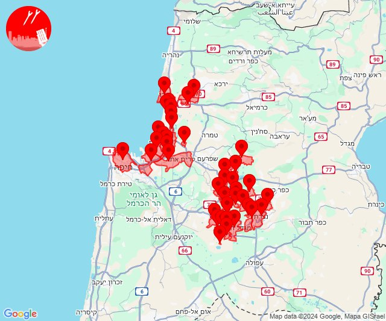

## 07:13

🔴 צבע אדום (08/11/2024):

09:13:
• צפון הגולן: מצוק עורבים, רמת טראמפ (15 שניות)

צופר - צבע אדום

## 07:13

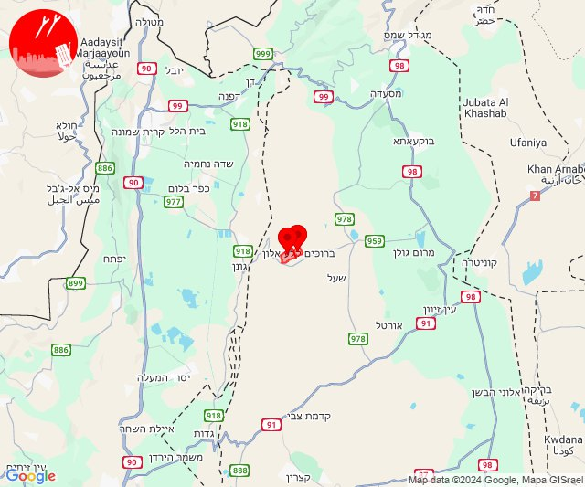

## 07:31

🔴 צבע אדום (08/11/2024):

09:31:
• קו העימות: זרעית (מיידי)

צופר - צבע אדום

## 07:31

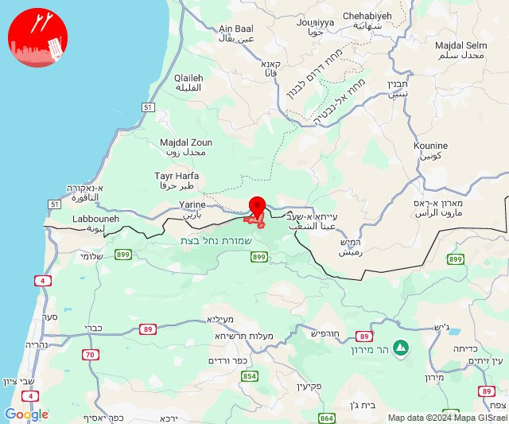

## 09:48

🔴 צבע אדום (08/11/2024):

11:47:
• גליל עליון: אזור תעשייה שער נעמן (דקה)
• המפרץ: קריית ים (דקה)

11:48:
• גליל עליון: עכו - אזור תעשייה, עכו, כפר מסריק, עין המפרץ, בוסתן הגליל (30 שניות)

צופר - צבע אדום

## 09:48

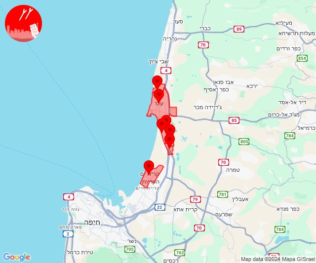

## 09:49

✈️ חדירת כלי טיס עוין (08/11/2024):

11:49:
• קו העימות: מרגליות 

צופר - צבע אדום

## 09:49

## 10:58

🔴 צבע אדום (08/11/2024):

12:58:
• קו העימות: משגב עם (מיידי)

צופר - צבע אדום

## 10:58

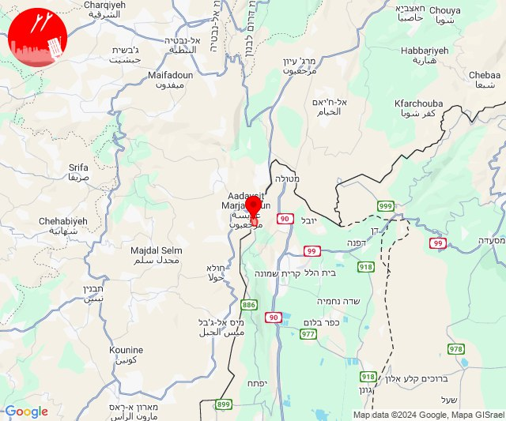

## 11:26

🔴 צבע אדום (08/11/2024):

13:26:
• קו העימות: מרגליות (מיידי)

צופר - צבע אדום

## 11:26

## 12:15

🔴 צבע אדום (08/11/2024):

14:15:
• קו העימות: כפר גלעדי, משגב עם (מיידי)

צופר - צבע אדום

## 12:15

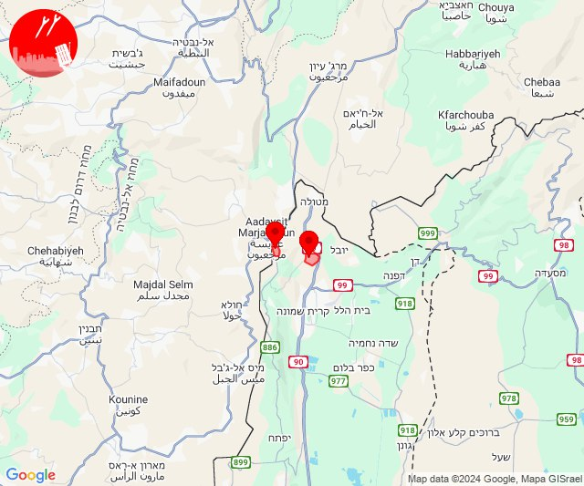

## 12:56

🔴 צבע אדום (08/11/2024):

14:55:
• קו העימות: כברי, עבדון, חניתה, יערה, מצובה (מיידי)

14:56:
• קו העימות: גשר הזיו, נהריה, סער, בית העלמין החדש נהריה, מנות, נווה זיו, כברי (מיידי, 15 שניות, 30 שניות)

צופר - צבע אדום

## 12:56

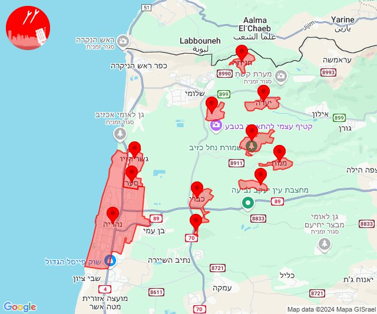

## 13:20

🔴 צבע אדום (08/11/2024):

15:18:
• ואדי ערה: אזור תעשייה יקנעם עילית, אליקים, יקנעם המושבה והזורע, יקנעם עילית, עין העמק, גלעד, דליה, עין השופט, רמת השופט (דקה וחצי)
• דן: גבעת השלושה, פתח תקווה (דקה וחצי)
• שרון: נווה ירק, מרכז אזורי דרום השרון (דקה וחצי)
• המפרץ: איבטין, בית עלמין תל רגב, רמת יוחנן, קריית אתא (דקה)
• העמקים: חוואלד (דקה)

15:19:
• גליל עליון: ג'דידה מכר, כפר יאסיף, בית העמק, נתיב השיירה, שייח' דנון, אבו סנאן, אשרת, ירכא, כליל, עמקה, אפק (30 שניות, דקה)
• דן: כפר סירקין (דקה וחצי)
• העמקים: תחנת רכבת כפר יהושוע, אורנים, כפר תקווה, קריית טבעון - בית זייד (דקה)
• שרון: תחנת רכבת ראש העין, נווה ירק (דקה וחצי)
• מרכז הגליל: אזור תעשייה טמרה, אעבלין, טמרה, שפרעם (דקה)
• המפרץ: אושה, כפר המכבי (דקה)

15:20:
• שרון: אלישמע, ג'לג'וליה, הוד השרון, חגור, ירחיב, כפר סבא, מתן, נווה ימין, צופית, שדי חמד, גני עם, עדנים, מרכז אזורי דרום השרון (דקה וחצי)

צופר - צבע אדום

## 13:20

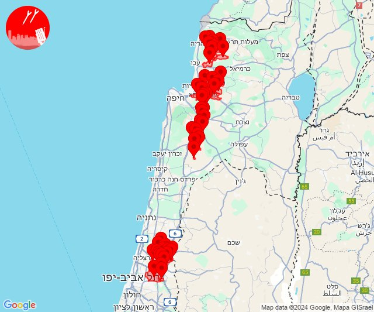

## 13:36

🔴 צבע אדום (08/11/2024):

15:36:
• קו העימות: נהריה (15 שניות)

צופר - צבע אדום

## 13:36

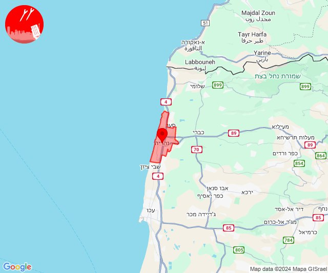

## 13:40

🔴 צבע אדום (08/11/2024):

15:40:
• גליל עליון: עכו (30 שניות)

צופר - צבע אדום

## 13:40

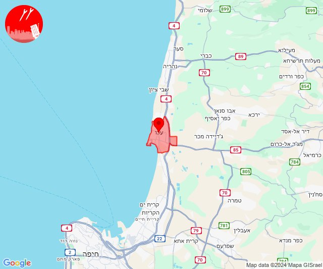

## 13:48

✈️ חדירת כלי טיס עוין (08/11/2024):

15:30:
• קו העימות: איזור תעשייה מילואות צפון, לימן 

15:31:
• קו העימות: חוף בצת, בצת, איזור תעשייה מילואות צפון 

15:32:
• קו העימות: נהריה 

15:34:
• קו העימות: נהריה 

15:35:
• גליל עליון: שייח' דנון 

15:40:
• קו העימות: בית הלל, שדה נחמיה, עמיר, כפר בלום 

15:43:
• קו העימות: גונן, להבות הבשן 

15:48:
• גליל עליון: אחיהוד, אזור תעשייה בר-לב 

צופר - צבע אדום

## 13:48

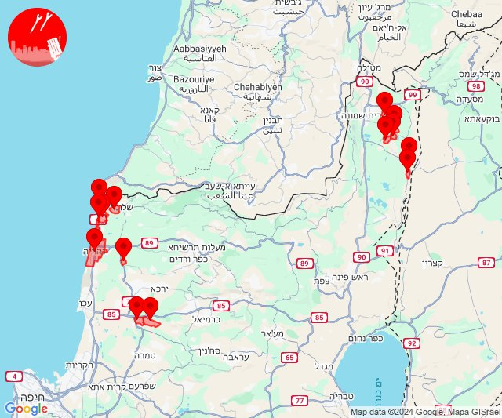

## 13:50

🔴 צבע אדום (08/11/2024):

15:50:
• קו העימות: מרגליות (מיידי)

צופר - צבע אדום

## 13:50

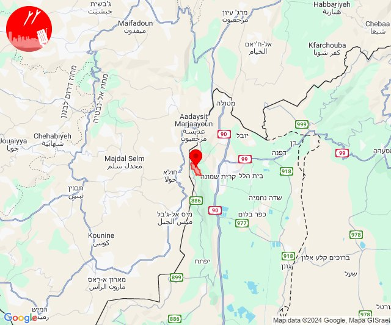

## 13:55

🔴 צבע אדום (08/11/2024):

15:54:
• גליל עליון: אזור תעשייה בר-לב, אחיהוד, יסעור (דקה)
• מרכז הגליל: טמרה, כאבול (דקה)

15:55:
• גליל עליון: ג'דידה מכר, בית העלמין החדש עכו, ג'וליס, טל - אל, כפר מסריק, עכו, עין המפרץ (30 שניות)
• קו העימות: חוות אירוח גורן, גורן (מיידי)
• מרכז הגליל: יעד, שעב (דקה)

צופר - צבע אדום

## 13:55

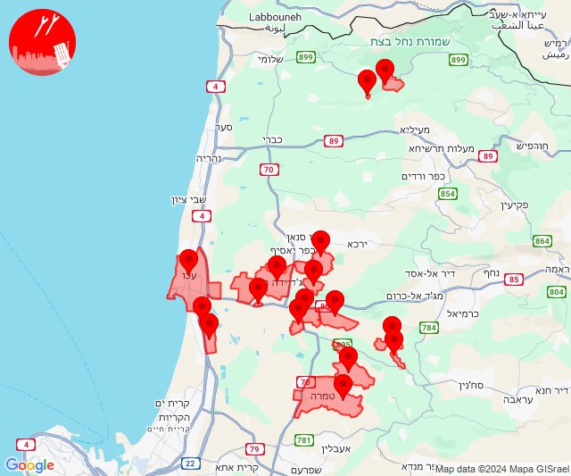

## 15:03

🔴 צבע אדום (08/11/2024):

17:03:
• קו העימות: יראון (מיידי)

צופר - צבע אדום

## 15:03

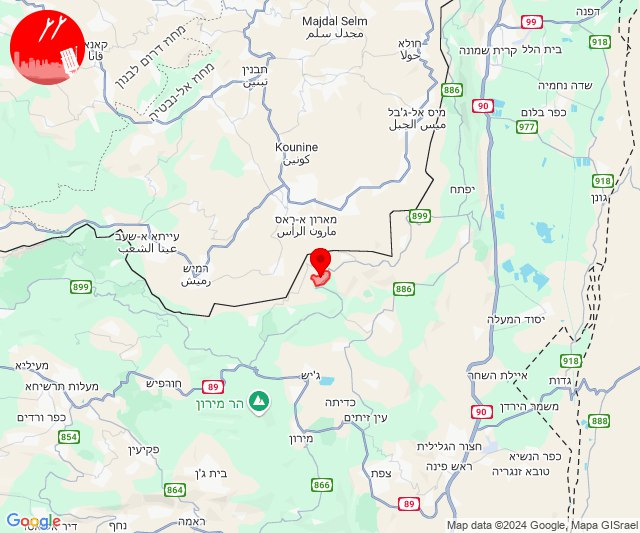

## 15:11

🔴 צבע אדום (08/11/2024):

17:11:
• קו העימות: קריית שמונה, מנרה, מרגליות, בית הלל (מיידי)

צופר - צבע אדום

## 15:11

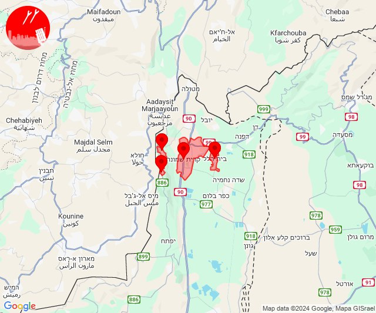

## 19:23

✈️ חדירת כלי טיס עוין (08/11/2024):

21:23:
• קו העימות: מצובה, שלומי 

צופר - צבע אדום

## 19:23

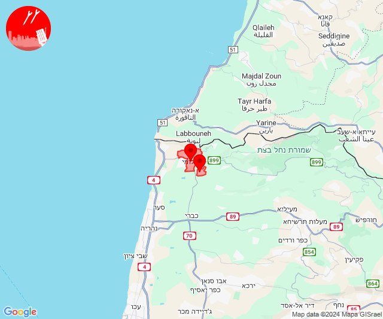

## 19:24

🔴 צבע אדום (08/11/2024):

21:24:
• קו העימות: בצת (מיידי)

צופר - צבע אדום

## 19:24

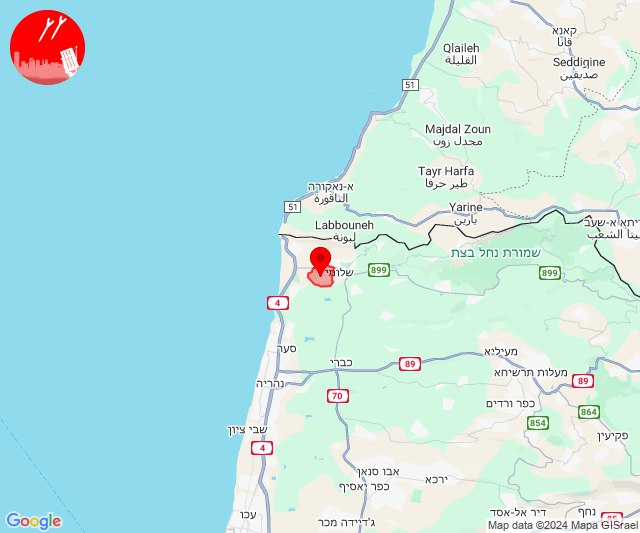

## 21:52

✈️ חדירת כלי טיס עוין (08/11/2024):

23:52:
• קו העימות: ראש הנקרה, חוף בצת 

צופר - צבע אדום

## 21:52

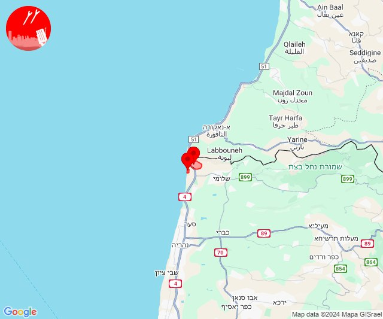

## 23:14

✈️ חדירת כלי טיס עוין (09/11/2024):

01:14:
• דרום הגולן: רמת מגשימים, חספין 

צופר - צבע אדום

## 23:14

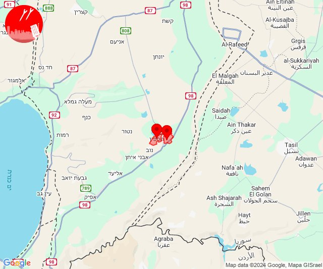

