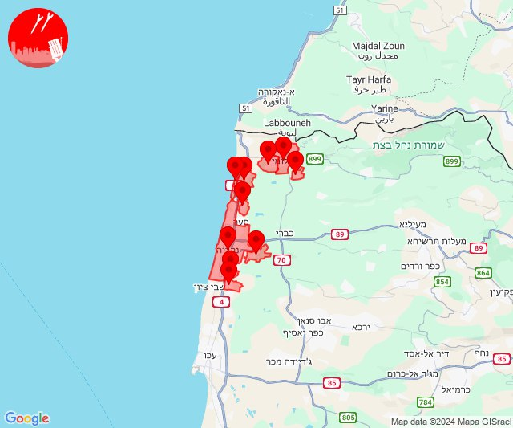

# Alerts for 2024-11-09

## 01:07

✈️ חדירת כלי טיס עוין (09/11/2024):

03:04:
• צפון הגולן: אל רום 

03:06:
• צפון הגולן: רמת טראמפ 

03:07:
• צפון הגולן: מצוק עורבים 

צופר - צבע אדום

## 01:07

## 04:59

🔴 צבע אדום (09/11/2024):

06:58:
• קו העימות: קריית שמונה (מיידי)

06:59:
• קו העימות: כפר גלעדי, משגב עם, תל חי, בית הלל, מטולה (מיידי)

צופר - צבע אדום

## 04:59

## 05:51

🔴 צבע אדום (09/11/2024):

07:51:
• קו העימות: מנרה (מיידי)

צופר - צבע אדום

## 05:51

## 06:06

🔴 צבע אדום (09/11/2024):

08:06:
• קו העימות: עלמה, ריחאנייה, אביבים, יראון, אזור תעשייה רמת דלתון, ג'ש - גוש חלב, דלתון (מיידי)
• גליל עליון: ביריה, צפת - עיר, אור הגנוז, בר יוחאי, קדיתא, צפת - נוף כנרת, חצור הגלילית, ראש פינה (30 שניות)

צופר - צבע אדום

## 06:06

## 07:27

🔴 צבע אדום (09/11/2024):

09:26:
• גליל עליון: אזור תעשייה שער נעמן, כפר מסריק, עין המפרץ, עכו - אזור תעשייה (דקה, 30 שניות)
• המפרץ: קריית ביאליק (דקה)

09:27:
• גליל עליון: ג'דידה מכר, עכו, בית העלמין החדש עכו (30 שניות)

צופר - צבע אדום

## 07:27

## 09:19

🔴 צבע אדום (09/11/2024):

11:19:
• קו העימות: מרגליות (מיידי)

צופר - צבע אדום

## 09:19

## 10:43

🔴 צבע אדום (09/11/2024):

12:42:
• קו העימות: בן עמי, בצת, מצובה, שלומי, נהריה, גשר הזיו, איזור תעשייה מילואות צפון, לימן, עברון (מיידי, 15 שניות)
• גליל עליון: מזרעה (30 שניות)

12:43:
• קו העימות: בן עמי (מיידי)

צופר - צבע אדום

## 10:43

## 10:52

🔴 צבע אדום (09/11/2024):

12:52:
• קו העימות: ברעם (מיידי)

צופר - צבע אדום

## 10:52

## 11:03

🔴 צבע אדום (09/11/2024):

13:03:
• קו העימות: בצת, שלומי (מיידי)

צופר - צבע אדום

## 11:03

## 11:33

🔴 צבע אדום (09/11/2024):

13:33:
• קו העימות: מעלות תרשיחא (מיידי)

צופר - צבע אדום

## 11:33

## 11:59

🔴 צבע אדום (09/11/2024):

13:56:
• קו העימות: גורן (מיידי)

13:57:
• קו העימות: אדמית, יערה, מנות, בצת, מצובה, שלומי, עבדון, נווה זיו, אילון, ערב אל עראמשה (מיידי)

13:58:
• גליל עליון: אזור תעשייה שער נעמן, כפר מסריק, עין המפרץ (דקה, 30 שניות)
• המפרץ: אזור תעשייה קריית ביאליק, קריית ביאליק, קריית ים, קריית מוצקין (דקה)

13:59:
• גליל עליון: עכו - אזור תעשייה (30 שניות)

צופר - צבע אדום

## 11:59

## 12:29

🔴 צבע אדום (09/11/2024):

14:29:
• קו העימות: אבן מנחם (מיידי)

צופר - צבע אדום

## 12:29

## 12:32

🔴 צבע אדום (09/11/2024):

14:32:
• גליל תחתון: אזור תעשייה קדמת גליל, כפר זיתים (דקה)

צופר - צבע אדום

## 12:32

## 12:53

✈️ חדירת כלי טיס עוין (09/11/2024):

14:51:
• דן: תל אביב - דרום העיר ויפו, תל אביב - מרכז העיר 

14:52:
• דן: בת ים 

14:53:
• השפלה: ראשון לציון - מערב 

צופר - צבע אדום

## 12:53

## 13:00

🔴 צבע אדום (09/11/2024):

15:00:
• קו העימות: בית ספר שדה מירון (מיידי)

צופר - צבע אדום

## 13:00

## 13:15

🔴 צבע אדום (09/11/2024):

15:14:
• קו העימות: מטולה (מיידי)

15:15:
• קו העימות: ע'ג'ר (מיידי)

צופר - צבע אדום

## 13:15

## 14:31

🔴 צבע אדום (09/11/2024):

16:31:
• קו העימות: יפתח (מיידי)

צופר - צבע אדום

## 14:31

## 14:56

🔴 צבע אדום (09/11/2024):

16:55:
• קו העימות: בית הלל, הגושרים, מעיין ברוך (מיידי)

16:56:
• קו העימות: כפר יובל (מיידי)

צופר - צבע אדום

## 14:56

## 15:33

🔴 צבע אדום (09/11/2024):

17:33:
• קו העימות: מנרה, מרגליות, קריית שמונה (מיידי)

צופר - צבע אדום

## 15:33

## 22:48

✈️ חדירת כלי טיס עוין (10/11/2024):

00:45:
• קו העימות: שאר ישוב, דפנה, הגושרים 

00:46:
• קו העימות: בית הלל, הגושרים 

00:47:
• קו העימות: קריית שמונה, בית הלל 

00:48:
• קו העימות: מנרה, מרגליות, קריית שמונה 

צופר - צבע אדום

## 22:48

