# Alerts for 2024-11-10

## 07:13

🔴 צבע אדום (10/11/2024):

09:13:
• קו העימות: מטולה, קריית שמונה, תל חי, כפר גלעדי, כפר יובל, בית הלל, קריית שמונה (מיידי)

צופר - צבע אדום

## 07:13

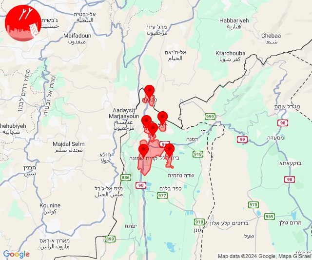

## 09:08

🔴 צבע אדום (10/11/2024):

11:07:
• קו העימות: בן עמי, נהריה, סער (מיידי, 15 שניות)
• גליל עליון: נתיב השיירה (30 שניות)

11:08:
• קו העימות: גשר הזיו, איזור תעשייה מילואות צפון, לימן, שלומי, בצת (מיידי)
• גליל עליון: שייח' דנון (30 שניות)

צופר - צבע אדום

## 09:08

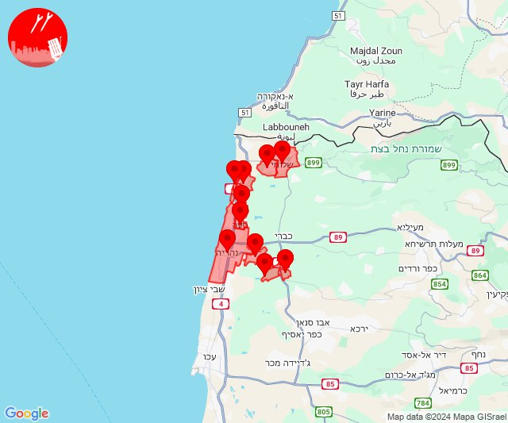

## 09:16

🔴 צבע אדום (10/11/2024):

11:16:
• קו העימות: מנרה (מיידי)

צופר - צבע אדום

## 09:16

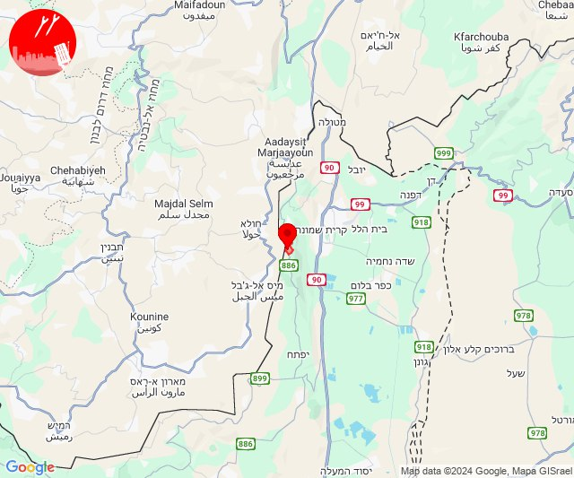

## 10:39

🔴 צבע אדום (10/11/2024):

12:38:
• קו העימות: זרעית, שתולה, שומרה (מיידי)

12:39:
• קו העימות: אבן מנחם, גורנות הגליל (מיידי)

צופר - צבע אדום

## 10:39

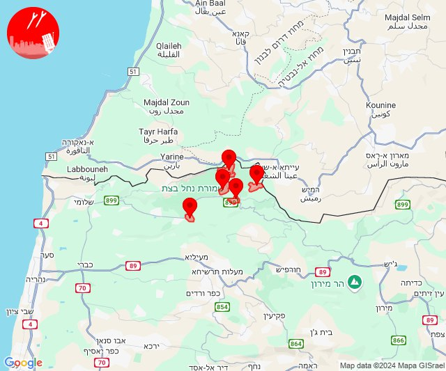

## 11:00

🔴 צבע אדום (10/11/2024):

13:00:
• קו העימות: מרגליות (מיידי)

צופר - צבע אדום

## 11:00

## 12:13

🔴 צבע אדום (10/11/2024):

14:13:
• קו העימות: מרגליות (מיידי)

צופר - צבע אדום

## 12:13

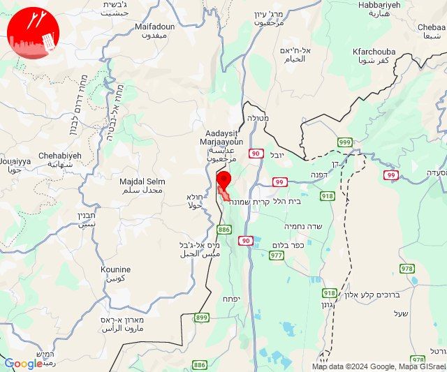

## 12:44

🔴 צבע אדום (10/11/2024):

14:44:
• קו העימות: אבירים (מיידי)

צופר - צבע אדום

## 12:44

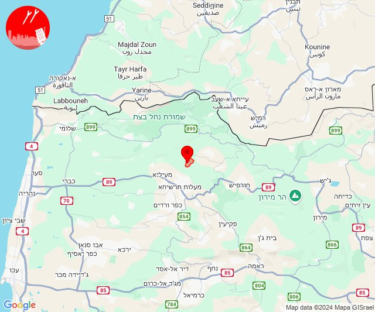

## 12:48

🔴 צבע אדום (10/11/2024):

14:48:
• קו העימות: זרעית (מיידי)

צופר - צבע אדום

## 12:48

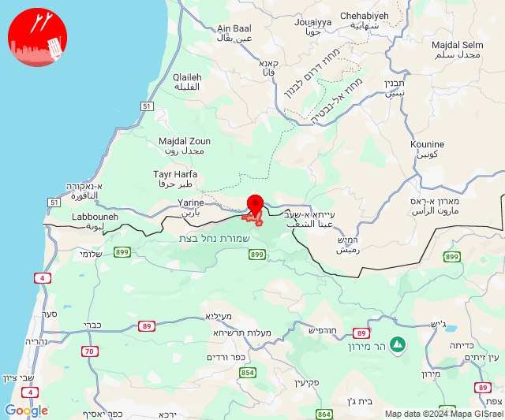

## 14:20

🔴 צבע אדום (10/11/2024):

16:20:
• קו העימות: מטולה (מיידי)

צופר - צבע אדום

## 14:20

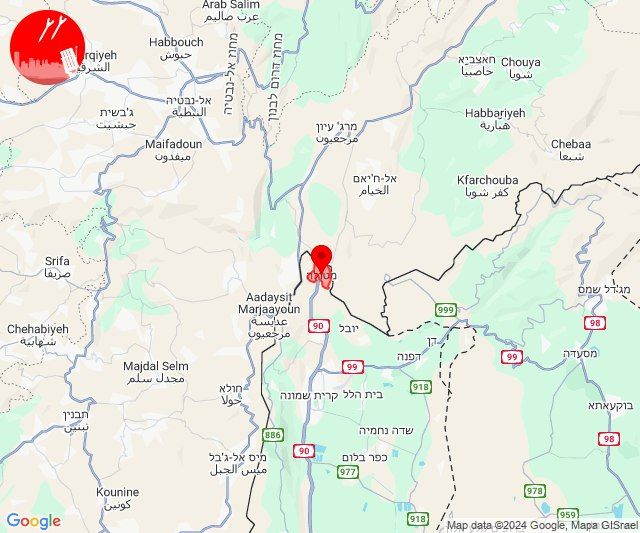

## 14:24

🔴 צבע אדום (10/11/2024):

16:24:
• קו העימות: מטולה (מיידי)

צופר - צבע אדום

## 14:24

## 14:44

🔴 צבע אדום (10/11/2024):

16:44:
• צפון הגולן: אורטל, רמת טראמפ, שעל (מיידי, 15 שניות)

צופר - צבע אדום

## 14:44

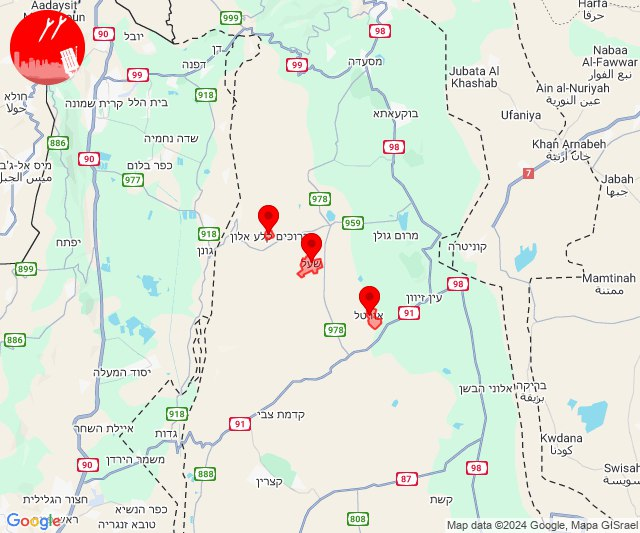

## 15:21

✈️ חדירת כלי טיס עוין (10/11/2024):

17:21:
• המפרץ: חיפה - מערב 

צופר - צבע אדום

## 15:21

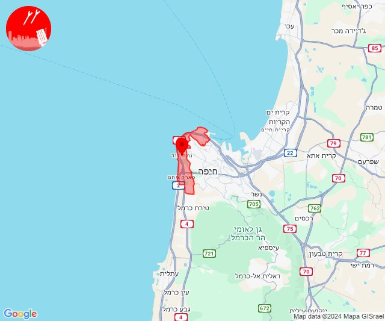

## 15:45

🔴 צבע אדום (10/11/2024):

17:45:
• קו העימות: חוות אירוח גורן, מנות (מיידי)

צופר - צבע אדום

## 15:45

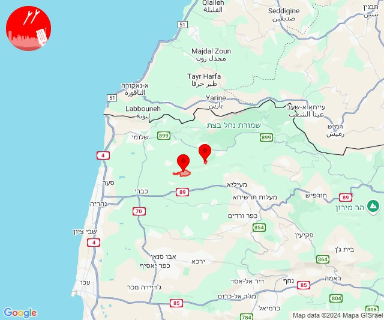

## 16:05

🔴 צבע אדום (10/11/2024):

18:05:
• קו העימות: מטולה (מיידי)

צופר - צבע אדום

## 16:05

## 21:36

✈️ חדירת כלי טיס עוין (10/11/2024):

23:33:
• קו העימות: ע'ג'ר 

23:35:
• קו העימות: כפר יובל, מעיין ברוך, הגושרים 

23:36:
• קו העימות: בית הלל, מעיין ברוך, קריית שמונה, הגושרים 

צופר - צבע אדום

## 21:36

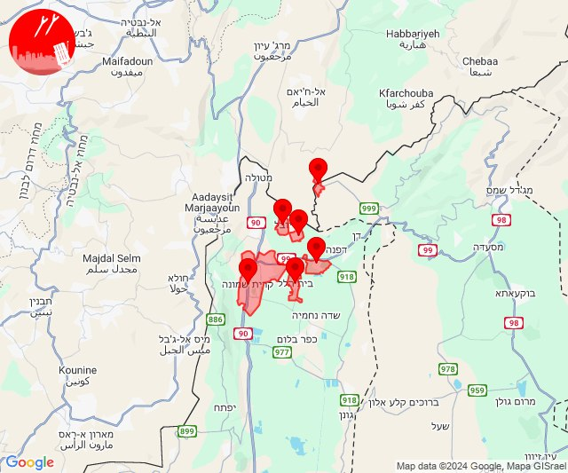

## 21:42

✈️ חדירת כלי טיס עוין (10/11/2024):

23:42:
• קו העימות: נאות מרדכי 

צופר - צבע אדום

## 21:42

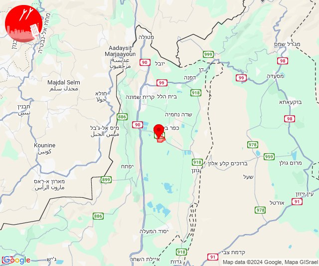

## 22:46

🔴 צבע אדום (11/11/2024):

00:46:
• גליל עליון: צפת - עיר (30 שניות)

צופר - צבע אדום

## 22:46

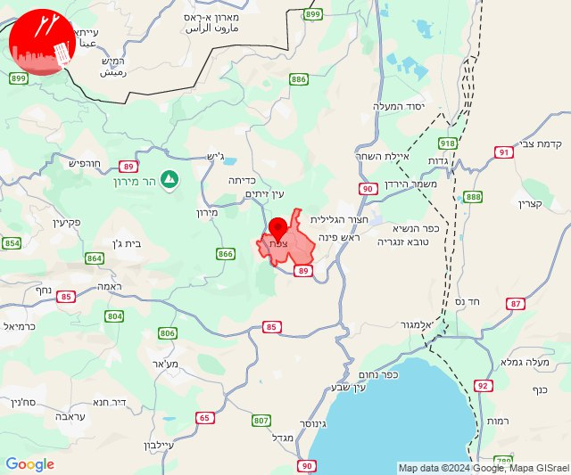

